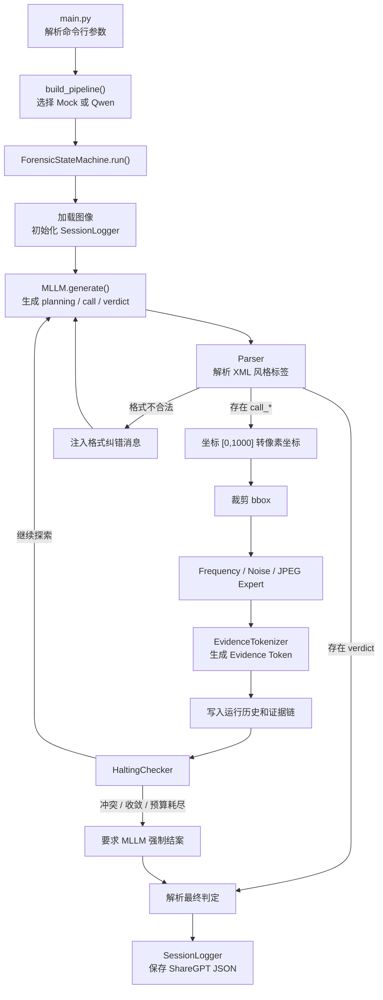
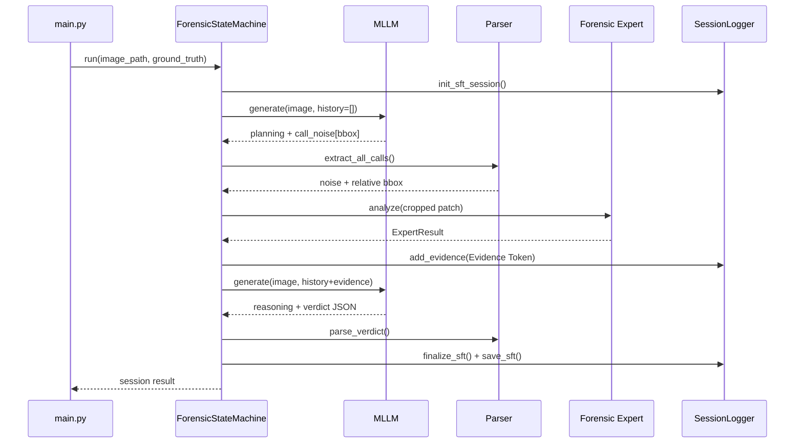

# Forensic-Agent 当前程序框架与运行逻辑

本文档描述当前仓库中已经实现的程序结构和单次图像分析流程，主要面向人工代码审计、项目交接和后续开发。内容以当前源码为准，不代表 `plan.md` 中尚未实现的 LoRA、GRPO 和全数据集评估功能。

## 1. 程序定位

Forensic-Agent 是一个由多模态大语言模型（MLLM）主动调度法证专家的图像真实性检测原型。

系统将 MLLM 作为高层“法官”：模型先观察图像、定位可疑区域，再通过结构化动作标签调用频域、噪声或 JPEG 专家。专家计算得到的物理指标会被转换为 Evidence Token，并重新注入模型上下文。模型结合视觉观察和物理证据进行多轮推理，最终输出 `Real`、`Fake` 或 `Uncertain` 判定及法证报告。

当前系统采用纯 Python `while` 循环实现状态机，不依赖 LangChain 等通用 Agent 框架。

## 2. 整体框架



## 3. 分层结构

| 层次 | 主要文件 | 核心职责 |
|------|----------|----------|
| 入口层 | `main.py` | 解析 CLI 参数，构造组件，执行单张或批量分析 |
| 配置层 | `config.py` | 保存路径、阈值、最大步数、专家参数和 System Prompt |
| 模型层 | `mllm/base.py`、`mock_client.py`、`qwen_client.py` | 提供统一 MLLM 接口，并实现 Mock 与真实 Qwen 后端 |
| 控制层 | `state_machine/controller.py` | 编排“生成—解析—调用专家—回灌证据—终止”的主循环 |
| 解析层 | `utils/parser.py` | 解析 `<planning>`、`<call_*>`、`<reasoning>` 和 `<verdict>` |
| 专家层 | `experts/` | 从图像局部区域提取频域、噪声和压缩痕迹 |
| 抽象层 | `state_machine/evidence_tokenizer.py` | 将专家结果转换为统一 Evidence Token JSON |
| 终止层 | `state_machine/halting.py` | 检查主动结案、最大步数、证据冲突和信息增益收敛 |
| 数据层 | `utils/logger.py` | 保存对话、证据链、判定结果和 SFT Trace |

## 4. 核心组件

### 4.1 CLI 与管道构建

`main.py` 是程序入口，支持以下主要参数：

```text
--image / -i    分析一张图像
--batch / -b    按数据集类别批量分析
--mllm          选择 mock 或 qwen
--mode / -m     选择 Mock 行为模式
--max / -n      限制每类批量图像数量
```

`build_pipeline()` 根据 `--mllm` 创建模型客户端，并注册三个专家：

```python
{
    "frequency_expert": FrequencyExpert(),
    "noise_expert": NoiseExpert(),
    "jpeg_expert": JPEGExpert(),
}
```

当前 CLI 主管道使用 `FrequencyExpert` v1。`experts/frequency_v2.py` 已存在，但主要用于阶段三的数据构造和实验，尚未接入 `main.py` 的默认分析管道。

### 4.2 MLLM 抽象层

所有模型客户端继承 `BaseMLLMClient`，统一暴露：

```python
generate(image_path, history) -> str
reset() -> None
name -> str
mode -> str
```

当前有两种实现：

- `MockMLLMClient`：根据模板和轮次生成结构化响应，用于 CPU 开发和状态机测试；它不具备真实视觉理解能力。
- `QwenVLClient`：加载 Qwen2.5-VL-7B-Instruct，在 GPU 上执行真实多模态推理，并在输出格式不合法时最多重试两次。

当用户选择 `--mllm qwen` 但 CUDA 不可用时，`main.py` 当前会打印警告并自动降级为 Mock。

### 4.3 输出协议与解析器

MLLM 使用 XML 风格标签与状态机通信：

```xml
<planning>
Suspected Region: [200, 200, 800, 800]
Visual Anomalies: 描述可疑视觉现象
Expert Target & Hypothesis: 说明专家选择及假设
</planning>
<call_noise>[200, 200, 800, 800]</call_noise>
```

获得足够证据后，模型应输出：

```xml
<reasoning>
结合视觉观察和 Evidence Token 进行物理—语义一致性分析。
</reasoning>
<verdict>
{"verdict":"Fake","confidence":0.86,"primary_evidence":["noise_residual_inconsistency"],"report":"..."}
</verdict>
```

`Parser` 使用正则表达式提取标签，并对 `call_frequency`、`call_call_noise` 等常见模型标签错误进行名称归一化。`<verdict>` 内部必须能够解析为 JSON，状态机才会将其视为有效结论。

### 4.4 法证专家

三个专家都继承 `BaseExpert`，接收状态机已经裁剪好的 BGR 图像 patch，并返回 `ExpertResult`。

| 专家 | 主要算法 | 目标现象 |
|------|----------|----------|
| Frequency | Hanning 窗、2D FFT、高频局部峰值 | GAN/Diffusion 上采样产生的周期性频域结构 |
| Noise | SRM 高通残差、局部方差图、不一致性度量 | 拼接、重绘或平滑造成的微观噪声断层 |
| JPEG | 8×8 块边界梯度、DCT 系数直方图 | 块效应、双重量化和二次保存痕迹 |

`ExpertResult` 主要包含：

- `evidence_name`：证据名称；
- `phenomenon`：实际检测到的物理现象；
- `reasoning`：该现象的法证解释；
- `strength`：范围为 `[0,1]` 的异常强度；
- `source`：专家来源；
- `support`：`Real`、`Uncertain` 或 `AI-generated`；
- `raw_metric` 和 `metadata`：算法调试信息。

### 4.5 Evidence Token

`EvidenceTokenizer` 将 `ExpertResult` 转换成可注入 MLLM 上下文的 JSON：

```json
{
  "evidence_name": "noise_residual_inconsistency",
  "region": "patch_coordinates_[100, 120, 500, 520]",
  "phenomenon": "Localized noise variance measures abnormally...",
  "reasoning": "Significant localized noise variance anomaly detected...",
  "strength": 0.763,
  "source": "noise_expert",
  "support": "AI-generated",
  "interpretation_text": "Severe statistical anomaly matching artificial generative fingerprints."
}
```

默认强度映射为：

| strength | support | 含义 |
|----------|---------|------|
| `0.0 <= s < 0.3` | Real | 与正常相机成像统计特征一致 |
| `0.3 <= s < 0.7` | Uncertain | 存在轻微或不确定异常 |
| `0.7 <= s <= 1.0` | AI-generated | 存在显著人工生成特征 |

## 5. 单次分析的完整运行逻辑

### 5.1 启动与初始化

单张分析示例：

```bash
python main.py --image dataset/GenImage_Test/Midjourney/example.png --mllm mock
```

程序首先验证文件是否存在，然后从路径推断 ground truth：路径包含 `/Real/` 时标记为 `Real`，其他路径默认标记为 `Fake`。该标签只应作为数据集评估和 Trace 元数据使用，不应被真实检测逻辑当作输入证据。

随后创建 MLLM、三个专家和 `ForensicStateMachine`，并调用：

```python
fsm.run(image_path, ground_truth=gt)
```

状态机开始时会：

1. 调用 `mllm.reset()`；
2. 通过 OpenCV 加载图像；
3. 获取图像高度和宽度；
4. 初始化 `SessionLogger`；
5. 创建空的运行时对话历史和证据链；
6. 将步数设为零，进入主循环。

### 5.2 第一轮 MLLM 决策

状态机调用：

```python
raw_output = mllm.generate(image_path, conversation)
```

模型可以选择：

- 输出 `<planning>` 和一个或多个 `<call_*>` 请求证据；
- 输出 `<reasoning>` 和 `<verdict>` 直接结案；
- 输出不合法内容，由状态机注入纠错消息后重试。

状态机优先解析 verdict。只要输出中存在可解析且包含 `verdict` 字段的 `<verdict>`，循环立即结束；同一响应中即使还包含 `<call_*>`，这些调用也不会再执行。

### 5.3 专家调度

当模型输出合法调用时，状态机按以下流程处理每个调用：

1. `Parser.extract_all_calls()` 提取专家名称和相对 bbox；
2. `CoordinateTransformer.relative_to_absolute()` 将 `[0,1000]` 坐标转换为图像像素；
3. `clip_bbox()` 将坐标限制到图像边界内，并保证最小裁剪尺寸；
4. `ImageUtils.crop_bbox()` 裁剪图像 patch；
5. 根据调用名称查找对应专家；
6. 执行 `expert.analyze(patch)`；
7. 将 `ExpertResult` 转换为 Evidence Token；
8. 把 Evidence Token 写入证据链，并作为新的 user 消息注入对话历史。

一轮 MLLM 输出可以包含多个专家调用。当前 `step` 在处理完该轮所有调用后只增加一次，因此它表示“包含专家调用的模型轮数”，不严格等于专家调用总次数。

### 5.4 终止判断

每轮专家调用完成后，`HaltingChecker.check()` 按优先级检查：

1. **模型主动结案**：输出了有效 `<verdict>`；
2. **最大步数**：`step >= MAX_STEPS`，当前默认上限为 5；
3. **证据冲突**：证据链中同时存在 `strength > 0.7` 和 `strength < 0.3`；
4. **信息增益收敛**：最后两条证据的 strength 差值小于当前阈值。

最大步数或信息增益收敛时，状态机会追加预算耗尽提示，再调用一次 MLLM 生成最终 verdict。证据冲突时，则追加“疑罪从无”提示，要求模型进行双向反思并输出 `Uncertain`。

如果最终输出仍无法解析，状态机会生成兜底判定：

```json
{
  "verdict": "Uncertain",
  "confidence": 0.5,
  "report": "取证资源耗尽或分析过程异常终止。"
}
```

### 5.5 Trace 保存与返回

循环结束后，`SessionLogger` 将完整会话保存为 ShareGPT 风格 JSON，内容包括：

- Session ID 和图像路径；
- ground truth 与图像来源；
- 全部 user/gpt 对话；
- Evidence Token 链；
- 最终 verdict；
- 图像尺寸、总步数、终止原因和模型模式。

文件写入：

```text
traces/sft_sessions/forensic_sft_session_时间_图像名.json
```

状态机同时向调用者返回内存中的结果字典，`main.py` 据此打印 verdict、confidence、步数、终止原因、专家证据和 SFT 文件路径。

## 6. 运行时序示例



## 7. 当前实现边界

- Mock MLLM 用于验证控制流，不能代表真实检测准确率；
- 真实 Qwen2.5-VL 需要 CUDA 和约 16 GB FP16 显存；
- 当前默认主管道仍使用 Frequency Expert v1；
- Noise/JPEG 信号会受到 Real JPEG、Fake PNG 数据格式差异影响；
- LoRA 微调、GRPO、全数据集评估和消融实验尚未进入当前运行管道；
- 每次运行都会生成一份 Trace，可用于调试和后续 SFT 数据加工。

## 8. 主要代码阅读入口

建议按以下顺序阅读源码：

1. `main.py`：理解外部入口和组件装配；
2. `state_machine/controller.py`：理解完整控制流；
3. `utils/parser.py`：理解 MLLM 与程序的通信协议；
4. `experts/base.py` 和三个专家实现：理解物理证据来源；
5. `state_machine/evidence_tokenizer.py`：理解证据抽象；
6. `state_machine/halting.py`：理解循环退出条件；
7. `mllm/mock_client.py` 与 `mllm/qwen_client.py`：比较测试后端和真实后端；
8. `utils/logger.py`：理解 Trace 和 SFT 数据落盘方式。
