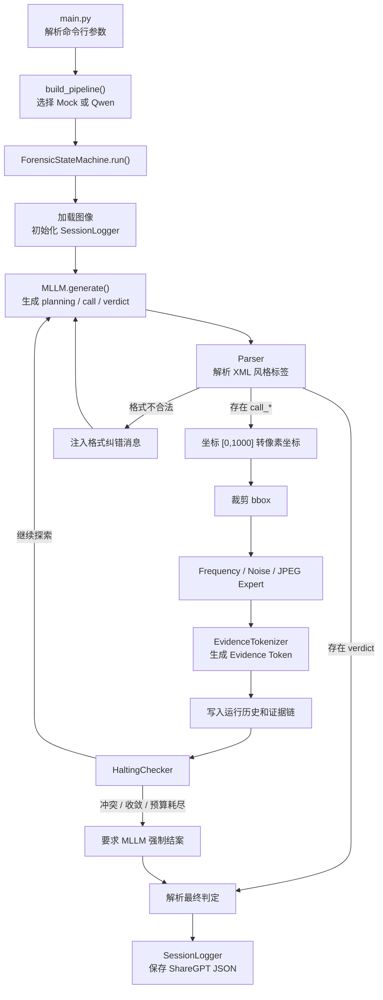
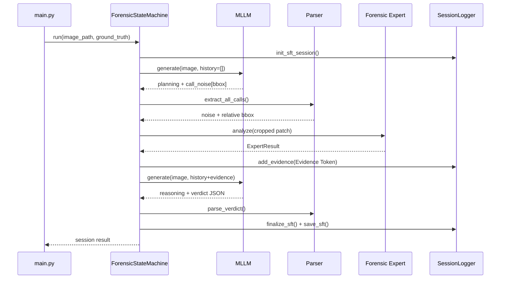

# Forensic-Agent 当前程序框架与运行逻辑

本文档描述当前仓库中已经实现的程序结构、单次图像分析流程、已确认缺陷和参考论文带来的架构依据，主要面向人工代码审计与项目交接。内容以当前源码为准；所有尚未实施的工作、依赖顺序和验收门槛统一维护在 `plan.md`，本文档不再作为执行计划。

## 1. 程序定位

Forensic-Agent 是一个由多模态大语言模型（MLLM）主动调度法证专家的图像真实性检测原型。

系统将 MLLM 作为高层“法官”：模型先观察图像、定位可疑区域，再通过结构化动作标签调用频域、噪声或 JPEG 专家。专家计算得到的物理指标会被转换为 Evidence Token，并重新注入模型上下文。模型结合视觉观察和物理证据进行多轮推理，最终输出 `Real`、`Fake` 或 `Uncertain` 判定及法证报告。

当前系统采用纯 Python `while` 循环实现状态机，不依赖 LangChain 等通用 Agent 框架。

## 2. 整体框架



## 3. 分层结构

| 层次 | 主要文件 | 核心职责 |
|------|----------|----------|
| 入口层 | `main.py` | 解析 CLI 参数，构造组件，执行单张或批量分析 |
| 配置层 | `config.py` | 保存路径、阈值、最大步数、专家参数和 System Prompt |
| 模型层 | `mllm/base.py`、`mock_client.py`、`qwen_client.py` | 提供统一 MLLM 接口，并实现 Mock 与真实 Qwen 后端 |
| 控制层 | `state_machine/controller.py` | 编排“生成—解析—调用专家—回灌证据—终止”的主循环 |
| 解析层 | `utils/parser.py` | 解析 `<planning>`、`<call_*>`、`<reasoning>` 和 `<verdict>` |
| 专家层 | `experts/` | 从图像局部区域提取频域、噪声和压缩痕迹 |
| 抽象层 | `state_machine/evidence_tokenizer.py` | 将专家结果转换为统一 Evidence Token JSON |
| 终止层 | `state_machine/halting.py` | 检查主动结案、最大步数、证据冲突和信息增益收敛 |
| 数据层 | `utils/logger.py` | 保存对话、证据链、判定结果和 SFT Trace |

## 4. 核心组件

### 4.1 CLI 与管道构建

`main.py` 是程序入口，支持以下主要参数：

```text
--image / -i    分析一张图像
--batch / -b    按数据集类别批量分析
--mllm          选择 mock 或 qwen
--mode / -m     选择 Mock 行为模式
--max / -n      限制每类批量图像数量
```

`build_pipeline()` 根据 `--mllm` 创建模型客户端，并注册三个专家：

```python
{
    "frequency_expert_v2": FrequencyExpertV2(),
    "noise_expert": NoiseExpert(),
    "jpeg_expert": JPEGExpert(),
}
```

G2-e（plan.md §4.9）后的运行时注册：频域专家为 v2，且其 `source_name` 与 v1 区分（`frequency_expert_v2`），校准查询才能命中 v2 条目；v1 标记 DEPRECATED 且不再注册，ELA 亦不注册（其 G2-b 能力为压缩历史捷径）。调用标签仍是 `<call_freq>`：`controller.EXPERT_KEY_MAP` 把 `freq → frequency_expert_v2`。

### 4.2 MLLM 抽象层

所有模型客户端继承 `BaseMLLMClient`，统一暴露：

```python
generate(image_path, history) -> str
reset() -> None
name -> str
mode -> str
```

当前有两种实现：

- `MockMLLMClient`：根据模板和轮次生成结构化响应，用于 CPU 开发和状态机测试；它不具备真实视觉理解能力。
- `QwenVLClient`：加载 Qwen2.5-VL-7B-Instruct，在 GPU 上执行真实多模态推理，并在输出格式不合法时最多重试两次。

当用户选择 `--mllm qwen` 但 CUDA 不可用时，`main.py` 当前会打印警告并自动降级为 Mock。

### 4.3 输出协议与解析器

MLLM 使用 XML 风格标签与状态机通信：

```xml
<planning>
Suspected Region: [200, 200, 800, 800]
Visual Anomalies: 描述可疑视觉现象
Expert Target & Hypothesis: 说明专家选择及假设
</planning>
<call_noise>[200, 200, 800, 800]</call_noise>
```

获得足够证据后，模型应输出：

```xml
<reasoning>
结合视觉观察和 Evidence Token 进行物理—语义一致性分析。
</reasoning>
<verdict>
{"verdict":"Fake","confidence":0.86,"primary_evidence":["noise_residual_inconsistency"],"report":"..."}
</verdict>
```

`Parser` 使用正则表达式提取标签，并对 `call_frequency`、`call_call_noise` 等常见模型标签错误进行名称归一化。`<verdict>` 内部必须能够解析为 JSON，状态机才会将其视为有效结论。

### 4.4 法证专家

三个专家都继承 `BaseExpert`，接收状态机已经裁剪好的 BGR 图像 patch，并返回 `ExpertResult`。

| 专家 | 主要算法 | 目标现象 |
|------|----------|----------|
| Frequency | Hanning 窗、2D FFT、高频局部峰值 | GAN/Diffusion 上采样产生的周期性频域结构 |
| Noise | SRM 高通残差、局部方差图、不一致性度量 | 拼接、重绘或平滑造成的微观噪声断层 |
| JPEG | 8×8 块边界梯度、DCT 系数直方图 | 块效应、双重量化和二次保存痕迹 |

`ExpertResult` 主要包含：

- `evidence_name`：证据名称；
- `phenomenon`：实际检测到的物理现象；
- `reasoning`：该现象的法证解释；
- `strength`：范围为 `[0,1]` 的异常强度；
- `source`：专家来源；
- `support`：`Real`、`Uncertain` 或 `AI-generated`；
- `raw_metric` 和 `metadata`：算法调试信息。

### 4.5 Evidence Token

`EvidenceTokenizer` 将 `ExpertResult` 转换成可注入 MLLM 上下文的 JSON（G1 后带明确坐标空间与稳定 id）：

```json
{
  "evidence_id": "E-1a2b3c4d5e",
  "evidence_name": "noise_residual_inconsistency",
  "region": "patch_coordinates_[100, 120, 500, 520]",
  "region_pixels": [100, 120, 500, 520],
  "region_normalized_1000": [200, 150, 800, 750],
  "coordinate_space": "pixels",
  "region_semantics": "diagnostic_evidence_region",
  "phenomenon": "Localized noise variance measures abnormally...",
  "reasoning": "Significant localized noise variance anomaly detected...",
  "strength": 0.763,
  "source": "noise_expert",
  "support": "AI-generated",
  "interpretation_text": "Severe statistical anomaly matching artificial generative fingerprints."
}
```

进入证据链前会经过 `EvidenceConsistencyChecker`：方向词与 strength 不一致的证据会标记 `consistency.fail` 并把 `support` 降级为 `Uncertain`。

默认强度映射为：

| strength | support | 含义 |
|----------|---------|------|
| `0.0 <= s < 0.3` | Real | 与正常相机成像统计特征一致 |
| `0.3 <= s < 0.7` | Uncertain | 存在轻微或不确定异常 |
| `0.7 <= s <= 1.0` | AI-generated | 存在显著人工生成特征 |

## 5. 单次分析的完整运行逻辑

### 5.1 启动与初始化

单张分析示例：

```bash
python main.py --image dataset/GenImage_Test/Midjourney/example.png --mllm mock
```

程序首先验证文件是否存在，然后从路径推断 ground truth：路径包含 `/Real/` 时标记为 `Real`，其他路径默认标记为 `Fake`。该标签只应作为数据集评估和 Trace 元数据使用，不应被真实检测逻辑当作输入证据。

随后创建 MLLM、三个专家和 `ForensicStateMachine`，并调用：

```python
fsm.run(image_path, ground_truth=gt)
```

状态机开始时会：

1. 调用 `mllm.reset()`；
2. 通过 OpenCV 加载图像；
3. 获取图像高度和宽度；
4. 初始化 `SessionLogger`；
5. 创建空的运行时对话历史和证据链；
6. 将步数设为零，进入主循环。

### 5.2 第一轮 MLLM 决策

状态机调用：

```python
raw_output = mllm.generate(image_path, conversation)
```

模型可以选择：

- 输出 `<planning>` 和一个或多个 `<call_*>` 请求证据；
- 输出 `<reasoning>` 和 `<verdict>` 直接结案；
- 输出不合法内容，由状态机注入纠错消息后重试。

状态机优先解析 verdict。只要输出中存在可解析且包含 `verdict` 字段的 `<verdict>`，循环立即结束；同一响应中即使还包含 `<call_*>`，这些调用也不会再执行。

### 5.3 专家调度

当模型输出合法调用时，状态机按以下流程处理每个调用：

1. `Parser.extract_all_calls()` 提取专家名称和相对 bbox；
2. `CoordinateTransformer.transform()` 将 `[0,1000]` 坐标转换为图像像素，同时保留请求的归一化坐标与 `clipped` 标记；
3. 裁剪图像 patch；
4. 根据调用名称查找对应专家并执行 `expert.analyze(patch)`；
5. 将 `ExpertResult` 转换为 Evidence Token（带稳定 `evidence_id`）；
6. `EvidenceConsistencyChecker.enforce()` 执行确定性方向检查，失败证据降级 `support`；
7. **去重**：`evidence_id` 已存在的相同结果不再进入证据链、对话或停止统计，只增加 `suppressed_duplicate_count`；
8. 唯一证据保存诊断区域裁剪图到 `traces/evidence/<session>/`，并把项目相对路径写入证据 token 与对话轮（`image_paths`）；
9. 把 Evidence Token 写入证据链，并作为新的 user 消息注入对话历史。

一轮 MLLM 输出可以包含多个专家调用。计数分开记录：`model_turn_count`（generate 调用次数）、`expert_call_count`（专家调用总次数，含重复）、`unique_evidence_count`（去重后证据数）。

### 5.4 终止判断

每轮专家调用完成后，`HaltingChecker.check()` 按优先级检查：

1. **模型主动结案**：输出了有效 `<verdict>`；
2. **预算耗尽**：`expert_call_count >= MAX_EXPERT_CALLS (5)` 或 `model_turn_count >= MAX_MODEL_TURNS (6)`（终止原因 `budget_exhausted`）；
3. **证据冲突**：证据链中同时存在 `strength > 0.7` 和 `strength < 0.3`；
4. **信息增益收敛**：最后两条**唯一**证据的 strength 差值小于当前阈值（重复证据已在上游去重，不会触发虚假收敛）。

预算耗尽或信息增益收敛时，状态机会追加预算耗尽提示，再调用一次 MLLM 生成最终 verdict。证据冲突时，则追加“疑罪从无”提示，要求模型进行双向反思并输出 `Uncertain`。

如果最终输出仍无法解析，状态机会生成兜底判定：

```json
{
  "verdict": "Uncertain",
  "confidence": 0.5,
  "report": "取证资源耗尽或分析过程异常终止。"
}
```

### 5.5 Trace 保存与返回

循环结束后，`SessionLogger` 将完整会话保存为 ShareGPT 风格 JSON，内容包括：

- Session ID 和图像路径；
- ground truth 与图像来源；
- 全部 user/gpt 对话（证据轮可携带 `image_paths` 诊断区域裁剪图）；
- Evidence Token 链（双坐标空间、`evidence_id`、一致性标记）；
- 最终 verdict；
- 元数据：图像尺寸、`halting_reason`、模型模式、G1 任务语义字段（`task_type` / `evidence_scope` / `region_semantics`）与分离计数（`model_turn_count` / `expert_call_count` / `unique_evidence_count` / `suppressed_duplicate_count` / `weighted_cost`）。

文件写入（`SessionLogger(sft_dir=...)` 可覆盖输出目录）：

```text
traces/sft_sessions/forensic_sft_session_时间_图像名.json
```

正式会话写入 `traces/sft_sessions/`（`finalize_sft_data.py` 按文件名前缀扫描该目录）；**Mock 干跑与测试必须重定向**，否则 mock session 会混入真实 trace——G2-d 干跑写入 `traces/dry_run_sessions/`，测试套件通过 `tests/conftest.py` 的 autouse fixture 写入临时目录。

状态机同时向调用者返回内存中的结果字典，`main.py` 据此打印 verdict、confidence、步数、终止原因、专家证据和 SFT 文件路径。

## 6. 运行时序示例



## 7. 当前实现边界

- Mock MLLM 用于验证控制流，不能代表真实检测准确率；
- 真实 Qwen2.5-VL 需要 CUDA 和约 16 GB FP16 显存；
- 频域专家已切换为 v2 并独立命名；v1 与 ELA 均不注册（G2-e 准入决策见 plan.md §4.9）；
- Noise/JPEG 的实测语义与直觉相反（G2-b 格式配平校准：高值指向 Real），专家文本已按实测极性改写，方向权威为 Evidence Bundle 的 `calibrated_likelihood`；
- LoRA 微调、GRPO、全数据集评估和消融实验尚未进入当前运行管道；
- 停止策略仍是固定优先级（`<verdict>` 可立即退出、info_gain 仍比较相邻 strength），重构依赖 G2 校准后的后验与工具增益（G3）；
- Expert 输出已带可靠性、校准似然、反向解释与可视化产物（G2-c）；残留问题是 strength 分带与校准分箱两套离散化不重合，需 EvidenceRectifier 统一（G3）；
- 每次运行都会生成一份 Trace（含 G1 任务语义与分离计数），可用于调试和后续 SFT 数据加工。

## 8. 主要代码阅读入口

建议按以下顺序阅读源码：

1. `main.py`：理解外部入口和组件装配；
2. `state_machine/controller.py`：理解完整控制流；
3. `utils/parser.py`：理解 MLLM 与程序的通信协议；
4. `experts/base.py` 和三个专家实现：理解物理证据来源；
5. `state_machine/evidence_tokenizer.py`：理解证据抽象；
6. `state_machine/halting.py`：理解循环退出条件；
7. `mllm/mock_client.py` 与 `mllm/qwen_client.py`：比较测试后端和真实后端；
8. `utils/logger.py`：理解 Trace 和 SFT 数据落盘方式。

## 9. 新增参考论文与项目借鉴分析

> 本节及后续论文章节只记录方法事实、与当前实现的差距和目标架构约束。具体实施顺序、资源需求与验收标准统一见 `plan.md` §4.7–§4.15。

本节保留此前第一组参考论文的对照结论。原始 PDF 当前已不在 `ref/` 目录，以下内容作为当时已完成核验的分析记录：

1. *From Pixels to Semantics: A Novel MLLM-Driven Approach for Explainable Tampered Text Detection*，ACM MM 2025，提出 TVSIP；
2. *Propose and Rectify: A Forensics-Driven MLLM Framework for Image Manipulation Localization*，IEEE TIFS 2026，提出 Propose-Rectify。

两篇论文的任务都包含图像篡改定位，而当前项目主要处理 Real/Fake/Uncertain 图像级真实性判断。因此，应借鉴它们的系统原则和验证方法，不宜把文本 OCR 或像素级分割模块不加区分地直接移植到当前代码中。

### 9.1 与当前工作的总体关系

| 维度 | 当前 Forensic-Agent | TVSIP | Propose-Rectify |
|------|----------------------|-------|-----------------|
| MLLM 角色 | 主动选择专家并生成最终 verdict | 语义定位分支 + 解释器 | 提出初始假设，不直接拥有最终裁决权 |
| 低层证据 | 三个独立专家输出标量与文本 | 专家像素掩码 | SRM、Bayar、Sobel、Noiseprint++ 特征图 |
| 融合方式 | Evidence Token 文本回灌 | 视觉掩码与语义框相加 | 分析引导门控 + 多尺度交叉注意力纠偏 |
| 空间输出 | MLLM bbox，专家分析局部 patch | OCR 校正 bbox + 像素掩码 | SAM 输出精细篡改掩码 |
| 解释约束 | reasoning 引用 Evidence Token | 对最终高亮区域进行解释 | 最终输出由法证特征纠偏后的表示产生 |
| 当前最值得借鉴 | — | 语义分支、定位—解释对齐、退化评估 | 提案—纠偏职责划分、多特征自适应验证 |

这两篇论文共同支持当前项目的基本出发点：MLLM 的语义能力和传统法证特征是互补的，单独依赖任一分支都不够可靠。不过，它们也指出当前设计的一个关键不足：专家证据不应只作为供 MLLM 自由解读的附加文本，还应对初始判断形成可验证、可校准的纠偏约束。

### 9.2 TVSIP 可以带来的启发

#### 9.2.1 将“语义异常”显式建模为第四类证据

TVSIP 的 Locator 包含低层视觉线索分支（LLVCB）和高层语义线索分支（HLSCB）。论文在第 4-5 页将 HLSCB 拆为检测、位置描述和 bbox 提取三个连续任务，再与专家掩码融合。其消融实验显示，HLSCB 单独定位能力有限，但与多个不同专家模型组合时都能提高结果；在 JPEG、缩放、噪声和模糊退化下，语义线索还能补偿低层痕迹衰减（第 7 页，表 4、表 6、表 7）。

当前项目的 `planning` 已包含视觉异常描述，但这部分没有形成独立、可审计的结构化证据。可以增加 `semantic_observation` Evidence Token，例如：

```json
{
  "evidence_name": "semantic_physical_inconsistency",
  "region": "patch_coordinates_[...]",
  "phenomenon": "主体阴影方向与场景主光源不一致",
  "reasoning": "该现象可能来自生成或局部合成，也可能由多光源环境造成",
  "strength": 0.58,
  "source": "semantic_expert",
  "support": "Uncertain"
}
```

这样可以把“MLLM 看到了什么”和“传统专家测到了什么”放入同一证据链，而不是让语义观察只存在于不可统计的自由文本中。

#### 9.2.2 分离定位器与解释器，避免定位—报告错位

TVSIP 明确区分 Locator 和 Interpreter，并要求 Interpreter 同时查看原图和标出最终可疑区域的高亮图。论文第 5 页和第 8 页的实验表明，相比仅提供非融合掩码或不提供 Locator，最终融合区域有助于检测、定位和解释保持一致。

当前项目可以先进行不依赖新模型的轻量改造：

1. 状态机汇总所有专家调用 bbox，生成一张半透明高亮图；
2. 最终结案轮同时向 Qwen 提供原图和高亮图；
3. verdict 中新增 `regions` 与 `evidence_ids`，要求每个报告结论绑定区域和证据；
4. 增加自动一致性检查：报告引用的区域必须与实际调用 bbox 具有足够 IoU。

这比仅在文本中写 `patch_coordinates_[...]` 更能帮助 MLLM 保留空间上下文，也更适合后续实现 Attention-Evidence Consistency Reward。

#### 9.2.3 借鉴框校正思想，但不直接照搬 OCR

TVSIP 使用 OCR 文本候选校正 MLLM 漂移的 bbox。这对文档篡改十分有效，但当前项目处理一般自然图像，不能直接依赖 OCR。

可迁移的是“MLLM 粗定位 + 外部结构校正”的原则。一般图像可以考虑：

- 使用 SAM 或边缘/显著性区域把粗 bbox 吸附到物体或异常边界；
- 将 bbox 扩展为多尺度区域：局部、上下文环带和全图；
- 对过小、越界、极端长宽比区域进行确定性校正；
- 在 Trace 中同时保存原始 bbox 与校正后 bbox，便于审计定位漂移。

#### 9.2.4 改进 SFT 数据结构和质量控制

TVSIP 的 TextDDLE 将输出拆成 Description、Detection、Localization、Explanation 四项，并采用 GPT-4o 生成后人工筛查；其训练采用大量合成数据预训练，再用较少真实困难样本进行 SFT（第 3-5 页）。解释又进一步拆为低层视觉线索和高层语义线索。

对当前 539 条候选训练数据及 38 条拒绝记录，可借鉴以下结构：

- 在训练响应中显式分开 `visual_observation`、`forensic_evidence`、`contamination_analysis` 和 `conclusion`；
- 训练样本同时保留“无语义异常”和“无低层异常”的合法情况，避免模型强行编造两类证据；
- 对自动生成的 reasoning 做人工抽样审核，重点删除不存在的视觉现象和错误因果关系；
- 未来扩充数据时采用“廉价合成格式训练 → 高质量真实推理 SFT”的两阶段策略。

### 9.3 Propose-Rectify 可以带来的启发

#### 9.3.1 将 MLLM 从最终法官调整为假设提出者

Propose-Rectify 最重要的原则是：MLLM 负责提出初始分析和可疑区域，最终判断必须接受正交法证证据的系统纠偏。论文强调“refinement”只是把已经正确的预测做精，而“rectification”需要验证初始推理是否可能错误（第 4 页）。

这与当前系统非常接近，但权责不同：当前专家返回 Evidence Token 后，最终 verdict 仍完全由 MLLM 自由生成。更稳健的演进方式是增加独立的 `EvidenceRectifier`：

```text
MLLM Proposal
    → 专家证据与可靠性校准
    → RectificationDecision
    → MLLM 仅负责把纠偏结果解释成人类可读报告
```

`RectificationDecision` 至少应包含：

```json
{
  "proposal": "Fake",
  "rectified_label": "Uncertain",
  "confidence": 0.54,
  "supporting_evidence": ["E1"],
  "contradicting_evidence": ["E2"],
  "reliability_context": {
    "image_format": "PNG",
    "compression_detected": false
  },
  "reason": "频域信号较弱，噪声证据受图像格式混杂影响"
}
```

该职责可以由规则与校准概率承担，也可以由学习式模块承担；无论实现形式如何，都必须防止模型无视低强度或冲突证据直接输出高置信度结论。采用顺序见 `plan.md` §4.10。

#### 9.3.2 从离散专家调用升级为分析引导的证据路由

论文的 Analysis-Informed Feature Gating 让 MLLM 分析表示查询法证特征，并分别为局部、中尺度和全局特征生成权重（第 6 页）。消融中移除门控后，检测 F1 从 0.809 降至 0.750，定位 F1 从 0.423 降至 0.360（第 11 页，表 5-6）。

当前 `<call_freq|noise|jpeg>` 已经是离散版门控，但缺少可靠性建模。目标路由至少需要表达：

- 根据图像格式、尺寸、压缩程度和 MLLM 假设计算每个专家的适用度；
- 记录 `requested_reason`、`expected_signal` 和 `reliability_weight`；
- 禁止把不同物理含义的 strength 当作可直接比较的同尺度概率；
- 使用校准后的证据似然或置信区间进行融合，而不是只使用统一的 0.3/0.7 阈值。

这能直接缓解当前 Real=JPEG、Fake=PNG 造成的 noise/jpeg 格式混杂问题。

#### 9.3.3 专家应输出多尺度空间特征，而不只是单个标量

Propose-Rectify 同时使用 SRM、Bayar、Sobel 和 Noiseprint++，并在局部、中尺度和全局三个尺度上逐步纠偏语义表示（第 4-6 页）。当前系统的三个专家主要把一个 patch 压缩为单个 `strength`，会丢失异常究竟位于 patch 内部何处的信息。

该结果说明目标 `ExpertResult` 不能只保留 `strength + phenomenon + reasoning`，还需要原始指标、可靠性、多尺度统计和空间 artifact；可学习 feature map 则属于更深层的纠偏表示。具体升级顺序与准入实验见 `plan.md` §4.9。

#### 9.3.4 像素级定位是合理的长期方向

论文通过 Enhanced Segmentation Module 对齐 SAM 语义特征和法证特征，并显式放大二者的差值与乘积响应（第 7 页）。在消融实验中，移除该模块后定位 F1 从 0.423 降至 0.403、IoU 从 0.351 降至 0.334（第 11 页）。

当前项目尚不具备像素级 GT，也主要面向 AI 生成图像的全局判断，因此现在直接训练 SAM 分支成本较高。更合适的顺序是：

1. 先保存专家 heatmap 和高亮 bbox；
2. 在具有局部篡改 mask 的数据集上单独验证定位能力；
3. 再引入 SAM 解码器和分割损失；
4. 最终联合优化图像级检测、区域级证据一致性和像素级定位。

### 9.4 研究结论与执行入口

两篇局部篡改论文共同支持以下架构结论：当前系统需要显式建模 Expert 可靠性，保留空间证据，并把 MLLM 的提案与法证纠偏分开；像素级定位是局部篡改阶段的长期能力，不是当前整图生成检测的监督目标。

原先位于本节的分阶段路线、优先级、消融、鲁棒性和跨域评测清单已迁移至 [plan.md](plan.md) 的 §4.8–§4.12。后续实现与验收以该计划为唯一基线，本文档不再维护重复待办。
### 9.5 不宜直接照搬的部分

- TVSIP 的 OCR 框校正是文本图像专用设计，一般自然图像应替换为 SAM、边缘或对象候选校正；
- Propose-Rectify 使用 8 张 RTX 4090 进行端到端训练，当前单卡环境更适合先验证规则纠偏和轻量 LoRA；
- 两篇论文主要研究局部篡改，而 GenImage 当前任务多数是整图生成，定位指标的意义需要针对数据类型重新定义；
- 深层特征融合虽然性能更强，但会降低 Evidence Token 的直接可读性。长期设计应同时保留可学习特征和人类可审计的结构化证据；
- 论文结果不能直接作为本项目性能预期，必须在格式配平、跨生成器和独立测试集上重新验证。

总体而言，最值得立即采用的不是直接增加大型分割网络，而是把当前系统从“MLLM 阅读专家分数后自由裁决”升级为“MLLM 提出假设—法证模块显式纠偏—MLLM解释纠偏结果”。这既保持当前状态机和 Evidence Token 的可解释优势，也更符合两篇论文共同验证的可靠取证范式。

## 10. 第二组参考论文：整图 AI 生成检测与解释

本节分析新加入的两篇论文：

1. [Toward Generalizable Forgery Detection and Reasoning](ref/Toward_Generalizable_Forgery_Detection_and_Reasoning.pdf)，IEEE TIP 2026，方法简称 FakeReasoning；
2. [ForenX: Towards Explainable AI-Generated Image Detection with Multimodal Large Language Models](ref/forenx.pdf)，提出 ForenX 与 ForgReason 数据集。

与第 9 节的局部篡改定位论文相比，这两篇论文直接研究“真实照片 vs 完全由生成模型产生的图像”，因此与当前 GenImage 任务更接近。它们最重要的共同结论是：通用 MLLM 的内容理解能力不能自动转化为法证能力；必须给视觉表示加入真实性约束，并同时约束检测结论与自然语言解释。

### 10.1 与当前系统的关键对照

| 维度 | 当前 Forensic-Agent | FakeReasoning | ForenX |
|------|----------------------|---------------|--------|
| 任务 | 整图 Real/Fake/Uncertain，主动调用外部专家 | 整图 Real/Fake + 分层推理 | 整图 Real/Fake + 人类可理解解释 |
| 视觉输入 | Qwen 原始视觉表示 + 专家文本 Token | 冻结 CLIP 与 DINO 双编码器 | CLIP 内容特征 + forensic prompt |
| 法证约束 | 专家 strength 通过文本回灌，无联合检测损失 | FAFF 融合 + 分类概率映射损失 | forensic projector + 辅助检测损失 |
| 结论来源 | 解析模型生成的 verdict JSON | 从固定结论位置的 real/fake token 概率映射 | LLM 输出与辅助 detector 共同训练 |
| 推理结构 | planning / call / reasoning / verdict | summary / caption / hierarchical reasoning / conclusion | 判定 + 分点证据说明 |
| 数据质量 | 原始 577 条 SFT 数据，以自动构造为主；现已自动拒绝 38 条严重伪冲突 | 机器生成后多轮专家审核 | 大规模弱标注预训练 + 2,215 张人工区域解释 |
| 泛化评估 | 尚未系统执行 | train-one-test-many，覆盖 10 类生成器 | 单源训练，跨 Diffusion/GAN 源测试 |
| 当前最值得借鉴 | — | 结论概率映射、结构化推理、CLIP+DINO 互补 | forensic prompt、辅助检测约束、两阶段数据训练 |

### 10.2 FakeReasoning 的可借鉴设计

#### 10.2.1 重新定义“定位”的含义

FakeReasoning 明确指出：对完全生成的图像而言，每个像素理论上都来自生成模型，因此传统篡改掩码或显著性定位不能直接解释“哪些像素被伪造”。这与当前项目非常相关。

当前模型仍会选择 bbox 调用专家，但这些 bbox 应被定义为：

> **诊断证据区域（diagnostic evidence region）**：包含异常纹理、结构、光照、文字或物理关系，能够支持真实性判断的区域；它不是对“篡改像素”的断言。

因此，后续 Trace、UI 和论文描述中应避免把当前 bbox 称为 forged region 或 manipulation mask。若未来混合局部篡改数据，则需要在任务元数据中显式区分 `fully_generated` 与 `locally_manipulated`。

#### 10.2.2 将自由文本 verdict 变成可校准概率

FakeReasoning 的 Classification Probability Mapper（CPM）在固定 `<CONCLUSION>` 位置找到分类 token，并把词表中 `real` 与 `fake` 的 logits 映射为二分类概率，再联合语言建模损失训练。该设计解决了“独立分类头给出一个结果，而解释文本说出另一个结果”的不一致问题。

当前系统完全依赖生成 JSON 中的 `verdict` 和模型自报 `confidence`，这两项都不是经过校准的概率。目标 `QwenVLClient` 数据流为：

```text
固定结论模板
    → 读取 Real / Fake / Uncertain 候选 token logits
    → softmax 得到 model_class_probs
    → 与 JSON verdict 交叉检查
    → 再交给 EvidenceRectifier 融合法证证据
```

对应的目标 Trace 字段为：

```json
{
  "model_class_probs": {
    "Real": 0.18,
    "Fake": 0.69,
    "Uncertain": 0.13
  },
  "text_verdict": "Fake",
  "verdict_consistent_with_logits": true
}
```

由于当前项目包含 `Uncertain`，不能直接复制论文的二分类映射；应增加第三个候选 token，或根据 Real/Fake 概率间隔及证据冲突规则派生 Uncertain。

#### 10.2.3 使用分层、可审计的推理 Schema

FakeReasoning 将输出分为 `<SUMMARY>`、`<CAPTION>`、`<REASONING>` 和 `<CONCLUSION>`，其中 reasoning 又区分低层视觉痕迹与高层语义异常。当前协议已经有 planning/reasoning/verdict，但视觉观察、专家事实和因果结论仍容易混在同一段文本中。

可将 SFT 目标改为以下结构：

```xml
<summary>说明分析目标与当前证据状态</summary>
<observation>只描述图像中可直接核验的现象</observation>
<forensic_evidence>逐条引用 Evidence ID、区域、可靠性和实际测量值</forensic_evidence>
<reasoning>区分支持、反证、替代解释和剩余不确定性</reasoning>
<verdict>{...}</verdict>
```

这里的重点不是要求模型暴露冗长思维过程，而是让最终审计记录明确区分“看见的事实”“工具测量”“解释”和“结论”。

#### 10.2.4 引入语义与局部表征互补

FakeReasoning 使用冻结的 CLIP 和 DINO ViT-L/14：CLIP 提供全局语义表示，DINO 提供更细粒度的局部视觉信息。FAFF 让 CLIP token 作为 query、DINO token 作为 key/value，并使用 DINO 高层注意力图作为交叉注意力偏置。论文消融表明该融合方向优于反向融合，高层 DINO 注意力也更有效。

对当前架构的含义是：语义线索与低层法证线索应分开表示，局部视觉特征不能长期被压缩成三个标量的文字描述。外部 Expert 与可学习 DINO/CLIP forensic token 是两种不同成本的实现路径，采用顺序见 `plan.md` §4.9 与 §4.11。

#### 10.2.5 数据审核流程比扩大数量更优先

FakeReasoning 的 MMFR 包含约 12 万张图像和 37.8 万条推理标注，覆盖 10 类生成器。其数据不是直接接受模型生成文本，而是先过滤标签不一致、低置信或格式错误样本，再由法证研究人员执行 accept/reject/unsure 审核；不确定样本进入多人复核。论文报告人工审核后平均每图推理数从 3.75 降至 3.15，约 16% 候选推理被拒绝。

这说明原始 577 条数据不能因格式正确就直接进入 LoRA。目前已自动隔离 38 条严重伪冲突，其余 539 条仍只是磁盘候选；审计分层、处置状态和 `final_v2` 准入规则见 `plan.md` §4.7 与 §4.11。

#### 10.2.6 评测解释时不能只用 BLEU/ROUGE

论文指出开放式法证推理可能存在多个有效答案，参考答案不完备、文本冗余和幻觉都会使传统文本相似度失真。其人工评估还发现模型解释具有一定模板化倾向。当前项目应以人工可核验性为主，LLM-as-a-judge 只能作为辅助，并应报告重复推理的一致率。

### 10.3 ForenX 的可借鉴设计

#### 10.3.1 把法证信号做成独立 Prompt，而非普通文字提示

ForenX 在同一个 CLIP 视觉特征上构造两条输入：content projector 保留图像内容表示，forensics projector 生成专门的 forensic prompt。后者通过辅助检测损失 `L_detection` 获得真实性约束，再映射到 LLM 的词嵌入空间。论文消融中，加入 LLM、forensics projector 和检测损失后，GenImage 平均准确率逐步从 84.7% 提升到 97.8%。

这验证了当前 Evidence Token 思路的方向，但也暴露其不足：当前 Token 只是自然语言上下文，没有被检测目标直接约束。确定性 Rectifier、专用 `<forensic_evidence>` 和连续 forensic token 分别对应规则纠偏、监督对齐和可学习表示，实施依赖见 `plan.md` §4.9–§4.11。

#### 10.3.2 检测与解释采用两阶段训练

ForenX 先在 GenImage 与 ForenSynths 上利用内容描述和检测标签进行第一阶段训练，再使用 ForgReason 做解释对齐。ForgReason 中有 2,215 张 Midjourney 写实图像的人工区域与原因标注；为防止只含假图导致过拟合，第二阶段又加入 5,000 张真实图和 1,000 张假图，共 8,215 张。

对当前架构的直接结论是：检测能力、解释对齐和跨域校准不能混成一次训练；人工标注应集中在模型—Expert 分歧、高置信错误和高写实 hard cases。实际数据阶段与门槛见 `plan.md` §4.11–§4.12。

#### 10.3.3 保留区域标注，但让总结模型受原始证据约束

ForenX 的人工流程是：先框出不合理区域并写原因，再把框的位置转换为空间描述，最后由 GPT-4 Vision 汇总。该流程说明少量 bbox 标注可显著提高解释与人类观察的一致性，也与当前专家调用 bbox 自然兼容。

不过，ForenX 的限制部分也展示了错误和模糊解释，例如把方向盘位置误判为异常、重复强调同一现象、或给出无法验证的细节。因此当前项目在自动汇总时应：

- 保留人工原始描述，不让模型汇总覆盖原标签；
- 要求每条生成解释引用一个 `evidence_id` 或 `region_id`；
- 允许输出“未发现可核验异常”，禁止为配合 Fake 标签强行编造；
- 对位置、数量、人体结构和文字内容做单独的事实核验；
- 把“无法从图像确认”作为合法的不确定性说明。

#### 10.3.4 增加提示词扰动测试

ForenX 的补充实验显示，普通微调 LLaVA 对非常轻微的 prompt 改写也可能明显掉点，而加入 forensic prompt 后对部分同义表达更稳定；但当问题改成“是否存在合成伪影”等不同任务表述时，两者都可能明显退化。

因此，单一 System Prompt 下的准确率不能代表系统稳健性；同义任务、中英文、输出顺序和 artifact/provenance 表述变化都可能改变结论。统一提示扰动协议及指标见 `plan.md` §4.12。

### 10.4 两篇论文合并后的架构约束

FakeReasoning 与 ForenX 共同说明，系统应将职责分为 MLLM Proposal、Forensic Representation、Rectification & Calibration 和 Evidence-bound Explanation。检测概率与解释必须受同一证据约束，不能继续依赖模型自报 confidence，也不能让报告文本覆盖结构化法证结论。

原先位于本节的实施优先级、训练顺序和完整评测协议已迁移至 [plan.md](plan.md) 的 §4.7–§4.13。本文仅保留论文依据与架构约束。
### 10.5 不应直接照搬的部分

- FakeReasoning 使用 13B LLaVA、双 ViT-L/14 和 8 张 A800；当前环境应先验证概率映射与数据审核，不能把其计算配置当作近期实现前提；
- ForenX 的辅助 detector 与 LLM 共同训练，而当前三个专家是不可微的外部程序，不能直接套用同一个损失函数；短期应通过 Rectifier 和 SFT 约束连接两者；
- 两篇论文均以 Real/Fake 二分类为主，当前 `Uncertain` 应保留，并通过概率间隔、证据冲突与覆盖率单独校准；
- 论文中的高准确率不能直接作为本项目预期，数据格式、训练源和测试协议不同，尤其要先排除 GenImage 的 JPEG/PNG 捷径；
- ForenX 的解释仍存在幻觉、模糊和错误事实，说明“给模型 forensic prompt”不能替代证据绑定与人工审计；
- FakeReasoning 的推理文本可能受语言分布支配，视觉模块提升检测不一定同步提升文本指标，因此训练与评测必须分别报告检测和解释结果。

总体判断：**两篇论文都支持“先保证监督可信、结论可校准、解释绑定证据，再引入更大视觉编码器”的依赖关系。** 该依赖已经固化到 `plan.md`，不在本文重复维护阶段顺序。

## 11. ForgeryVCR 对照与架构结论

本节分析 [ForgeryVCR: Visual-Centric Reasoning via Efficient Forensic Tools in MLLMs for Image Forgery Detection and Localization](ref/15.ForgeryVCR%20Visual-Centric%20Reasoning%20via%20Efficient%20Forensic%20Tools%20in%20MLLMs.pdf)。该工作使用 MLLM 主动调用 ELA、FFT、NoisePrint++ 与 Zoom-In，将不可见的低层痕迹转换为可重新输入视觉编码器的图像，再输出图像级真假结论和篡改 bbox，并用 SAM2 将 bbox 细化为像素掩码。

ForgeryVCR 与当前 Forensic-Agent 的控制流高度相似，是目前最直接支持“MLLM 主动调度外部法证工具”路线的参考工作。不过，两者的当前任务不同：本项目目前主要检测完全生成图像，ForgeryVCR 主要检测局部拼接、复制移动和移除/修补。因此，后续设计应保持同一套状态机和 Expert 接口，同时对全局生成与局部篡改使用不同的证据语义和输出目标。

### 11.1 当前全局任务与未来局部任务的统一边界

| 维度 | 当前：完全生成图像检测 | 后续：局部篡改检测与定位 |
|------|------------------------|----------------------------|
| 任务类型 | `fully_generated` | `locally_manipulated` |
| 最终标签 | Real / Fake / Uncertain | Real / Manipulated / Uncertain |
| 区域含义 | 诊断证据区域，不表示该区域才是伪造像素 | 候选篡改区域，可与真实 mask 比较 |
| 主要监督 | 图像级来源标签、生成器类型 | 图像级标签 + bbox/mask + 篡改类型 |
| 工具目标 | 判断整图生成统计特征、语义/物理异常 | 找到局部来源、压缩、噪声和边界不一致 |
| 定位指标 | Evidence coverage、区域稳定性，不使用篡改 IoU | BBox-IoU、Pixel F1、Mask IoU |
| SAM2 作用 | 不需要 | bbox 到像素 mask 的可选细化器 |

为统一任务语义，目标 Trace Schema 需要表达：

```json
{
  "task_type": "fully_generated",
  "evidence_scope": "global",
  "region_semantics": "diagnostic_evidence_region"
}
```

未来局部数据则使用：

```json
{
  "task_type": "locally_manipulated",
  "evidence_scope": "local",
  "region_semantics": "candidate_manipulation_region"
}
```

这样可以避免当前 bbox 在训练中被错误理解为篡改真值，也能在后续加入 SAM2 或分割头时保持数据兼容。

### 11.2 ForgeryVCR 对当前架构的关键证据

ForgeryVCR 的核心不是简单增加工具，而是改变工具证据进入 MLLM 的方式：

```text
当前项目：Expert → strength / explanation → Evidence Token 文本 → Qwen
ForgeryVCR：Tool → ELA/FFT/NPP 可视化图 → 视觉编码器 → MLLM
论文支持的目标方向：Expert → Evidence Bundle（数值 + 可视化图 + 可靠性）→ Qwen + Rectifier
```

其消融结果显示：无 CoT 时检测 F1/ACC 为 0.7351/0.7561；仅增加文本 CoT 后下降到 0.6431/0.7215；视觉与文本并用为 0.7756/0.7711；仅使用视觉中心推理达到 0.8271/0.8261。像素定位 IoU 也从无 CoT 的 0.4357 提升到视觉中心推理的 0.5306。该结果说明低层法证痕迹如果先被压缩成语言，可能出现信息损失和语义幻觉。

因此，Evidence Token 仍应保留用于日志、规则融合和人工审计，但不应继续作为专家证据进入 Qwen 的唯一通道。

论文还给出三项对当前项目特别重要的结论：

1. **工具需要准入测试**：论文从八种候选法证描述子中只保留 ELA、FFT、NPP 和 Zoom-In；继续增加 CFA、DCT、PSCC、VAE residual 与 SRM 后理论性能上限几乎饱和；
2. **轨迹需要按样本增益生成**：只有单工具模型优于无工具基线且超过有效阈值时，该工具才进入该样本的 SFT 轨迹；
3. **SFT 只教会调用格式，RL 才改善选择策略**：论文观察到 SFT 模型倾向机械调用工具，GRPO 后会替换无效工具、删除模糊视图并减少冗余 Zoom-In。

### 11.3 对当前系统的确认结论

结合 ForgeryVCR 与本轮代码、数据审计，可以确认三个问题：

1. **Expert 输出需要升级**：现有标量与文字 Evidence Token 会丢失空间分布，不同 Expert 的 strength 也没有统一概率意义；Qwen 无法直接复核频谱、噪声残差或压缩结构。（**部分缓解**：G1 已增加确定性方向一致性门与诊断区域图回灌；条件可靠性与可视化产物仍待 G2。）
2. **停止策略需要重构**：当前固定优先级会让候选 verdict 绕过冲突检查；所谓信息增益只是相邻 strength 差，不是 KL divergence；重复 evidence 还会制造虚假收敛。（**部分缓解**：G1 已通过证据去重消除虚假收敛路径、预算改为专家调用/模型轮双计数；固定优先级与真实信息增益仍待 G3。）
3. **旧 SFT 不能直接训练**：原始 577 条中已自动拒绝 38 条伪冲突，磁盘保留 539 条候选；borderline 高度模板化，correct 抽查发现答案正确但推理错误，format 只能作为格式专用数据。（**已收口**：G0 完成后候选 509 条全部带明确处置状态、拒绝集 68 条；`final_v2` 由 G4 重新生成。）

这些是已经确认的架构诊断；括号内标注了 G0/G1 完成后的缓解状态。

### 11.4 计划入口

Expert 准入与 Evidence Bundle、坐标和证据去重、EvidenceRectifier、停止策略 v2、视觉证据回灌、SFT `final_v2`、统一评测、可选 GRPO 以及局部篡改 L1–L3 的详细步骤和阶段门槛，均已迁移至 [plan.md](plan.md) 的 §4.7–§4.15。

后续开发只更新 `plan.md` 的执行状态；本文档继续记录当前实现、已确认缺陷及论文为何支持这些设计方向，不再维护独立路线图。
