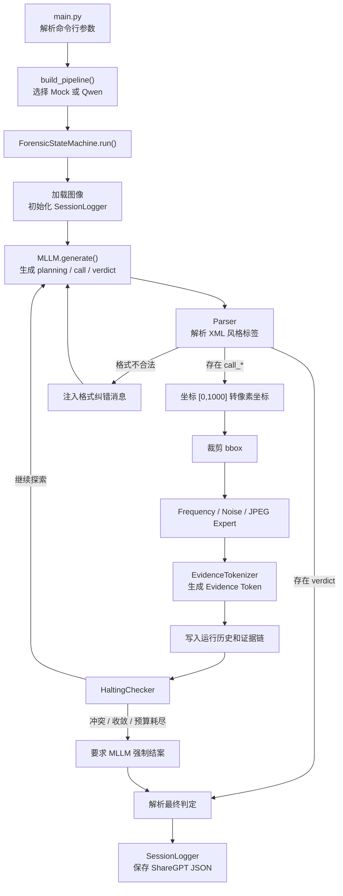
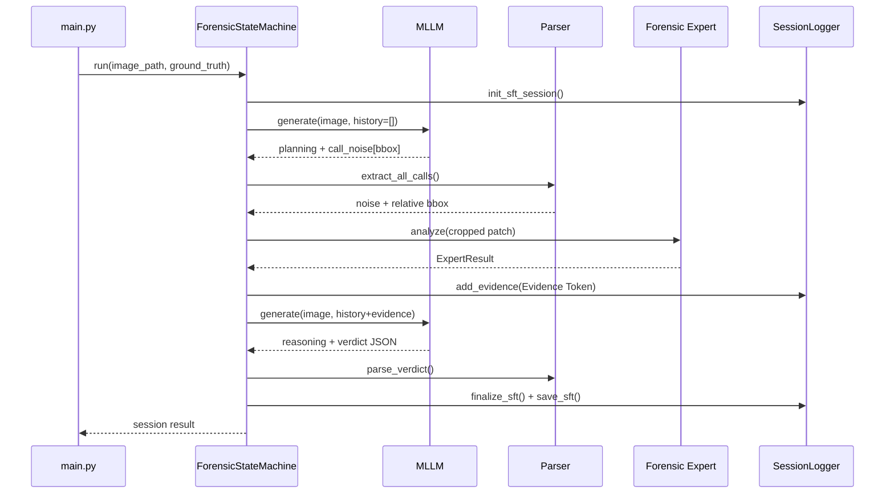
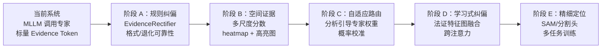

# Forensic-Agent 当前程序框架与运行逻辑

本文档描述当前仓库中已经实现的程序结构和单次图像分析流程，主要面向人工代码审计、项目交接和后续开发。内容以当前源码为准，不代表 `plan.md` 中尚未实现的 LoRA、GRPO 和全数据集评估功能。

## 1. 程序定位

Forensic-Agent 是一个由多模态大语言模型（MLLM）主动调度法证专家的图像真实性检测原型。

系统将 MLLM 作为高层“法官”：模型先观察图像、定位可疑区域，再通过结构化动作标签调用频域、噪声或 JPEG 专家。专家计算得到的物理指标会被转换为 Evidence Token，并重新注入模型上下文。模型结合视觉观察和物理证据进行多轮推理，最终输出 `Real`、`Fake` 或 `Uncertain` 判定及法证报告。

当前系统采用纯 Python `while` 循环实现状态机，不依赖 LangChain 等通用 Agent 框架。

## 2. 整体框架



## 3. 分层结构

| 层次 | 主要文件 | 核心职责 |
|------|----------|----------|
| 入口层 | `main.py` | 解析 CLI 参数，构造组件，执行单张或批量分析 |
| 配置层 | `config.py` | 保存路径、阈值、最大步数、专家参数和 System Prompt |
| 模型层 | `mllm/base.py`、`mock_client.py`、`qwen_client.py` | 提供统一 MLLM 接口，并实现 Mock 与真实 Qwen 后端 |
| 控制层 | `state_machine/controller.py` | 编排“生成—解析—调用专家—回灌证据—终止”的主循环 |
| 解析层 | `utils/parser.py` | 解析 `<planning>`、`<call_*>`、`<reasoning>` 和 `<verdict>` |
| 专家层 | `experts/` | 从图像局部区域提取频域、噪声和压缩痕迹 |
| 抽象层 | `state_machine/evidence_tokenizer.py` | 将专家结果转换为统一 Evidence Token JSON |
| 终止层 | `state_machine/halting.py` | 检查主动结案、最大步数、证据冲突和信息增益收敛 |
| 数据层 | `utils/logger.py` | 保存对话、证据链、判定结果和 SFT Trace |

## 4. 核心组件

### 4.1 CLI 与管道构建

`main.py` 是程序入口，支持以下主要参数：

```text
--image / -i    分析一张图像
--batch / -b    按数据集类别批量分析
--mllm          选择 mock 或 qwen
--mode / -m     选择 Mock 行为模式
--max / -n      限制每类批量图像数量
```

`build_pipeline()` 根据 `--mllm` 创建模型客户端，并注册三个专家：

```python
{
    "frequency_expert": FrequencyExpert(),
    "noise_expert": NoiseExpert(),
    "jpeg_expert": JPEGExpert(),
}
```

当前 CLI 主管道使用 `FrequencyExpert` v1。`experts/frequency_v2.py` 已存在，但主要用于阶段三的数据构造和实验，尚未接入 `main.py` 的默认分析管道。

### 4.2 MLLM 抽象层

所有模型客户端继承 `BaseMLLMClient`，统一暴露：

```python
generate(image_path, history) -> str
reset() -> None
name -> str
mode -> str
```

当前有两种实现：

- `MockMLLMClient`：根据模板和轮次生成结构化响应，用于 CPU 开发和状态机测试；它不具备真实视觉理解能力。
- `QwenVLClient`：加载 Qwen2.5-VL-7B-Instruct，在 GPU 上执行真实多模态推理，并在输出格式不合法时最多重试两次。

当用户选择 `--mllm qwen` 但 CUDA 不可用时，`main.py` 当前会打印警告并自动降级为 Mock。

### 4.3 输出协议与解析器

MLLM 使用 XML 风格标签与状态机通信：

```xml
<planning>
Suspected Region: [200, 200, 800, 800]
Visual Anomalies: 描述可疑视觉现象
Expert Target & Hypothesis: 说明专家选择及假设
</planning>
<call_noise>[200, 200, 800, 800]</call_noise>
```

获得足够证据后，模型应输出：

```xml
<reasoning>
结合视觉观察和 Evidence Token 进行物理—语义一致性分析。
</reasoning>
<verdict>
{"verdict":"Fake","confidence":0.86,"primary_evidence":["noise_residual_inconsistency"],"report":"..."}
</verdict>
```

`Parser` 使用正则表达式提取标签，并对 `call_frequency`、`call_call_noise` 等常见模型标签错误进行名称归一化。`<verdict>` 内部必须能够解析为 JSON，状态机才会将其视为有效结论。

### 4.4 法证专家

三个专家都继承 `BaseExpert`，接收状态机已经裁剪好的 BGR 图像 patch，并返回 `ExpertResult`。

| 专家 | 主要算法 | 目标现象 |
|------|----------|----------|
| Frequency | Hanning 窗、2D FFT、高频局部峰值 | GAN/Diffusion 上采样产生的周期性频域结构 |
| Noise | SRM 高通残差、局部方差图、不一致性度量 | 拼接、重绘或平滑造成的微观噪声断层 |
| JPEG | 8×8 块边界梯度、DCT 系数直方图 | 块效应、双重量化和二次保存痕迹 |

`ExpertResult` 主要包含：

- `evidence_name`：证据名称；
- `phenomenon`：实际检测到的物理现象；
- `reasoning`：该现象的法证解释；
- `strength`：范围为 `[0,1]` 的异常强度；
- `source`：专家来源；
- `support`：`Real`、`Uncertain` 或 `AI-generated`；
- `raw_metric` 和 `metadata`：算法调试信息。

### 4.5 Evidence Token

`EvidenceTokenizer` 将 `ExpertResult` 转换成可注入 MLLM 上下文的 JSON：

```json
{
  "evidence_name": "noise_residual_inconsistency",
  "region": "patch_coordinates_[100, 120, 500, 520]",
  "phenomenon": "Localized noise variance measures abnormally...",
  "reasoning": "Significant localized noise variance anomaly detected...",
  "strength": 0.763,
  "source": "noise_expert",
  "support": "AI-generated",
  "interpretation_text": "Severe statistical anomaly matching artificial generative fingerprints."
}
```

默认强度映射为：

| strength | support | 含义 |
|----------|---------|------|
| `0.0 <= s < 0.3` | Real | 与正常相机成像统计特征一致 |
| `0.3 <= s < 0.7` | Uncertain | 存在轻微或不确定异常 |
| `0.7 <= s <= 1.0` | AI-generated | 存在显著人工生成特征 |

## 5. 单次分析的完整运行逻辑

### 5.1 启动与初始化

单张分析示例：

```bash
python main.py --image dataset/GenImage_Test/Midjourney/example.png --mllm mock
```

程序首先验证文件是否存在，然后从路径推断 ground truth：路径包含 `/Real/` 时标记为 `Real`，其他路径默认标记为 `Fake`。该标签只应作为数据集评估和 Trace 元数据使用，不应被真实检测逻辑当作输入证据。

随后创建 MLLM、三个专家和 `ForensicStateMachine`，并调用：

```python
fsm.run(image_path, ground_truth=gt)
```

状态机开始时会：

1. 调用 `mllm.reset()`；
2. 通过 OpenCV 加载图像；
3. 获取图像高度和宽度；
4. 初始化 `SessionLogger`；
5. 创建空的运行时对话历史和证据链；
6. 将步数设为零，进入主循环。

### 5.2 第一轮 MLLM 决策

状态机调用：

```python
raw_output = mllm.generate(image_path, conversation)
```

模型可以选择：

- 输出 `<planning>` 和一个或多个 `<call_*>` 请求证据；
- 输出 `<reasoning>` 和 `<verdict>` 直接结案；
- 输出不合法内容，由状态机注入纠错消息后重试。

状态机优先解析 verdict。只要输出中存在可解析且包含 `verdict` 字段的 `<verdict>`，循环立即结束；同一响应中即使还包含 `<call_*>`，这些调用也不会再执行。

### 5.3 专家调度

当模型输出合法调用时，状态机按以下流程处理每个调用：

1. `Parser.extract_all_calls()` 提取专家名称和相对 bbox；
2. `CoordinateTransformer.relative_to_absolute()` 将 `[0,1000]` 坐标转换为图像像素；
3. `clip_bbox()` 将坐标限制到图像边界内，并保证最小裁剪尺寸；
4. `ImageUtils.crop_bbox()` 裁剪图像 patch；
5. 根据调用名称查找对应专家；
6. 执行 `expert.analyze(patch)`；
7. 将 `ExpertResult` 转换为 Evidence Token；
8. 把 Evidence Token 写入证据链，并作为新的 user 消息注入对话历史。

一轮 MLLM 输出可以包含多个专家调用。当前 `step` 在处理完该轮所有调用后只增加一次，因此它表示“包含专家调用的模型轮数”，不严格等于专家调用总次数。

### 5.4 终止判断

每轮专家调用完成后，`HaltingChecker.check()` 按优先级检查：

1. **模型主动结案**：输出了有效 `<verdict>`；
2. **最大步数**：`step >= MAX_STEPS`，当前默认上限为 5；
3. **证据冲突**：证据链中同时存在 `strength > 0.7` 和 `strength < 0.3`；
4. **信息增益收敛**：最后两条证据的 strength 差值小于当前阈值。

最大步数或信息增益收敛时，状态机会追加预算耗尽提示，再调用一次 MLLM 生成最终 verdict。证据冲突时，则追加“疑罪从无”提示，要求模型进行双向反思并输出 `Uncertain`。

如果最终输出仍无法解析，状态机会生成兜底判定：

```json
{
  "verdict": "Uncertain",
  "confidence": 0.5,
  "report": "取证资源耗尽或分析过程异常终止。"
}
```

### 5.5 Trace 保存与返回

循环结束后，`SessionLogger` 将完整会话保存为 ShareGPT 风格 JSON，内容包括：

- Session ID 和图像路径；
- ground truth 与图像来源；
- 全部 user/gpt 对话；
- Evidence Token 链；
- 最终 verdict；
- 图像尺寸、总步数、终止原因和模型模式。

文件写入：

```text
traces/sft_sessions/forensic_sft_session_时间_图像名.json
```

状态机同时向调用者返回内存中的结果字典，`main.py` 据此打印 verdict、confidence、步数、终止原因、专家证据和 SFT 文件路径。

## 6. 运行时序示例



## 7. 当前实现边界

- Mock MLLM 用于验证控制流，不能代表真实检测准确率；
- 真实 Qwen2.5-VL 需要 CUDA 和约 16 GB FP16 显存；
- 当前默认主管道仍使用 Frequency Expert v1；
- Noise/JPEG 信号会受到 Real JPEG、Fake PNG 数据格式差异影响；
- LoRA 微调、GRPO、全数据集评估和消融实验尚未进入当前运行管道；
- 每次运行都会生成一份 Trace，可用于调试和后续 SFT 数据加工。

## 8. 主要代码阅读入口

建议按以下顺序阅读源码：

1. `main.py`：理解外部入口和组件装配；
2. `state_machine/controller.py`：理解完整控制流；
3. `utils/parser.py`：理解 MLLM 与程序的通信协议；
4. `experts/base.py` 和三个专家实现：理解物理证据来源；
5. `state_machine/evidence_tokenizer.py`：理解证据抽象；
6. `state_machine/halting.py`：理解循环退出条件；
7. `mllm/mock_client.py` 与 `mllm/qwen_client.py`：比较测试后端和真实后端；
8. `utils/logger.py`：理解 Trace 和 SFT 数据落盘方式。

## 9. 新增参考论文与项目借鉴分析

本节对照以下两篇本地参考论文：

1. [From Pixels to Semantics: A Novel MLLM-Driven Approach for Explainable Tampered Text Detection](ref/From%20Pixels%20to%20Semantics%20A%20Novel%20%7BMLLM%7D-Driven%20Approach%20for%20Explainable%20Tampered%20Text%20Detection.pdf)，ACM MM 2025，提出 TVSIP；
2. [Propose and Rectify: A Forensics-Driven MLLM Framework for Image Manipulation Localization](ref/Propose_and_Rectify_A_Forensics-Driven_MLLM_Framework_for_Image_Manipulation_Localization.pdf)，IEEE TIFS 2026，提出 Propose-Rectify。

两篇论文的任务都包含图像篡改定位，而当前项目主要处理 Real/Fake/Uncertain 图像级真实性判断。因此，应借鉴它们的系统原则和验证方法，不宜把文本 OCR 或像素级分割模块不加区分地直接移植到当前代码中。

### 9.1 与当前工作的总体关系

| 维度 | 当前 Forensic-Agent | TVSIP | Propose-Rectify |
|------|----------------------|-------|-----------------|
| MLLM 角色 | 主动选择专家并生成最终 verdict | 语义定位分支 + 解释器 | 提出初始假设，不直接拥有最终裁决权 |
| 低层证据 | 三个独立专家输出标量与文本 | 专家像素掩码 | SRM、Bayar、Sobel、Noiseprint++ 特征图 |
| 融合方式 | Evidence Token 文本回灌 | 视觉掩码与语义框相加 | 分析引导门控 + 多尺度交叉注意力纠偏 |
| 空间输出 | MLLM bbox，专家分析局部 patch | OCR 校正 bbox + 像素掩码 | SAM 输出精细篡改掩码 |
| 解释约束 | reasoning 引用 Evidence Token | 对最终高亮区域进行解释 | 最终输出由法证特征纠偏后的表示产生 |
| 当前最值得借鉴 | — | 语义分支、定位—解释对齐、退化评估 | 提案—纠偏职责划分、多特征自适应验证 |

这两篇论文共同支持当前项目的基本出发点：MLLM 的语义能力和传统法证特征是互补的，单独依赖任一分支都不够可靠。不过，它们也指出当前设计的一个关键不足：专家证据不应只作为供 MLLM 自由解读的附加文本，还应对初始判断形成可验证、可校准的纠偏约束。

### 9.2 TVSIP 可以带来的启发

#### 9.2.1 将“语义异常”显式建模为第四类证据

TVSIP 的 Locator 包含低层视觉线索分支（LLVCB）和高层语义线索分支（HLSCB）。论文在第 4-5 页将 HLSCB 拆为检测、位置描述和 bbox 提取三个连续任务，再与专家掩码融合。其消融实验显示，HLSCB 单独定位能力有限，但与多个不同专家模型组合时都能提高结果；在 JPEG、缩放、噪声和模糊退化下，语义线索还能补偿低层痕迹衰减（第 7 页，表 4、表 6、表 7）。

当前项目的 `planning` 已包含视觉异常描述，但这部分没有形成独立、可审计的结构化证据。可以增加 `semantic_observation` Evidence Token，例如：

```json
{
  "evidence_name": "semantic_physical_inconsistency",
  "region": "patch_coordinates_[...]",
  "phenomenon": "主体阴影方向与场景主光源不一致",
  "reasoning": "该现象可能来自生成或局部合成，也可能由多光源环境造成",
  "strength": 0.58,
  "source": "semantic_expert",
  "support": "Uncertain"
}
```

这样可以把“MLLM 看到了什么”和“传统专家测到了什么”放入同一证据链，而不是让语义观察只存在于不可统计的自由文本中。

#### 9.2.2 分离定位器与解释器，避免定位—报告错位

TVSIP 明确区分 Locator 和 Interpreter，并要求 Interpreter 同时查看原图和标出最终可疑区域的高亮图。论文第 5 页和第 8 页的实验表明，相比仅提供非融合掩码或不提供 Locator，最终融合区域有助于检测、定位和解释保持一致。

当前项目可以先进行不依赖新模型的轻量改造：

1. 状态机汇总所有专家调用 bbox，生成一张半透明高亮图；
2. 最终结案轮同时向 Qwen 提供原图和高亮图；
3. verdict 中新增 `regions` 与 `evidence_ids`，要求每个报告结论绑定区域和证据；
4. 增加自动一致性检查：报告引用的区域必须与实际调用 bbox 具有足够 IoU。

这比仅在文本中写 `patch_coordinates_[...]` 更能帮助 MLLM 保留空间上下文，也更适合后续实现 Attention-Evidence Consistency Reward。

#### 9.2.3 借鉴框校正思想，但不直接照搬 OCR

TVSIP 使用 OCR 文本候选校正 MLLM 漂移的 bbox。这对文档篡改十分有效，但当前项目处理一般自然图像，不能直接依赖 OCR。

可迁移的是“MLLM 粗定位 + 外部结构校正”的原则。一般图像可以考虑：

- 使用 SAM 或边缘/显著性区域把粗 bbox 吸附到物体或异常边界；
- 将 bbox 扩展为多尺度区域：局部、上下文环带和全图；
- 对过小、越界、极端长宽比区域进行确定性校正；
- 在 Trace 中同时保存原始 bbox 与校正后 bbox，便于审计定位漂移。

#### 9.2.4 改进 SFT 数据结构和质量控制

TVSIP 的 TextDDLE 将输出拆成 Description、Detection、Localization、Explanation 四项，并采用 GPT-4o 生成后人工筛查；其训练采用大量合成数据预训练，再用较少真实困难样本进行 SFT（第 3-5 页）。解释又进一步拆为低层视觉线索和高层语义线索。

对当前 577 条数据，可借鉴以下结构：

- 在训练响应中显式分开 `visual_observation`、`forensic_evidence`、`contamination_analysis` 和 `conclusion`；
- 训练样本同时保留“无语义异常”和“无低层异常”的合法情况，避免模型强行编造两类证据；
- 对自动生成的 reasoning 做人工抽样审核，重点删除不存在的视觉现象和错误因果关系；
- 未来扩充数据时采用“廉价合成格式训练 → 高质量真实推理 SFT”的两阶段策略。

### 9.3 Propose-Rectify 可以带来的启发

#### 9.3.1 将 MLLM 从最终法官调整为假设提出者

Propose-Rectify 最重要的原则是：MLLM 负责提出初始分析和可疑区域，最终判断必须接受正交法证证据的系统纠偏。论文强调“refinement”只是把已经正确的预测做精，而“rectification”需要验证初始推理是否可能错误（第 4 页）。

这与当前系统非常接近，但权责不同：当前专家返回 Evidence Token 后，最终 verdict 仍完全由 MLLM 自由生成。更稳健的演进方式是增加独立的 `EvidenceRectifier`：

```text
MLLM Proposal
    → 专家证据与可靠性校准
    → RectificationDecision
    → MLLM 仅负责把纠偏结果解释成人类可读报告
```

`RectificationDecision` 至少应包含：

```json
{
  "proposal": "Fake",
  "rectified_label": "Uncertain",
  "confidence": 0.54,
  "supporting_evidence": ["E1"],
  "contradicting_evidence": ["E2"],
  "reliability_context": {
    "image_format": "PNG",
    "compression_detected": false
  },
  "reason": "频域信号较弱，噪声证据受图像格式混杂影响"
}
```

短期可以用规则和校准概率实现，不必立即训练神经网络。这样能防止模型无视低强度或冲突证据，直接输出高置信度结论。

#### 9.3.2 从离散专家调用升级为分析引导的证据路由

论文的 Analysis-Informed Feature Gating 让 MLLM 分析表示查询法证特征，并分别为局部、中尺度和全局特征生成权重（第 6 页）。消融中移除门控后，检测 F1 从 0.809 降至 0.750，定位 F1 从 0.423 降至 0.360（第 11 页，表 5-6）。

当前 `<call_freq|noise|jpeg>` 已经是离散版门控，但缺少可靠性建模。可以把路由从“调用/不调用”扩展为：

- 根据图像格式、尺寸、压缩程度和 MLLM 假设计算每个专家的适用度；
- 记录 `requested_reason`、`expected_signal` 和 `reliability_weight`；
- 禁止把不同物理含义的 strength 当作可直接比较的同尺度概率；
- 使用校准后的证据似然或置信区间进行融合，而不是只使用统一的 0.3/0.7 阈值。

这能直接缓解当前 Real=JPEG、Fake=PNG 造成的 noise/jpeg 格式混杂问题。

#### 9.3.3 专家应输出多尺度空间特征，而不只是单个标量

Propose-Rectify 同时使用 SRM、Bayar、Sobel 和 Noiseprint++，并在局部、中尺度和全局三个尺度上逐步纠偏语义表示（第 4-6 页）。当前系统的三个专家主要把一个 patch 压缩为单个 `strength`，会丢失异常究竟位于 patch 内部何处的信息。

建议逐步扩展 `ExpertResult`：

```text
现有：strength + phenomenon + reasoning
下一步：增加 raw_metric、reliability、scale_scores
再下一步：增加 heatmap_path / mask_path / region_statistics
长期：保留可学习的 feature map，进入跨注意力纠偏模块
```

其中 Sobel 边界和多尺度 SRM 可以先用 CPU 实现；Bayar 约束卷积和 Noiseprint++ 属于需要训练或加载权重的后续模块。

#### 9.3.4 像素级定位是合理的长期方向

论文通过 Enhanced Segmentation Module 对齐 SAM 语义特征和法证特征，并显式放大二者的差值与乘积响应（第 7 页）。在消融实验中，移除该模块后定位 F1 从 0.423 降至 0.403、IoU 从 0.351 降至 0.334（第 11 页）。

当前项目尚不具备像素级 GT，也主要面向 AI 生成图像的全局判断，因此现在直接训练 SAM 分支成本较高。更合适的顺序是：

1. 先保存专家 heatmap 和高亮 bbox；
2. 在具有局部篡改 mask 的数据集上单独验证定位能力；
3. 再引入 SAM 解码器和分割损失；
4. 最终联合优化图像级检测、区域级证据一致性和像素级定位。

### 9.4 推荐的项目演进路径



建议优先级如下：

| 优先级 | 建议 | 原因 | GPU |
|--------|------|------|-----|
| P0 | 修复 Qwen 多轮图像历史并引入 `EvidenceRectifier` | 保证主管道逻辑正确，防止 MLLM 无视证据 | 否 |
| P0 | 为专家增加格式/退化条件下的可靠性字段 | 直接处理当前 JPEG/PNG 混杂 | 否 |
| P1 | 保存专家 raw metric、多尺度分数和 heatmap | 避免空间证据被压缩成单个标量 | 否/可选 |
| P1 | 最终轮输入原图 + 可疑区域高亮图 | 提高定位—解释一致性 | Qwen 推理需要 |
| P1 | 扩充 SFT Schema 并抽样人工复核 | 降低自动 reasoning 幻觉和错误因果 | 否 |
| P2 | 加入 Sobel/Bayar/Noiseprint++ 并学习门控 | 获得更强、多样的法证表征 | 是 |
| P3 | 引入 SAM 和检测/分割联合训练 | 将系统扩展到局部篡改定位 | 是，且需要 mask 数据 |

### 9.5 建议增加的实验

两篇论文都通过消融、跨域和退化实验来证明语义—法证融合确实有效。当前项目后续评估至少应包含：

#### 消融实验

- MLLM only；
- MLLM + 单专家；
- 当前三专家 Evidence Token；
- 三专家 + 规则 `EvidenceRectifier`；
- 加入语义 Evidence Token；
- 加入多尺度证据和高亮图；
- Frequency v1 与 v2 对比。

#### 鲁棒性实验

- JPEG 不同质量；
- 图像缩放；
- 高斯模糊与高斯噪声；
- 亮度、对比度和暗化；
- PNG/JPEG 格式配平后的重新评估。

#### 泛化与可信度指标

- 按 ADM、BigGAN、Glide、Midjourney、SD14、SD15、VQDM、Wukong 分模型报告；
- 使用“留一生成器”进行跨生成器测试；
- 除 Accuracy/F1 外，报告 ECE、Brier Score 和 Uncertain 覆盖率；
- 报告证据—结论一致率、区域 IoU、平均专家调用数和单位图像耗时；
- 对专家可靠性按图像格式和退化类型分层统计。

### 9.6 不宜直接照搬的部分

- TVSIP 的 OCR 框校正是文本图像专用设计，一般自然图像应替换为 SAM、边缘或对象候选校正；
- Propose-Rectify 使用 8 张 RTX 4090 进行端到端训练，当前单卡环境更适合先验证规则纠偏和轻量 LoRA；
- 两篇论文主要研究局部篡改，而 GenImage 当前任务多数是整图生成，定位指标的意义需要针对数据类型重新定义；
- 深层特征融合虽然性能更强，但会降低 Evidence Token 的直接可读性。长期设计应同时保留可学习特征和人类可审计的结构化证据；
- 论文结果不能直接作为本项目性能预期，必须在格式配平、跨生成器和独立测试集上重新验证。

总体而言，最值得立即采用的不是直接增加大型分割网络，而是把当前系统从“MLLM 阅读专家分数后自由裁决”升级为“MLLM 提出假设—法证模块显式纠偏—MLLM解释纠偏结果”。这既保持当前状态机和 Evidence Token 的可解释优势，也更符合两篇论文共同验证的可靠取证范式。
