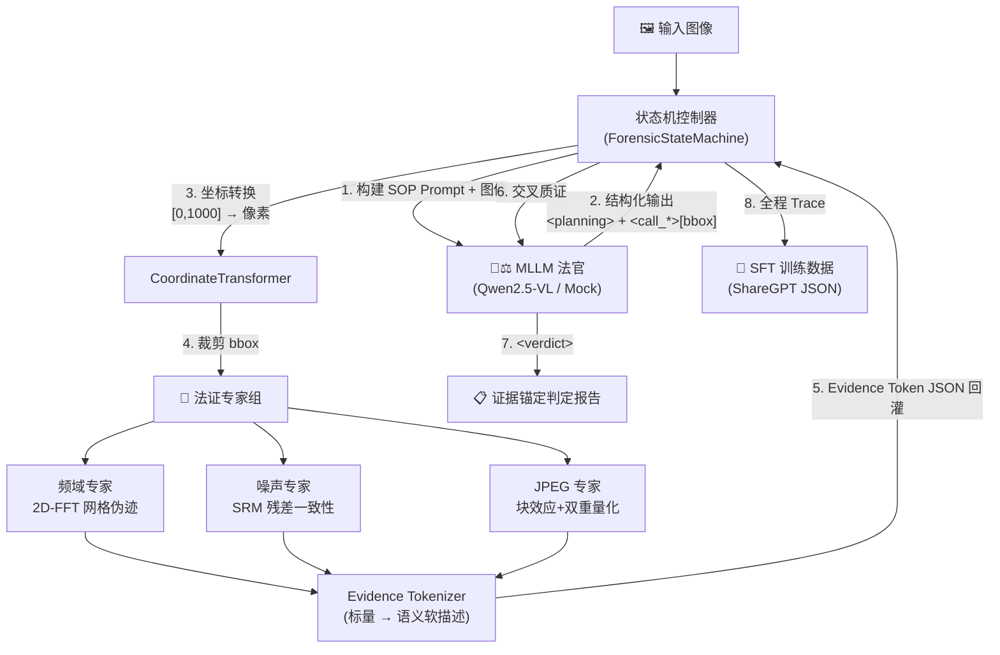
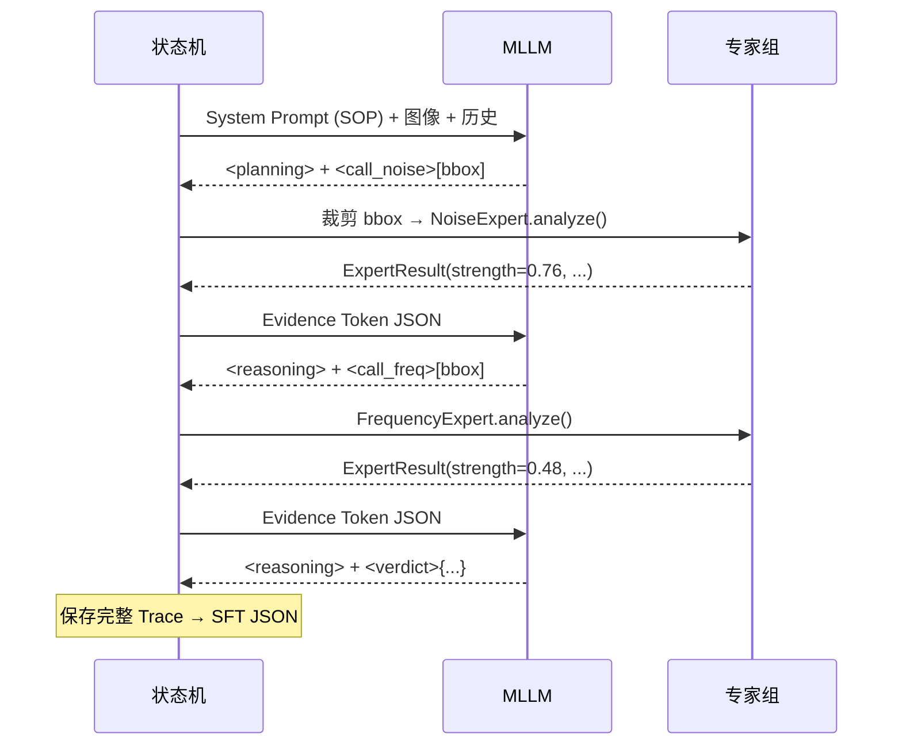

# Forensic-Agent

**主动探索型双分支图像取证系统**
MLLM 驱动、法证证据锚定的 AI 生成图像检测，输出可解释的法证报告。

[](https://www.python.org/)
[](https://pytorch.org/)
[](./LICENSE)
[](./tests/)

---

## 1. 项目概览

多模态大语言模型（MLLM，如 GPT-4o、Qwen2.5-VL）长于高层语义理解，却对频域伪迹、微观噪声分布、JPEG 压缩痕迹等底层物理法证特征处于"睁眼瞎"状态——其视觉编码器（CLIP）在下采样过程中丢弃了这些关键信息。

**本系统**将 MLLM 作为"法官"，与传统法证"专家组"结合，构建主动探索式闭环：

1. MLLM 扫描图像，锁定可疑区域（Planning）
2. 按需**主动调用**法证专家（`freq` / `noise` / `jpeg`），传入具体 bbox
3. 专家输出被抽象为结构化 **Evidence Token**（含物理现象描述 + 置信度）
4. MLLM 交叉质证全部证据，生成证据锚定的可解释真伪判定报告

> **学术差异点**：FakeXplain 教模型推理人类标注的可见伪迹，而本方法教模型推理**机器提取的法证级证据**。

**适用场景**：AIGC 图像检测、数字图像取证、可解释 AI 判定系统。当前支持单张静态图像；视频支持为后续规划（见 §7 路线图）。

---

## 2. 系统架构

### 2.1 整体数据流



### 2.2 状态机主循环



### 2.3 模块职责

| 层 | 模块 | 职责 |
|----|------|------|
| 控制 | `state_machine/controller.py` | 主循环编排：解析 → 执行专家 → 注入证据 → 终止判断 |
| 控制 | `state_machine/halting.py` | 四重终止守卫（verdict / max_steps / conflict / info_gain） |
| 控制 | `state_machine/evidence_tokenizer.py` | 标量 → 语义映射 + Evidence Token Schema 构建 |
| 模型 | `mllm/qwen_client.py` | 真实 Qwen2.5-VL 推理 + 格式纠错反馈环 |
| 模型 | `mllm/mock_client.py` | 模板驱动 Mock（4 种行为模式，CPU 测试用） |
| 专家 | `experts/frequency.py` / `frequency_v2.py` | 2D-FFT 功率谱周期峰值检测 |
| 专家 | `experts/noise.py` | SRM 高通滤波 + 局部方差不一致性 |
| 专家 | `experts/jpeg.py` | 8×8 块效应 + DCT 直方图双重量化 |
| 工具 | `utils/parser.py` | 正则解析 XML 标签 + 容错归一化 |
| 工具 | `utils/coordinate_transformer.py` | [0,1000] 相对坐标 ↔ 绝对像素坐标 |
| 工具 | `utils/logger.py` | SessionLogger（SFT Trace）+ 操作审计日志 |

---

## 3. 快速开始

### 3.1 环境要求

- Python 3.12+
- **CPU 模式**：完全可用（专家算法 + Mock MLLM 无需 GPU）
- **GPU 模式**：真实 Qwen2.5-VL 推理需 RTX 4090（24 GB）或同等显存

### 3.2 安装

```bash
pip install -r requirements.txt
```

### 3.3 数据挂载

项目假定以下数据目录已就位（见 `agent.md` §4）：

```
dataset/
├── Real/                    # 1000 张真实照片 (JPEG)
└── GenImage_Test/           # 8000 张 AI 生成图 (PNG)，8 个子目录
    ├── ADM/  BigGAN/  Glide/  Midjourney/
    └── SD14/ SD15/    VQDM/   Wukong/
```

### 3.4 模型资产

| 项目 | 路径 / 说明 |
|------|-------------|
| 模型 | Qwen2.5-VL-7B-Instruct（16.6 GB，5 × safetensors） |
| 路径 | `/root/autodl-tmp/psychology_video_project/models/models/qwen--Qwen2.5-VL-7B-Instruct/snapshots/master` |
| 配置 | `config.py` → `QWEN_MODEL_PATH` |
| 显存 | FP16 ~16 GB（RTX 4090 可承载） |

> ⚠️ 加载模型权重前必须获得用户 GPU 授权（见 `agent.md` §3.2）。

### 3.5 单张图像分析

```bash
# CPU 模式（Mock MLLM）
python main.py --image dataset/GenImage_Test/Midjourney/0_midjourney_169.png

# GPU 模式（真实 Qwen2.5-VL）
python main.py --image dataset/GenImage_Test/Midjourney/0_midjourney_169.png --mllm qwen
```

### 3.6 批量分析

```bash
python main.py --batch Real --max 5          # Real 子集（限 5 张）
python main.py --batch Midjourney            # 全部 Midjourney
python main.py --batch all --max 10          # 全部类别，每类 10 张
```

### 3.7 Mock 行为模式（CPU 调试）

```bash
python main.py --image path/to/img.png --mode fast_verdict   # 2 轮快速结案
python main.py --image path/to/img.png --mode two_calls      # 2 轮均衡（默认）
python main.py --image path/to/img.png --mode explore_all    # 遍历 3 个专家
python main.py --image path/to/img.png --mode conflict       # 制造证据冲突
```

### 3.8 运行测试

```bash
pytest tests/ -v              # 运行当前测试集
pytest tests/test_pipeline.py # 仅端到端测试
```

---

## 4. 工程目录

```
innovation_project/
├── main.py                         # CLI 入口（--image / --batch / --mllm / --mode）
├── config.py                       # 集中配置：路径、阈值、System Prompt、sigmoid 参数
├── requirements.txt                # 依赖清单
│
├── experts/                        # 法证专家模块（纯 CPU）
│   ├── base.py                     # BaseExpert 抽象类 + ExpertResult 数据结构
│   ├── frequency.py                # 2D-FFT 功率谱峰值检测（v1）
│   ├── frequency_v2.py             # 多尺度 FFT（全图 + 50% 降采样，v2）
│   ├── noise.py                    # SRM 高通滤波 + 局部方差不一致性
│   └── jpeg.py                     # 块效应度量 + DCT 双重量化检测
│
├── mllm/                           # MLLM 客户端抽象层
│   ├── base.py                     # BaseMLLMClient 抽象接口
│   ├── mock_client.py              # 模板驱动 Mock（4 种行为模式，CPU）
│   └── qwen_client.py              # 真实 Qwen2.5-VL 客户端（GPU）+ 格式纠错环
│
├── state_machine/                  # 状态机核心
│   ├── controller.py               # 主循环：解析→执行专家→Evidence Token 注入→终止
│   ├── halting.py                  # 四重终止守卫（verdict/max_steps/conflict/info_gain）
│   └── evidence_tokenizer.py       # ExpertResult → Evidence Token Schema JSON
│
├── utils/                          # 工具层
│   ├── image_utils.py              # 图像加载 / 裁剪 / 灰度化 / RGBA 处理
│   ├── coordinate_transformer.py   # [0,1000] 相对 ↔ 绝对像素坐标
│   ├── parser.py                   # 正则解析器（XML 标签 + 容错归一化）
│   └── logger.py                   # SessionLogger (ShareGPT) + 操作审计日志
│
├── scripts/                        # 批处理脚本
│   ├── calibrate_experts.py        # 专家 sigmoid 参数 ROC 校准
│   ├── generate_sft_data.py        # A/B 双线 SFT 数据规模化生成（GPU）
│   ├── build_sft_data.py           # 四类 SFT 数据构造（合成）
│   ├── finalize_sft_data.py        # A 线筛选 + 数据整合 → final/
│   ├── audit_sft_conflicts.py      # 伪冲突自动隔离与拒绝集维护
│   └── audit_sft_correct.py        # correct 结构审计 + 全量处置状态标记
│
├── tests/                          # CPU 单元测试与端到端测试
├── sft_data/train/final/           # 旧版 SFT 候选集（509 条）+ 拒绝集（68 条）
├── calibration/                    # 专家校准报告
├── traces/sft_sessions/            # 管道运行的原始 Trace（ShareGPT）
└── claude_operation_log.md         # 开发操作审计日志
```

---

## 5. 接口规范（API & Schemas）

### 5.1 Evidence Token Schema

专家输出经 `EvidenceTokenizer` 抽象为统一 JSON 后注入 MLLM 上下文：

```json
{
  "evidence_name": "noise_residual_inconsistency",
  "region": "patch_coordinates_[380, 220, 720, 580]",
  "phenomenon": "Localised noise variance measures abnormally (inconsistency ratio: 3.2802). Variance collapse or inflation detected.",
  "reasoning": "Significant localised noise variance anomaly detected. Real camera sensors produce spatially homogeneous micro-noise (shot noise + PRNU)...",
  "strength": 0.7630,
  "source": "noise_expert",
  "support": "AI-generated",
  "interpretation_text": "Severe statistical anomaly matching artificial generative fingerprints."
}
```

> 当前 `final/` 是旧版数据的诊断结果，不是已经通过训练准入的最终数据。`correct` 只保证答案与 GT 一致，`borderline` 高度模板化，`format` 只能作为格式专用数据。后续在 Expert 与停止策略更新后生成独立的 `final_v2/`。

| 字段 | 类型 | 说明 |
|------|------|------|
| `evidence_name` | str | 证据标识（如 `abnormal_high_frequency_residual`） |
| `region` | str | 分析区域（绝对像素坐标） |
| `phenomenon` | str | 物理现象描述（含实测数值） |
| `reasoning` | str | **条件化**物理解释（随 strength 三段式变化） |
| `strength` | float | 归一化异常值 ∈ [0, 1] |
| `source` | str | `frequency_expert` / `noise_expert` / `jpeg_expert` |
| `support` | str | `Real` / `AI-generated` / `Uncertain` |
| `interpretation_text` | str | 语义软描述（强度映射字典） |

### 5.2 强度映射字典（Discretized Text Mapping）

| strength 区间 | support | interpretation_text |
|--------------|---------|---------------------|
| 0.0 ≤ s < 0.3 | Real | Statistical patterns align with normal hardware camera capture. |
| 0.3 ≤ s < 0.7 | Uncertain | Mild mathematical distortions noted; localized compression or blurring suspected. |
| 0.7 ≤ s ≤ 1.0 | AI-generated | Severe statistical anomaly matching artificial generative fingerprints. |

### 5.3 MLLM 输出标签协议（SOP）

| 标签 | 格式 | 说明 |
|------|------|------|
| `<planning>` | 文本块 | 必含 Suspected Region / Visual Anomalies / Expert Target & Hypothesis |
| `<call_freq\|noise\|jpeg>` | `[ymin, xmin, ymax, xmax]` | bbox 范围 [0, 1000]（对齐 Qwen2.5-VL 规范） |
| `<reasoning>` | 文本块 | 物理-语义一致性校验 + 环境污染质询 |
| `<verdict>` | JSON | 见下方 Schema |

### 5.4 Verdict Schema

```json
{
  "verdict": "Fake",
  "confidence": 0.86,
  "primary_evidence": ["noise_residual_inconsistency"],
  "report": "面部区域经法证分析确认存在显著的噪声方差塌陷（65%）..."
}
```

| 字段 | 取值 | 说明 |
|------|------|------|
| `verdict` | `Real` / `Fake` / `Uncertain` | 三分类判定 |
| `confidence` | 0.0 – 1.0 | 置信度（证据冲突时主动降低） |
| `primary_evidence` | str[] | 支撑判定的证据名称列表 |
| `report` | str | 可解释法证报告 |

### 5.5 SFT 训练数据 Schema（ShareGPT）

```json
{
  "id": "forensic_sft_session_xxx",
  "type": "correct | conflict | borderline | format",
  "ground_truth": "Fake",
  "final_verdict": { "verdict": "Fake", "confidence": 0.86, "..." : "..." },
  "conversations": [
    { "from": "user", "value": "<image>\n请分析这张图像的真实性..." },
    { "from": "gpt",  "value": "<planning>...</planning><call_noise>...</call_noise>" },
    { "from": "user", "value": "{\"evidence_name\": \"...\", \"strength\": 0.76, ...}" },
    { "from": "gpt",  "value": "<reasoning>...</reasoning><verdict>{...}</verdict>" }
  ],
  "evidence_chain": [ "..." ],
  "metadata": { "total_steps": 2, "halting_reason": "verdict_output" }
}
```

---

## 6. 法证专家与终止机制

### 6.1 三个专家

| 专家 | 算法 | 检测目标 | CPU |
|------|------|----------|-----|
| **频域专家** (`freq`) | Hanning 窗 → 2D-FFT → 功率谱 → 高频径向峰值检测 | GAN/Diffusion 上采样网格伪迹 | ✓ |
| **噪声专家** (`noise`) | SRM 5×5 高通滤波核 → 局部方差 vs 全局方差 | 拼接 / AI 局部重绘 / 边缘羽化 | ✓ |
| **JPEG 专家** (`jpeg`) | 8×8 块边界梯度比 + DCT 系数直方图"挖空"检测 | 双重 JPEG 压缩 / 二次保存痕迹 | ✓ |

> 每个专家的 `reasoning` 字段为**三段式条件化输出**：strength < 0.3 解释为何正常 → 0.3–0.7 描述模糊并建议交叉验证 → ≥ 0.7 说明为何判 AI 生成。

### 6.2 四重终止守卫

| 优先级 | 条件 | 触发逻辑 |
|--------|------|----------|
| 1 | **模型主动结案** | MLLM 输出 `<verdict>` 标签 |
| 2 | **最大步数封顶** | 专家调用 ≥ 5 轮（`config.MAX_STEPS`） |
| 3 | **证据强冲突** | 一专家强判假（strength > 0.7），另一专家强判真（strength < 0.3） |
| 4 | **信息增益收敛** | 连续两轮 Evidence Token 的 strength 变化 < 0.1 |

---

## 7. 项目进展与路线图

### 7.1 已完成

| 阶段 | 内容 | 关键产出 |
|------|------|----------|
| **一** 1.1–1.6 | 基础设施 / 工具层 / 专家算法 / MLLM 抽象 / 状态机 / 测试 | 完整 CPU 管道；阶段一基线 95 项测试通过 |
| **二** 2.1 | 真实 MLLM 接入 | `QwenVLClient`（FP16, 16.6 GB）+ 格式纠错反馈环 |
| **二** 2.2 | 专家算法校准 | ROC 网格搜索：noise sep=0.83 / jpeg sep=1.02 / freq sep=0.05 |
| **二** 2.3 | SFT 数据规模化生成 | 865 条真实 Qwen 推理 Trace（A 线 610 + B 线 255） |
| **二** 2.4 | 验证与评估 | 格式覆盖率 98%+；端到端准确率 25%（确认 SFT 必要性） |
| **三** 3.1a | SFT 数据构造 | **509 条候选训练数据**（correct 166 / conflict 143 / borderline 100 / format 100）+ 68 条拒绝记录 |
| **四** G0 | 旧 SFT 数据审计收口 | 全部旧样本获得明确处置状态（regenerate 409 / format_only 100 / rejected 68）；correct 硬拒绝 30 条；幂等审计脚本 + 16 项测试 |
| **三** 3.2 | 专家重构 | `frequency_v2.py`（多尺度 FFT）+ 四专家 reasoning 条件化修复 |

### 7.2 后续执行顺序

详细步骤、依赖和验收门槛统一见 `plan.md` §4.7–§4.15；README 仅保留当前顺序概览。

| 顺序 | 阶段 | 主要工作 | GPU |
|------|------|----------|-----|
| 1 | G0 ✅ | 旧 SFT 数据用途隔离与拒绝集收口（已完成） | 否 |
| 2 | G1 | 坐标协议、证据去重、多轮图像历史和语义一致性修复 | 否 |
| 3 | G2 | Expert 准入、条件校准和 Evidence Bundle | Qwen 对比需要 |
| 4 | G3 | EvidenceRectifier 与停止策略 v2 | 校准需要 |
| 5 | G4 | 重新生成并审核 `final_v2`，随后进行 LoRA | 是 |
| 6 | G5/G6 | 统一评测；达标后可选 GRPO | 是 |
| 7 | L1–L3 | 全局检测稳定后扩展局部篡改定位 | 是 |

### 7.3 已知局限

- **基座模型无法证推理**：未微调的 Qwen2.5-VL 端到端准确率仅 25%（Real 53% / Fake 20%）——它收到 Evidence Token 后不知如何解读，1.9 步即结案且轻信单个专家。**这正是 SFT 的核心动机。**
- **专家检测的是"格式差异"**：数据集 Real 为 JPEG、Fake 为 PNG，导致 noise/jpeg 专家的信号强度受图像格式影响大于受 AI 伪造影响。
- **频域专家信号弱**：v1 separation=0.05（无效），v2 提升至 0.24 但仍不足以独立判定。
- **旧 SFT 尚未达到训练准入**：G0 审计后 509 条候选全部获得明确处置状态（regenerate / format_only），68 条结构失效样本进入拒绝集；correct 集 166 条全部生成于专家 reasoning 修复之前，必须用修复后的专家重新生成后才能投入 LoRA。
- **停止逻辑不是真正信息增益**：当前实现比较相邻 strength，且 `<verdict>` 优先于冲突检查；重复证据可能造成虚假收敛。
- **仅支持静态图像**：无视频帧采样 / 时序一致性分析能力。

---

## 8. 维护说明（Maintenance Protocol）

### 8.1 四轨文件驱动

本项目严格遵循"文件驱动 + 小步快跑"开发规范（见 `agent.md`）：

| 文件 | 角色 | 修改时机 |
|------|------|----------|
| `active_forensic_agent_tasks.md` | 原始需求（**只读**） | 禁止修改 |
| `plan.md` | **后续工作的唯一执行计划** | 变更前先追加计划，持续更新阶段状态 |
| `claude_operation_log.md` | 操作审计日志 | 每完成一个二级小节立即追加 |
| `README.md` | 项目入口文档 | 每完成一个大节统一更新 |
| `CURRENT_PROGRAM_ARCHITECTURE.md` | 当前实现、已确认缺陷与论文架构依据 | 源码或架构事实变化时更新，不维护待办 |
| `Reasoning_Framework.md` | 早期研究动机与概念设计 | 仅作背景参考，不作为当前实现或计划 |

### 8.2 版本控制规范

- **原子化提交**：一个 Plan 小节对应一个 commit，严禁合并
- **提交信息格式**：`<type>(<scope>): <description>`（如 `feat(plan-3.1a): ...`）
- **提交前置条件**：模块通过导入验证 + 基础功能测试
- **不自动推送远端**（按 `agent.md` §5.1）

```bash
git add -A
git commit -m "feat(plan-X.Y): 描述"
```

### 8.3 测试

```bash
pytest tests/ -v                        # 当前完整测试集
pytest tests/test_pipeline.py -v        # 端到端管道
pytest tests/test_parser.py -v          # 单模块
```

### 8.4 操作日志

所有开发操作记录于 `claude_operation_log.md`（增量追加，严禁覆盖）：

```markdown
### [TIMESTAMP] - [对应 plan.md 小节编号] 任务阶段名称
* **当前操作动作**：...
* **对应计划锚点**：...
* **核心变更说明**：...
* **涉及/修改的文件清单**：...
* **执行结果与验证状态**：...
* **置信度或遗留待办（TODO）**：...
```

### 8.5 GPU 使用规范

⚠️ **加载任何模型权重或执行 GPU 任务前，必须先向用户报告算力需求并获得明确授权**（见 `agent.md` §3.2）。

---

## 9. 运行环境

基于 **AutoDL 算力云平台** 开发与测试：

- **GPU**：NVIDIA RTX 4090 (24 GB) — 按需开启
- **CPU 模式**：日常开发默认模式，零 GPU 费用
- **基础镜像**：Ubuntu 22.04 / Python 3.12 / PyTorch 2.5.1 / CUDA 12.4

---

## 10. 引用

```bibtex
@misc{forensic-agent,
  author = {HJ},
  title  = {Forensic-Agent: 主动探索型双分支图像取证系统},
  year   = {2026},
  note   = {MLLM-driven, evidence-grounded AI-generated image detection},
}
```

## 11. 许可证

MIT
