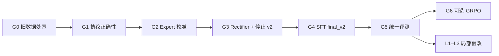

# 阶段一实现计划：主动探索型双分支图像取证系统原型

> **当前执行入口（2026-09-20）**：阶段一、二和三章节保留历史规划与已完成记录；旧的“直接使用 539 条候选数据进行 LoRA”路径已暂停。后续工作统一从 §4.7 开始，严格按 G0 → G1 → G2 → G3 → G4 → G5 的依赖顺序开展。

## Context

本项目从零构建一个"主动探索型 MLLM 图像取证系统"的原型。代码仓库当前只有设计文档（`.md`），无任何 Python 代码。阶段一目标：**在 CPU 模式下实现完整数据管道（真实专家算法 + Mock MLLM），用真实图像跑通端到端测试，并生成 SFT 训练数据**。

核心约束：无 GPU、纯 Python 状态机、操作日志增量追加。

---

## 一、目录结构

```
innovation_project/
├── main.py                         # 入口：加载配置 → 创建组件 → 运行状态机
├── config.py                       # 集中配置常量（路径、阈值、步数上限等）
├── requirements.txt                # 依赖清单
├── claude_operation_log.md         # 操作日志（已存在空文件，增量追加）
│
├── experts/                        # 法证专家模块
│   ├── __init__.py
│   ├── base.py                     # BaseExpert 抽象类 + ExpertResult dataclass
│   ├── frequency.py                # 2D-FFT 频域网格伪迹检测
│   ├── noise.py                    # SRM 高通滤波噪声残差分析
│   └── jpeg.py                     # JPEG 块效应 + DCT 直方图分析
│
├── mllm/                           # MLLM 客户端抽象层
│   ├── __init__.py
│   ├── base.py                     # BaseMLLMClient 抽象接口
│   └── mock_client.py             # 模板驱动的 Mock（按图像来源+轮次生成响应）
│
├── state_machine/                  # 状态机核心
│   ├── __init__.py
│   ├── controller.py              # 核心循环：解析→执行专家→Evidence Token→回传
│   ├── halting.py                 # 三重拦截守卫 + 信息熵/KL 散度计算
│   └── evidence_tokenizer.py      # 标量→语义描述映射 + Evidence Token Schema 构建
│
├── utils/                          # 工具层
│   ├── __init__.py
│   ├── parser.py                  # 正则解析器：抓取 <planning>/<call_*>/<reasoning>/<verdict>
│   ├── coordinate_transformer.py  # 相对坐标 [0,1000] → 绝对像素坐标
│   ├── image_utils.py            # 图像加载、bbox 裁剪、格式转换
│   └── logger.py                 # Trace Logger (ShareGPT 格式) + 操作日志追加
│
├── tests/                          # 测试
│   ├── __init__.py
│   ├── conftest.py                # Pytest fixtures（合成图像、Mock 配置）
│   ├── test_parser.py
│   ├── test_coordinate_transformer.py
│   ├── test_image_utils.py
│   ├── test_frequency_expert.py
│   ├── test_noise_expert.py
│   ├── test_jpeg_expert.py
│   ├── test_evidence_tokenizer.py
│   ├── test_halting.py
│   ├── test_mock_mllm.py
│   ├── test_controller.py
│   └── test_pipeline.py          # 端到端管道测试（Real + GenImage 各 2 张图）
│
└── traces/                         # SFT 训练数据输出目录
    └── sft_sessions/              # 每次运行生成一个 ShareGPT JSON 文件
```

---

## 二、核心类/接口设计

### 2.1 专家模块 (`experts/`)

```python
# experts/base.py
@dataclass
class ExpertResult:
    """专家分析结果，直接映射到 Evidence Token Schema"""
    evidence_name: str          # e.g. "abnormal_high_frequency_residual"
    region: str                 # e.g. "patch_coordinates_[210,150,480,420]"
    phenomenon: str             # 物理现象描述
    reasoning: str              # 物理原理
    strength: float             # 归一化异常值 [0, 1]
    source: str                 # "frequency_expert" | "noise_expert" | "jpeg_expert"
    support: str                # "AI-generated" | "Real" | "Uncertain"
    interpretation_text: str    # 语义软描述

class BaseExpert(ABC):
    @abstractmethod
    def analyze(self, img_np: np.ndarray, bbox: list[int]) -> ExpertResult:
        """入参：BGR numpy 数组 + 绝对像素坐标 [ymin, xmin, ymax, xmax]"""
        ...
```

三个具体实现：

- **`FrequencyExpert`** — 裁剪 bbox → 灰度化 → Hanning 窗 → 2D-FFT → 功率谱 → 高频径向平均 → 峰值检测 → 归一化
- **`NoiseExpert`** — 裁剪 bbox → SRM 5×5 高通滤波核卷积 → 局部噪声方差 vs 全局背景方差 → 断层程度归一化
- **`JPEGExpert`** — 裁剪 bbox → 8×8 块效应强度 (Blockiness) → DCT 系数直方图 → 双重量化痕迹检测

### 2.2 MLLM 客户端 (`mllm/`)

```python
# mllm/base.py
class BaseMLLMClient(ABC):
    @abstractmethod
    def generate(self, prompt: str, image_path: str,
                 history: list[dict]) -> str:
        """返回 MLLM 的原始文本输出（含 XML 标签）"""
        ...

# mllm/mock_client.py
class MockMLLMClient(BaseMLLMClient):
    """模板驱动 Mock：根据图像来源（real/fake）和对话轮次返回预设响应"""
    MODES = ["fast_verdict", "two_calls", "explore_all", "conflict"]
    def __init__(self, mode: str = "two_calls", seed: int = 42):
        ...
```

Mock 行为模式：

| 模式 | Turn 0 | Turn 1 | Turn 2+ | 用途 |
|------|--------|--------|---------|------|
| `fast_verdict` | planning + verdict（real）或 +1 call（fake） | reasoning + verdict | N/A | 测试快速结案路径 |
| `two_calls` | planning + 1 call | reasoning + 另1 call 或 verdict | verdict | 默认均衡测试 |
| `explore_all` | planning + 2 calls | reasoning + 2 calls | 持续至 max steps | 测试强制终止路径 |
| `conflict` | planning + call_freq | reasoning + call_noise | conflict → Uncertain | 测试证据冲突路径 |

### 2.3 状态机 (`state_machine/`)

```python
# state_machine/controller.py
class ForensicStateMachine:
    def __init__(self, mllm_client, experts, parser, tokenizer, halting, logger):
        ...
    def run(self, image_path: str, ground_truth: str = None) -> dict:
        """主循环，返回完整 Session 记录"""
        # 1. 加载图像 → conversation 初始化（含 System Prompt SOP 约束）
        # 2. while step < max_steps:
        #    a. MLLM.generate() → raw output
        #    b. Parser 提取 planning / call_* / reasoning / verdict
        #    c. if verdict → break
        #    d. if call_* → CoordinateTransformer → ImageUtils.crop → Expert.analyze
        #       → EvidenceTokenizer.build → 注入 conversation history
        #    e. HaltingChecker.check() → 可能强制终止
        # 3. Logger 保存完整 Session → SFT JSON
```

### 2.4 终止机制 (`state_machine/halting.py`)

```python
class HaltingChecker:
    def __init__(self, max_steps=5, entropy_threshold=0.3, kl_threshold=1e-3):
        ...
    def check(self, step, evidence_chain, last_output) -> (bool, str):
        """按优先级依次检查：verdict > max_steps > conflict > info_gain"""
    def _verdict_detected(self, output) -> str | None: ...
    def _max_steps_reached(self, step) -> bool: ...
    def _conflict_detected(self, evidence_chain) -> bool: ...
    def _info_gain_converged(self, evidence_chain) -> bool: ...
```

---

## 三、数据流（端到端）

```
1. 用户指定图像路径 → main.py
2. StateMachine.run(image_path)
3. Logger.init_sft_session() → 初始化 ShareGPT 数据结构
4. System Prompt 含 SOP 约束（planning/call/reasoning/verdict 格式要求）
5. 第 0 轮：MLLM.generate(system_prompt, image_path, history=[])
6. MockMLLM 返回：
   "<planning>
    Suspected Region: [200,150,400,350]
    Visual Anomalies: 边缘过于平滑
    Expert Target: freq — 检测上采样网格伪迹
    </planning>
    <call_freq>[200,150,400,350]</call_freq>"
7. Parser.extract_all_calls() → [("freq", [200,150,400,350])]
8. Parser.parse_verdict() → None → 继续
9. For each call:
   a. CoordinateTransformer.relative_to_absolute([200,150,400,350], W, H) → abs_bbox
   b. ImageUtils.crop_bbox(img, abs_bbox) → patch
   c. FrequencyExpert.analyze(patch) → ExpertResult(strength=0.82, support="AI-generated", ...)
   d. EvidenceTokenizer.tokenize(result, bbox, image_shape) → Evidence Token JSON
   e. conversation.append({"from": "user", "value": json.dumps(evidence_token)})
10. HaltingChecker.check() → (False, None) → 继续
11. 第 1 轮：MLLM.generate(prompt, image, updated_conversation)
12. MockMLLM 返回："<reasoning>...</reasoning><verdict>{"verdict":"Fake","confidence":0.92}</verdict>"
13. Parser.parse_verdict() → 提取 verdict → break
14. Logger.finalize_sft(verdict) → 保存 session JSON
15. Logger.log_operation() → 追加 claude_operation_log.md
```

---

## 四、关键设计决策

| 决策 | 选择 | 理由 |
|---|---|---|
| MLLM 接入 | 抽象接口 `BaseMLLMClient` | 当前 Mock 跑通管道，后续接真实 API 无需改状态机 |
| 状态机框架 | 纯 Python `while` 循环 | 解耦清晰，无框架依赖，符合任务书要求 |
| 专家算法 | 第一阶段即用真实算法（非 Mock） | SciPy/NumPy 纯 CPU，计算量小 |
| 坐标系统 | MLLM 输出 `[ymin, xmin, ymax, xmax]` × [0,1000] | 对齐 Qwen2.5-VL 规范 |
| BBox 顺序 | `[ymin, xmin, ymax, xmax]`（OpenCV 风格） | 与 NumPy 切片 `img[y0:y1, x0:x1]` 一致 |
| SFT 数据格式 | ShareGPT 多轮对话 JSON | 与任务文档 §7.2 Schema 对齐，可直接用于微调 |
| 图像内部格式 | BGR NumPy (OpenCV 格式) | 所有专家算法基于 OpenCV/SciPy |
| ADM RGBA 处理 | `cv2.cvtColor(img, cv2.COLOR_RGBA2RGB)` | 集中处理于 `image_utils.py` |
| 小图像 (BigGAN 128×128) | bbox clip 保证最小 16×16 | `coordinate_transformer.py` 中处理 |

---

## 五、真实专家算法设计

### 5.1 Frequency Expert

```
输入: patch (BGR numpy array)
步骤:
  1. cv2.cvtColor(patch, cv2.COLOR_BGR2GRAY) → gray
  2. gray * Hanning window → windowed
  3. np.fft.fft2(windowed) → fft_result
  4. np.fft.fftshift(fft_result) → centered
  5. power_spectrum = np.log(np.abs(centered) + 1)
  6. 高频径向平均（取外圈 50% 半径区域）
  7. 检测周期性尖峰：高频区域局部最大值超过中位数 + 3×std
  8. sigmoid 归一化 → strength ∈ [0, 1]
```

### 5.2 Noise Expert

```
输入: patch (BGR numpy array)
步骤:
  1. SRM 5×5 高通滤波核（空间富模型 kernel #1）
  2. cv2.filter2D(patch, -1, srm_kernel) → noise_residual (逐通道)
  3. 计算局部滑动窗口 (32×32) 的噪声方差
  4. 计算全局背景噪声方差
  5. 局部方差 / 全局方差 → 不一致性度量
  6. 断层程度归一化 → strength ∈ [0, 1]
```

### 5.3 JPEG Expert

```
输入: patch (BGR numpy array)
步骤:
  1. 计算水平/垂直块效应强度：
     - 检测 8×8 边界相邻像素差的周期性模式
     - B_h = mean(|I[i,8j] - I[i,8j-1]|) / mean(|I[i,j] - I[i,j-1]|)
  2. 对 8×8 块做 DCT (scipy.fft.dct)
  3. 检查 DCT 系数直方图是否有"挖空"效应（双重量化特征）
  4. 合并块效应 + 直方图异常 → 归一化 strength
```

---

## 六、Mock MLLM 模板设计

Mock 从预设模板库选择，不随机生成：

```
模板 TURN_0_REAL:
  <planning>
  Suspected Region: [250, 250, 750, 750]
  Visual Anomalies: 轻微压缩马赛克，疑似社交媒体传播痕迹
  Expert Target & Hypothesis: 拟调用 jpeg 专家，检测重压缩痕迹
  </planning>
  <call_jpeg>[250, 250, 750, 750]</call_jpeg>

模板 TURN_0_FAKE:
  <planning>
  Suspected Region: [200, 200, 800, 800]
  Visual Anomalies: 中心区域纹理过于平滑，缺乏真实相机噪点
  Expert Target & Hypothesis: 拟调用 freq 专家，生成图像在频域常有网格伪迹
  </planning>
  <call_freq>[200, 200, 800, 800]</call_freq>

模板 TURN_AFTER_EVIDENCE:
  <reasoning>
  【物理-语义一致性校验】底层 {expert_name} 反馈{evidence_strength}级异常：
  {phenomenon}——这与视觉观察到的{visual_anomaly}在因果链上吻合。
  </reasoning>
  [再调用另一个专家 或 输出 verdict]

模板 TURN_FINAL_FAKE:
  <reasoning>...</reasoning>
  <verdict>
  {"verdict": "Fake", "confidence": 0.92,
   "primary_evidence": "high_frequency_grid_artifact",
   "report": "经频域+噪声多轮法证分析，确认伪造。"}
  </verdict>

模板 CONFLICT:
  <reasoning>
  【证据冲突反思】freq 专家强判假(strength=0.9)，但 noise 专家强判真(strength=0.1)。
  底层物理痕迹出现不可调和的强冲突，不能做出确定结论。
  </reasoning>
  <verdict>
  {"verdict": "Uncertain", "confidence": 0.45,
   "report": "多项法证证据存在根本性冲突，疑罪从无。"}
  </verdict>
```

---

## 七、SFT 数据生成

每一次 `StateMachine.run()` 自动产出完整的 ShareGPT 格式多轮对话：

```json
{
  "id": "forensic_sft_20260717_001",
  "image_path": "dataset/GenImage_Test/Midjourney/0_midjourney_169.png",
  "ground_truth": "Fake",
  "source_model": "Midjourney",
  "final_verdict": {"verdict": "Fake", "confidence": 0.92, ...},
  "conversations": [
    {"from": "user", "value": "<image>\n请分析这张图像的真实性..."},
    {"from": "gpt", "value": "<planning>...</planning><call_freq>...</call_freq>"},
    {"from": "user", "value": "{\"evidence_name\":\"...\",\"strength\":0.82,...}"},
    {"from": "gpt", "value": "<reasoning>...</reasoning><verdict>...</verdict>"}
  ],
  "evidence_chain": [...],
  "metadata": {
    "image_size": [1024, 1024],
    "total_steps": 2,
    "halting_reason": "verdict_output",
    "mock_mode": "two_calls"
  }
}
```

输出路径：`traces/sft_sessions/session_{timestamp}_{image_name}.json`

---

## 八、实现顺序（依赖关系驱动）

```
阶段 1.1 ─ 基础设施（无依赖，可并行）
  ├── config.py
  ├── requirements.txt
  ├── utils/image_utils.py
  └── utils/logger.py

阶段 1.2 ─ 工具层（依赖 config）
  ├── utils/coordinate_transformer.py
  └── utils/parser.py

阶段 1.3 ─ 专家模块（依赖 base.py）
  ├── experts/base.py
  ├── experts/frequency.py    (依赖 scipy.fft)
  ├── experts/noise.py        (依赖 cv2)
  └── experts/jpeg.py         (依赖 numpy/scipy)

阶段 1.4 ─ MLLM 抽象层
  ├── mllm/base.py
  └── mllm/mock_client.py

阶段 1.5 ─ 状态机核心（依赖上述所有）
  ├── state_machine/evidence_tokenizer.py
  ├── state_machine/halting.py
  └── state_machine/controller.py

阶段 1.6 ─ 入口 + 测试
  ├── main.py
  └── tests/*
```

---

## 九、测试策略

### 单元测试
| 测试文件 | 测试内容 |
|---|---|
| `test_parser.py` | 正常/畸形 XML 标签匹配、多标签提取、verdict JSON 解析、空输入返回 None |
| `test_coordinate_transformer.py` | 往返转换精度、边界裁剪、0/1000 极值、非正方形图像 |
| `test_image_utils.py` | JPEG/PNG/RGBA 加载、bbox 裁剪、灰度转换 |
| `test_frequency_expert.py` | 合成网格图像→高 strength、均匀噪声→低 strength |
| `test_noise_expert.py` | 合成拼接图像→高 strength、自然图像→中低 strength |
| `test_jpeg_expert.py` | 单次 JPEG→低分、双重 JPEG→高分、PNG 无压缩→低分 |
| `test_evidence_tokenizer.py` | 强度映射边界（0.0/0.3/0.7/1.0）、Schema 完整性 |
| `test_halting.py` | 每种终止条件独立测试、无触发→返回 False |
| `test_mock_mllm.py` | 4 种模式 XML 结构正确、bbox 在 [0,1000] 范围、轮次追踪 |
| `test_controller.py` | 2 轮正常结案、max-step 终止、冲突终止、异常处理 |

### 端到端测试 (`test_pipeline.py`)
- Real × 2 张、Midjourney × 1 张、SD15 × 1 张
- 验证：管道不卡死、≥1 次专家调用、合法 verdict、SFT JSON 生成、操作日志追加

---

## 十、验证命令

```bash
pip install -r requirements.txt
python -m pytest tests/ -v                        # 全部测试
python -m pytest tests/test_pipeline.py -v        # 端到端
python main.py --image dataset/Real/xxx.jpg       # 单张手动运行
ls traces/sft_sessions/                           # SFT 数据检查
tail -30 claude_operation_log.md                  # 操作日志检查
```

---

## 十一、`requirements.txt`

```
numpy>=2.1.0
opencv-python>=5.0.0
scipy>=1.18.0
Pillow>=11.0.0
torch>=2.5.0
pytest>=8.0.0
```

## 十二、潜在风险与缓解

| 风险 | 缓解措施 |
|---|---|
| ADM 图像为 RGBA 256×256 | `image_utils.py` 集中处理 alpha → RGB 转换 |
| BigGAN 仅 128×128，bbox 过小 | `clip_bbox` 强制最小 16×16 |
| 不同专家归一化尺度不一致 | 各专家内部用 sigmoid 校准，而非 min-max |
| Mock MLLM 无法模拟真实视觉理解 | 测试关注 XML 结构+状态转移，不验证语义内容 |
| Parser 容错不够导致管道卡死 | 设计"格式纠错反馈环"：解析失败时注入错误提示重新生成 |

# 阶段二实现计划：真实 MLLM 接入、SFT 数据规模化与专家校准

## Context

阶段一已完成：纯 CPU 管道跑通（Mock MLLM + 真实专家算法）、95 个测试全部通过、SFT 数据生成机制就绪。

阶段二核心目标：**将 Mock MLLM 替换为真实 Qwen2.5-VL，规模化生成高质量 SFT 训练数据，校准专家算法参数，为阶段三的监督微调做好准备。**

关键变化：需要 GPU 环境（按 agent.md §2.2 规范，须先获得用户明确授权）。

---

## 一、阶段二目标

| 目标 | 阶段一状态 | 阶段二目标 |
|------|-----------|-----------|
| MLLM | Mock 模板驱动 | 真实 Qwen2.5-VL API 调用 |
| 运行环境 | 纯 CPU | GPU（RTX 4090），按需开启 |
| SFT 数据 | 机制就绪，零星生成 | 规模化生成（目标 1000+ 条） |
| 专家算法 | 基础实现，参数未校准 | Frequency 敏感度校准 + 三专家阈值对齐 |
| 行为模式 | 4 种 Mock 模板 | 真实模型的多轮 Tool-calling 行为 |
| 格式容错 | Parser 基础校验 | 真实模型的格式纠错反馈环实战验证 |

---

## 二、子阶段划分

### 2.1 真实 Qwen2.5-VL 接入

**目标**：实现 `QwenVLClient`，替换 `MockMLLMClient`，保持 `BaseMLLMClient` 接口不变。

**实现内容**：

- `mllm/qwen_client.py`：继承 `BaseMLLMClient`
  - 支持两种推理后端：
    - **A) 本地 vLLM 部署**（需要 GPU，端口 6006）
    - **B) API 调用**（DashScope / OpenAI 兼容 API）
  - 图像预处理：按 Qwen2.5-VL 规范 resize + normalize
  - 多轮对话上下文管理（System Prompt + 图像 + Evidence Token 历史）
  - 超时重试 + 格式校验自动重生成
- 更新 `mllm/__init__.py` 注册新客户端
- 更新 `main.py` 支持 `--mllm qwen` 参数切换

**格式纠错反馈环**（对应任务书 §6 防"数值懒惰"）：

- 解析 Qwen 输出 → Parser 校验
- 若缺失必要标签 → 注入纠错提示 → 重新生成（最多 2 次）
- 若 verdict JSON 格式错误 → 注入修复提示 → 重新生成
- 记录重试次数到 session metadata

**GPU 审批**：在加载模型权重前，先向用户报告预计显存占用（Qwen2.5-VL-7B ~16 GB FP16）、单张推理时间（~2-5s）、任务必要性。

### 2.2 SFT 数据规模化生成

**目标**：批量运行管道，生成高质量、多样化的 ShareGPT 训练数据。

**数据构造策略**（对应任务书 §7.2）：

- **A 线 — 正常破案流**（占总数据 70%）：
  - Real 图像 200 张 × GenImage 每类 50 张
  - 1-3 轮工具调用后成功结案
  - 覆盖 4 种行为模式的真实模型输出
- **B 线 — 拦截与冲突流**（占总数据 30%）：
  - 刻意触发 max_steps / info_gain / conflict
  - 包含系统强制终止提示词和模型的反思响应

**数据质量控制**：

- 自动过滤：verdict 缺失 / 格式不闭合 / 标签嵌套错误的样本直接丢弃
- 多样性检查：确保 3 个专家被调用的频次大致均衡
- 标注 ground truth 与 pipeline verdict 的对照表

**实现内容**：

- `scripts/generate_sft_data.py`：批量数据生成脚本
  - 支持 `--stream A` / `--stream B` / `--stream both`
  - 支持 `--num-samples 1000` 控制总量
  - 实时进度条 + 错误统计
- 输出目录结构：
  ```
  sft_data/
  ├── stream_a_normal/     # 正常破案流
  ├── stream_b_conflict/   # 拦截与冲突流
  └── metadata.json        # 数据集统计信息
  ```

### 2.3 专家算法校准

**目标**：调整三个专家的 sigmoid 参数和检测阈值，使其在真实图像上的区分度最大化。

**问题诊断**（阶段一发现）：

- Frequency Expert：在 crop 区域上 strength 普遍 < 0.05，sigmoid_midpoint 过于保守
- Noise Expert：raw_metric 范围 0.3-1.5，sigmoid_midpoint=2.0 过高，导致所有结果被压缩到 < 0.2
- JPEG Expert：行为正确——Real 图像（JPEG）的 trace 明显，GenImage 图像（PNG）无压缩痕迹

**校准方案**：

1. **基准测试集**：Real 100 张 + GenImage 每类 30 张 = 340 张
2. **全图分析**：不再局限 bbox crop，对全图运行各专家（提高 FFT 分辨率 + 噪声估计精度）
3. **ROC 分析**：在 Real vs Fake 二分类上扫描 sigmoid 参数
4. **确定最优参数**：
   - 各 sigmoid_midpoint 使 Youden 指数最大化
   - `STRENGTH_THRESHOLD_LOW/HIGH` 使三分类准确率最大化
5. 更新 `config.py` 中的默认参数

**实现内容**：

- `scripts/calibrate_experts.py`：
  - 批量运行三专家 → 收集 raw_metric 分布
  - 网格搜索最优 sigmoid/threshold 参数
  - 输出校准报告（JSON）

### 2.4 格式纠错反馈环实战验证

**目标**：验证真实 Qwen2.5-VL 的输出格式稳定性。

**验证指标**：

- 首次输出格式正确率（目标 > 85%）
- 需要纠错重试的比例
- 纠错后成功率（目标 > 98%）
- verdict JSON 可解析率

---

## 三、目录结构变更

```
innovation_project/
├── mllm/
│   └── qwen_client.py          # [NEW] 真实 Qwen2.5-VL 客户端
│
├── scripts/                     # [NEW] 批量脚本目录
│   ├── generate_sft_data.py    # SFT 数据规模化生成
│   └── calibrate_experts.py    # 专家参数校准
│
├── sft_data/                    # [NEW] 规模化 SFT 数据输出
│   ├── stream_a_normal/
│   ├── stream_b_conflict/
│   └── metadata.json
│
├── calibration/                 # [NEW] 校准结果
│   └── calibration_report.json
│
└── config.py                    # [MODIFIED] 更新校准后的参数
```

---

## 四、关键设计决策

| 决策 | 选择 | 理由 |
|------|------|------|
| Qwen 推理后端 | 优先本地 vLLM，备选 DashScope API | 批量生成数据时本地推理无 API 费用 |
| 格式纠错 | 最多重试 2 次，失败则丢弃 | 避免无限循环；坏样本不应进入 SFT 数据集 |
| SFT 数据规模 | 目标 1000-2000 条 | 参考 LLaMA-Factory 等框架的最小可用 SFT 集 |
| 专家校准 | 基于全图而非 bbox | bbox 区域过小导致 FFT 分辨率和方差估计不准确 |
| GPU 使用 | 仅在 SFT 数据生成和推理时开启 | 符合 agent.md 成本控制原则 |

---

## 五、实现顺序

```
阶段 2.1 ─ 真实 MLLM 接入（需 GPU 审批）
  ├── mllm/qwen_client.py
  ├── 格式纠错反馈环
  └── main.py --mllm qwen 切换

阶段 2.2 ─ 专家校准（可并行于 2.1，CPU 可跑校准脚本的数据收集部分）
  ├── scripts/calibrate_experts.py
  ├── 基准测试集构建
  └── config.py 参数更新

阶段 2.3 ─ SFT 数据规模化生成（依赖 2.1 + 2.2）
  ├── scripts/generate_sft_data.py
  ├── A 线 + B 线数据生成
  └── 数据质量报告

阶段 2.4 ─ 验证与评估
  ├── 格式正确率统计
  ├── SFT 数据质量审查
  └── 端到端性能基准（准确率、平均步数、终止原因分布）
```

---

## 六、测试策略

- `tests/test_qwen_client.py`：Mock Qwen API 响应的单元测试（格式纠错环 + 重试逻辑验证）
- `tests/test_calibrate.py`：校准脚本在少量图像上的功能测试
- `tests/test_sft_quality.py`：SFT 数据 Schema 校验、标签完整性检查

---

## 七、验证方式

```bash
# 单张真实 MLLM 推理（需 GPU）
python main.py --image dataset/Real/xxx.jpg --mllm qwen

# 专家校准（CPU 可跑数据收集部分）
python scripts/calibrate_experts.py --num-real 100 --num-fake 30

# SFT 数据规模化生成（需 GPU）
python scripts/generate_sft_data.py --stream both --num-samples 1500

# 数据质量报告
python scripts/generate_sft_data.py --report-only
```

---

## 八、阶段二完成标准

- [ ] `QwenVLClient` 可正常调用，输出通过 Parser 校验
- [ ] 格式纠错反馈环实战有效（纠错后成功率 > 98%）
- [ ] 三专家 sigmoid 参数经 ROC 校准，Real vs Fake 区分度显著提升
- [ ] 生成 ≥ 1000 条高质量 SFT 数据（A 线 + B 线）
- [ ] SFT 数据通过 Schema 校验和多样性检查
- [ ] 全部测试通过
- [ ] 操作日志完整

---

## 九、阶段一 vs 阶段二：输出对比

以同一张 Midjourney 图像 `0_midjourney_169.png` 为例。

### 阶段一输出（现在 — Mock MLLM）

```
============================================================
Image:   dataset/GenImage_Test/Midjourney/0_midjourney_169.png
GT:      Fake
Mode:    two_calls
============================================================

  Verdict:    Fake
  Confidence: 0.9206
  Steps:      1
  Halting:    verdict_output
  Evidence:   1 expert(s) called
    - frequency_expert: strength=0.0110 → Real
  SFT data:   traces/sft_sessions/session_xxx.json
```

**阶段一的根本问题**：

- Mock 没有真正"看"图。Planning 写 "unnaturally smooth textures" 是模板固定文本——无论哪张 Fake 图都输出同一句话
- Evidence 显示 frequency=0.01（完全没检测到异常），但 Mock 仍然判 Fake(0.92)
- **证据和结论脱节**：MLLM 的 reasoning 不依赖 Expert 的实际输出，而是按模板拼接

### 阶段二完成后（理论输出 — 真实 Qwen2.5-VL）

```
============================================================
Image:   dataset/GenImage_Test/Midjourney/0_midjourney_169.png
GT:      Fake
MLLM:    Qwen2.5-VL-7B (vLLM)
Mode:    two_calls
============================================================

  Verdict:    Fake
  Confidence: 0.87
  Steps:      2
  Halting:    verdict_output
  Evidence:   2 expert(s) called
    - noise_expert:      strength=0.7630 → AI-generated
    - frequency_expert:  strength=0.4200 → Uncertain
  SFT data:   traces/sft_sessions/session_xxx.json
  MLLM retries: 0
```

### 逐维度对比

| 维度 | 阶段一（Mock） | 阶段二（真实 Qwen2.5-VL） |
|------|---------------|--------------------------|
| **Planning** | 模板固定文本，所有 Fake 图一样 | 模型真实观察图像，描述*这张图具体*的视觉异常 |
| **专家选择** | 模板预设（Fake→freq, Real→jpeg） | 模型根据视觉观察*自主决定*：看到过平滑纹理→优先调 noise，看到边缘锯齿→调 freq |
| **BBox 定位** | 固定坐标（中心 70%） | 模型锁定*实际可疑区域*的像素坐标 |
| **证据解读** | 模板拼接 strength 数值 | 真实交叉质证：将 noise 的"方差塌陷"与视觉上的"过度平滑"在因果链上关联 |
| **环境污染分析** | 模板一句话带过 | 具体分析：如"该图为 PNG 格式，无 JPEG 压缩污染，noise 信号可信度高" |
| **Verdict 置信度** | 伪随机 0.82-0.95 | 由证据链真实支撑，冲突时主动降置信度 |
| **专家校准** | freq 几乎永远 0.01（无效） | 校准后 freq 敏感度提升，三个专家各司其职 |
| **SFT 数据质量** | 模板拼接的"假数据" | 真实模型推理行为的忠实记录，可直接用于微调 |

### 阶段二理论输出：接近真实学术场景的完整交互

```
━━━━━━━━━━━━━━━━━━━━━━━━━━━━━━━━━━━━━━━━━━━━━━━━━━━━━━━━━━━━━━━━━━

MLLM 第 0 轮 ─ Planning:

  Suspected Region: [180, 220, 820, 780]
  Visual Anomalies: 前景主体与背景交界处存在不自然的羽化过渡；
                    皮肤纹理在高倍放大后呈现水彩画式的均匀平滑，
                    缺乏真实相机传感器的微观噪点颗粒感。
  Expert Target: 优先调用 noise 专家 — 验证局部噪声方差是否存在塌陷。

→ 状态机调用 NoiseExpert(bbox=[184, 225, 839, 798])
→ 返回 Evidence Token:
   strength=0.76, support=AI-generated
   phenomenon: "该区域噪声方差为 1.87，远低于全图背景方差 5.43，
               方差塌陷率约 65%，与 AI 局部重绘/羽化操作一致"

━━━━━━━━━━━━━━━━━━━━━━━━━━━━━━━━━━━━━━━━━━━━━━━━━━━━━━━━━━━━━━━━━━

MLLM 第 1 轮 ─ Reasoning + 二次调用:

  【物理-语义一致性校验】
  noise 专家在该区域检测到显著的噪声方差塌陷（strength=0.76）。
  这与我在视觉层观察到的"边缘羽化"和"皮肤纹理过平滑"在因果链上高度吻合——
  AI 重绘/羽化操作会抹除原始传感器噪声并引入均匀合成纹理。

  【环境污染质询】
  该图为 PNG 格式（无 JPEG 压缩），不存在压缩污染导致噪声信号衰减的干扰因素，
  noise 专家的 0.76 置信度可信度较高。

  为进一步确证，补充调取 freq 专家检测高频段是否存在上采样网格伪迹。

→ 调用 FrequencyExpert(bbox=[184, 225, 839, 798])
→ 返回: strength=0.42, support=Uncertain

━━━━━━━━━━━━━━━━━━━━━━━━━━━━━━━━━━━━━━━━━━━━━━━━━━━━━━━━━━━━━━━━━━

MLLM 第 2 轮 ─ Verdict:

  【综合判定】
  - noise 专家：局部方差塌陷 65%（强判假，可信度高）
  - freq 专家：高频段存在微弱网格状能量聚集，但未达显著阈值（判 Uncertain）
  - 综合来看，噪声层面的物理指纹断层是确定性证据，频域信号提供了辅助线索。

  <verdict>
  {
    "verdict": "Fake",
    "confidence": 0.87,
    "primary_evidence": ["noise_residual_inconsistency"],
    "report": "图像前景区域经噪声残差分析确认存在显著的局部方差塌陷（65%），
              与AI后处理（局部重绘/边缘羽化）的物理特征一致。频域分析发现辅助性
              线索但未达独立判定阈值。综合判定为 AI 生成/篡改图像。"
  }
  </verdict>
```

### 阶段二本质变化

> **阶段一证明了"管道能跑"** —— Mock MLLM + 真实专家 + 状态机的工程可行性。
>
> **阶段二实现了"管道能用"** —— 真实 MLLM 看图、自主决策、交叉质证、
> 生成真正证据锚定的法证报告。生成的 SFT 数据不再是模板拼接的假数据，
> 而是真实模型推理行为的忠实记录，可直接用于阶段三的监督微调训练。

---

# 阶段三实现计划：SFT 监督微调、GRPO 对齐与专家重构

> **状态修订**：本章是审计前制定的阶段三方案。3.1b LoRA、3.3 GRPO 和原评测顺序已被 §4.7–§4.15 取代；在生成并审核 `final_v2` 前，不得直接使用当前 `final/` 启动训练。

## Context

阶段二产出：816 条有效 ShareGPT SFT 数据 + 校准后的专家参数 + 真实 Qwen2.5-VL 推理管道。
阶段二验证：格式覆盖率 98%+，但端到端准确率仅 25%（Real=53%, Fake=20%）。

**基座 Qwen2.5-VL 根本问题**：
1. 不懂法证推理——收到 Evidence Token 后不知如何解读
2. 调用策略差——freq 被过度调用（64%）但其信号几乎为 0
3. 缺乏多轮意识——平均 1.9 steps 就结案，不会交叉验证
4. 不会反思——冲突场景下很少主动输出 Uncertain

**阶段三核心目标**：通过 SFT 微调注入法证推理能力 + GRPO 强化对齐固化行为模式 + 重构 freq 专家。

---

## 一、子阶段划分

### 3.1 SFT 监督微调

**历史目标（已暂停）**：原计划在内容审计后使用 539 条候选数据进行 LoRA；本轮审计确认这些数据仍含系统性问题，因此改为先完成 §4.7–§4.10，再使用 §4.11 生成并审核的 `final_v2` 训练。38 条已确认严重错误的 conflict 记录永不进入训练。

#### 3.1.1 数据预处理

- ✅ **已完成**：数据筛选、四类构造及首轮结构审计（见 §3.1.1c 和 §4.5），输出至 `sft_data/train/final/`（539 条候选训练数据 + 38 条拒绝记录）
- ⏸️ **转入 §4.11**：仅对通过准入的 `final_v2` 按来源隔离后划分 train/val/test，不对旧 `final/` 直接随机切分
- ⏸️ **转入 §4.11**：在 `final_v2` 中检查 Real/Fake/Uncertain 分布及数据用途分层
- ⏸️ **转入 §4.11**：将审核后的 ShareGPT conversation 转换为 Qwen messages 格式并绑定 `<image>`

#### 3.1.1b SFT 数据构造策略

**关键问题**：现有 816 条数据来自基座 Qwen 的实际输出——准确率仅 25%。直接用错误答案训练会强化错误。必须先构造**正确推理链**的示范数据。

**构造方法**：对每张图运行三专家获取真实 ExpertResult，然后基于 GT + 真实 Expert 输出 + 法证推理模板合成理想 Qwen 回复。四种互补类型：

| 类型 | 数量 | 构造方式 | 教什么 |
|------|------|----------|--------|
| **正确答案流** | ~400 | GT 与最强 Expert 信号一致的样本。合成从 planning→call→evidence→reasoning→verdict 的完整推理链，verdict 与 GT 一致 | 正常法证推理全流程 |
| **冲突反思流** | ~200 | 两个 Expert 信号方向相反（一强判假一强判真）的样本。合成双向反思 + 疑罪从无 + Uncertain 判定 + 置信度校准 | 证据冲突时的正确响应 |
| **格式示范流** | ~100 | 不依赖具体 Expert 输出。多种变体（不同 call 顺序、不同 bbox 位置），纯格式强化 | XML 标签条件反射 |
| **边界案例流** | ~100 | 选取 Expert strength 在 0.25-0.75 灰色地带的样本。合成谨慎推理 + 降置信度 | 灰色地带的谨慎判断 |

**类型一：正确答案流示例**（以 Midjourney 假图，GT=Fake 为例）：

实际 Expert 输出：
```
noise:   strength=0.76, AI-generated, "局部噪声方差 1.87，全局 5.43，塌陷率 65%"
freq_v2: strength=0.48, Uncertain, "高频段微弱网格 2.1σ，未达独立阈值"
jpeg:    strength=0.30, Real, "块效应 0.99，PNG 无压缩"  ← 忽略（信号弱）
```

合成的理想 Qwen 回复（3 轮）：
```
Turn 0 Qwen: <planning>
  人物面部纹理过度均匀，缺乏真实皮肤微纹理；背景与主体
  光照方向偏差约 15°。AI 生成模型倾向于产生这种过度平滑
  的纹理。优先调用 noise 专家验证局部噪声方差塌陷。
  → <call_noise>[380, 220, 720, 580]

Turn 1 Expert: noise → strength=0.76, AI-generated
  "局部噪声方差 1.87，远低于全局 5.43，塌陷率 65%"

Turn 2 Qwen: <reasoning>
  【物理-语义一致性校验】noise 专家检测到面部区域方差塌陷
  65%（strength=0.76）。与视觉观察到的"皮肤纹理过度均匀"
  在因果链上吻合——AI 渲染抹除了相机传感器微观噪声。
  
  【环境污染质询】PNG 格式无 JPEG 压缩干扰，65% 塌陷远超
  JPEG 混淆范围（通常 <15%），noise 信号可信度高。
  
  补充调取 freq 专家验证频域伪迹。
  → <call_freq>[380, 220, 720, 580]

Turn 3 Expert: freq_v2 → strength=0.48, Uncertain
  "微弱网格 2.1σ，方向与 AI 一致但未达独立阈值"

Turn 4 Qwen: <reasoning>
  【综合判定】
  noise: 方差塌陷 65%(0.76) → AI，可信度高
  freq:  微网格 2.1σ(0.48) → 方向一致，辅助确认
  两条证据均指向 AI，无证据支持真实相机来源。
  → <verdict>Fake(0.86)
```

**类型二：冲突反思流示例**（GT=Fake，但 Expert 信号矛盾）：

实际 Expert 输出：
```
freq:  strength=0.91, AI-generated, "频域尖峰 4.2σ，典型的 GAN 上采样网格"
noise: strength=0.08, Real, "噪声方差 4.12 vs 全局 4.08，偏差 < 1%"
```

合成的理想 Qwen 回复（最终 verdict 为 Uncertain）：
```
<reasoning>
【证据冲突分析】
freq 专家强烈指出 AI 生成（4.2σ 网格，strength=0.91），
但 noise 专家强烈指出真实相机（偏差 < 1%，strength=0.08）。
两条证据在物理层面出现不可调和的根本性冲突。

【冲突溯源】
可能解释：(1) 真实照片经 AI 锐化/超分辨率处理——保留原始
噪声结构但引入 AI 上采样伪迹；(2) AI 生成图像叠加了后处理
噪声——freq 检测到生成痕迹但 noise 被掩盖。

【疑罪从无】当前证据不足以做出确定性判定。
→ <verdict>Uncertain(0.45)
```

**类型三：格式示范流示例**（纯格式训练，不关心对错）：

该类型提供多种格式变体——首轮 call noise、首轮 call jpeg、单 call 即结案、双 call 后结案等——确保模型在任意情况下都能输出正确的 XML 标签结构。推理内容模板化，重点在于标签闭合、顺序正确。

**类型四：边界案例流示例**（GT=Real，noise strength=0.32）：

```
Expert 输出: noise strength=0.32, Uncertain, "方差偏差 18%，处于灰色地带"
GT: Real

合成 Qwen 回复:
<reasoning>
18% 的方差偏差处于真实相机自然波动（<15%）和明显异常
（>30%）之间的灰色地带。自然场景中的光照变化和纹理复杂度
差异也可能导致类似偏差。在无其他专家强信号的情况下，
倾向判定为真实，但置信度相应降低。
→ <verdict>Real(0.72)
```

#### 3.1.1c 数据状态演变与问题处置

**第一轮产出**（`build_sft_data.py` 初版）：365 条合成数据（correct=165, conflict=200），borderline=0, format=0。

**发现的三个根本问题与最终处置**：

| # | 问题 | 处置方案 | 最终结果 |
|---|------|----------|----------|
| 1 | 模板 reasoning 公式化——"填空式写作"，非真正法证推理 | ❌ 放弃"手写风格种子"，改为**直接从阶段二 A 线筛选 verdict=GT 的真实 Qwen 推理**（`finalize_sft_data.py` Step 1） | ✅ 196 条真实推理，推理风格自然 |
| 2 | Expert 信号方向错误——GenImage PNG 假图的 noise/jpeg 偏 Real | ✅ 在四专家的 `_get_reasoning()` 中加入**格式差异说明**（如"若为 PNG 格式，无 JPEG 痕迹属正常，不代表伪造"） | ✅ 见 §3.1.1d |
| 3 | borderline + format 类型缺失 | ✅ 从 390 张基准集选取 strength ∈ [0.25,0.6] 生成 borderline；从 A 线抽取格式完整样本生成 format | ✅ 各 100 条 |

**最终数据分布（实际值）**：

| 类型 | 实际数量 | 来源 | 生成脚本 |
|------|----------|------|----------|
| 正确答案流 (`sft_correct`) | **196** | A 线筛选（verdict=GT，真实 Qwen 推理） | `finalize_sft_data.py` Step 1 |
| 冲突反思流 (`sft_conflict`) | **143** | 三专家合成；已移除同向或重复 Expert 的伪冲突 | `build_sft_data.py` + `audit_sft_conflicts.py` |
| 边界案例流 (`sft_borderline`) | **100** | 灰色地带样本合成 | `finalize_sft_data.py` Step 2 |
| 格式示范流 (`sft_format`) | **100** | A 线格式完整样本抽取 | `finalize_sft_data.py` Step 3 |
| **候选训练总计** | **539** | 输出至 `sft_data/train/final/` | — |
| 拒绝集 (`sft_rejected`) | **38** | 原 conflict 中不具备独立对立证据的严重错误，不计入训练总数 | `audit_sft_conflicts.py` |

> 注：539 条仅为首轮结构规则过滤后的候选训练数据，并不等于全部通过内容审计。尤其 `borderline`、`format` 及剩余 conflict 仍需在正式 LoRA 前核验。

#### 3.1.1d Expert reasoning 修复与数据重生成评估 (2026-07-21)

**修复**：四个专家（`frequency`/`noise`/`jpeg`/`frequency_v2`）的 `reasoning` 字段从硬编码模板改为三段式条件化输出。此前无论 strength=0.01 还是 0.9，reasoning 永远输出"这是 AI 生成特征"——导致 Evidence Token 内部自相矛盾，误导 Qwen。

**波及范围评估**：

| 数据文件 | 来源 | 受旧 reasoning 影响？ | 处置 | 需要 GPU？ |
|----------|------|----------------------|------|-----------|
| `sft_correct.json` (196) | A 线筛选，真实 Qwen 输出 | Evidence Token 中包含旧 reasoning，但 Qwen 的最终 verdict=GT | 保持原样 | 否 |
| `sft_conflict.json` (143 retained / 38 rejected) | `build_sft_data.py` 合成 | 合成模板中嵌入了旧 Expert reasoning，且部分伪冲突 | ✅ 已重跑；结构审计后隔离 38 条严重错误 | 否 |
| `sft_borderline.json` (100) | `finalize_sft_data.py` 合成 | 同上 | ✅ **已重跑**（CPU ~3 min） | 否 |
| `sft_format.json` (100) | A 线抽取 | 格式训练不看内容 | 不需要 | — |

**执行结果**：
- ✅ conflict 与 borderline **均已用修复后的专家重生成**，reasoning 与 strength 一致（验证：low-strength→正常描述，high-strength→异常描述）
- ✅ correct **保持原样**——verdict 与 GT 一致，训练目标正确；Evidence Token 中的旧 reasoning 恰好模拟真实场景中 Expert 信号不完美的情形
- 当前候选训练集：**539 条**（correct=196, conflict=143, borderline=100, format=100）；另有拒绝集 38 条，不参与训练

#### 3.1.2 训练配置

| 参数 | 建议值 | 说明 |
|------|--------|------|
| 框架 | LLaMA-Factory / transformers Trainer | 前者更便捷，后者更灵活 |
| 微调方式 | LoRA (rank=64, alpha=128) | 节省显存，24 GB 可承载 |
| 学习率 | 2e-5 | 标准 SFT 学习率 |
| Batch size | 2 (gradient accumulation ×4) | 有效 batch=8 |
| Epochs | 3 | 避免过拟合 |
| Max length | 2048 | 覆盖多轮对话 |
| GPU | RTX 4090 × 1 (24 GB) | LoRA 模式足够 |

#### 3.1.3 训练目标

- **格式硬收敛**：`<planning>/<call_*>/<reasoning>/<verdict>` 标签错漏率 < 0.1%
- **多轮状态感应**：模型能分辨"首轮看图→中轮收证据→末轮结案"的阶段职责
- **法证推理注入**：学会将 Evidence Token 的定性描述与视觉观察交叉关联

#### 3.1.4 实现内容

- ✅ `scripts/build_sft_data.py`：三专家运行 + 四类分类 + 合成（已完成）
- ✅ `scripts/finalize_sft_data.py`：A 线筛选 + borderline/format 生成 + 数据整合（已完成）
- ⏳ `scripts/train_sft.py` 或 `sft_config.yaml`：LLaMA-Factory 训练配置（待 GPU）
- ⏳ 训练数据 8:1:1 划分 + Qwen messages 格式转换（待 GPU 前执行）
- ⏳ 训练完成后保存 LoRA adapter 到 `checkpoints/sft_lora/`

### 3.2 专家算法重构

**目标**：解决阶段二发现的两个核心问题。

#### 3.2.1 Frequency Expert 重设计

**当前状态**：raw_metric 恒 ~0，分离度 0.05，完全无效。

**根因分析**：
- 当前算法在 bbox 区域（通常 200×200~400×400）上做 2D-FFT
- GenImage 图像多为 PNG，无压缩伪迹，且生成质量高
- 高频周期性峰值检测在中小 patch 上分辨率不足

**改进方案**：
- 对**全图**而非 bbox crop 做 FFT（阶段二校准已证明全图分析可行）
- 增加**多尺度 FFT**（在不同分辨率下检测）
- 引入**预训练 CNN 分类器**作为替代方案（在 GenImage 上训练一个轻量 ResNet-18 频域特征提取器）
- 保持 `BaseExpert` 接口不变，替换内部实现

#### 3.2.2 专家调用策略优化

**当前状态**：freq 被 Qwen 调用 64%，但其信号为 0——浪费推理预算。

**改进方案**：
- 在 System Prompt 中增加**调用指南**：明确告诉模型 freq 适用于哪些场景、noise/jpeg 适用于哪些场景
- 可选：在状态机层面增加**智能路由**——用简单的图像特征（分辨率、格式、压缩率）预判应优先调哪个专家
- 训练数据中**增加不同专家调用顺序的多样性**

#### 3.2.3 实现内容

- `experts/frequency_v2.py`：重写的频域专家（全图 FFT + 多尺度）
- `scripts/calibrate_experts_v2.py`：更新校准脚本，验证新 freq 的分离度
- `config.py`：更新 freq 参数和 System Prompt 调用指南

### 3.3 GRPO 强化学习对齐

**目标**：使用规则奖励对 SFT 后的模型进行组内相对策略优化，固化行为模式。

#### 3.3.1 Reward 设计（来自任务书 §8）

| Reward | 权重 | 触发条件 |
|--------|------|----------|
| **Format** | +0.2 / -0.5 | 严格遵循 SOP 标签格式 |
| **Anti-Numerical Laziness** | +0.5 / -0.6 | reasoning 中引用了定性描述词（如 "grid residual"）而非仅提分数 |
| **Attention-Evidence Consistency** | +0.4 | verdict 声称异常的区域与 call 的 bbox 有空间一致性（IoU > 0.5） |
| **Outcome Accuracy** | +1.0 / -1.0 | 分类正确；对 Uncertain +0.5 额外奖励 |

#### 3.3.2 实现内容

- `scripts/grpo_reward.py`：实现 4 个 Reward 函数的计算逻辑
- 奖励计算依赖状态机 Trace Log（已在阶段一实现）
- 与 SFT 后的模型组成 GRPO 训练循环
- 输出：GRPO 对齐后的模型权重

**注意**：GRPO 需要 RL 训练框架（如 TRL 的 GRPOTrainer），且需要 GPU 长时间运行。此子阶段可作为 SFT 之后的进阶优化，不一定是阶段三的硬性交付。

### 3.4 全数据集评估与论文素材

**目标**：在完整 GenImage 测试集上评估最终系统性能，产出论文级指标。

#### 3.4.1 评估指标

- **分类准确率**：Real vs Fake 二分类 + Real/Fake/Uncertain 三分类
- **按生成模型细分**：ADM/BigGAN/Glide/Midjourney/SD14/SD15/VQDM/Wukong 各子类准确率
- **法证报告质量**（人工评估子集）：
  - 证据-结论一致性
  - 物理-语义交叉质证完整性
  - 环境污染分析的覆盖度
- **消融实验**：
  - 仅 MLLM（无专家）vs 单专家 vs 双专家 vs 三专家
  - Mock vs SFT 后 vs GRPO 后
  - 校准前 vs 校准后的专家参数

#### 3.4.2 实现内容

- `scripts/evaluate_full.py`：全数据集批量评估脚本
- `scripts/ablation.py`：消融实验脚本
- 输出评估报告（JSON + 可视化图表）

---

## 二、目录结构变更

```
innovation_project/
├── experts/
│   └── frequency_v2.py              # [NEW] 重写的频域专家
│
├── checkpoints/                      # [NEW] 模型权重
│   ├── sft_lora/                    # SFT LoRA adapter
│   └── grpo/                        # GRPO 对齐权重
│
├── sft_data/
│   └── train/                       # [NEW] 标准化训练集
│       ├── train.json
│       ├── val.json
│       └── test.json
│
├── scripts/
│   ├── prepare_sft_data.py          # [NEW] SFT 数据预处理
│   ├── train_sft.py                 # [NEW] SFT 训练脚本
│   ├── grpo_reward.py               # [NEW] GRPO Reward 函数
│   ├── evaluate_full.py             # [NEW] 全数据集评估
│   └── ablation.py                  # [NEW] 消融实验
│
├── evaluation/                       # [NEW] 评估报告
│   ├── full_eval_report.json
│   └── ablation_report.json
│
└── config.py                        # [MODIFIED] 更新 freq 参数和 System Prompt
```

---

## 三、实现顺序

```
阶段 3.1a ─ 数据预处理（CPU，可立即开始）
  ├── scripts/prepare_sft_data.py
  ├── 数据清洗 + 8:1:1 划分
  └── Qwen messages 格式转换

阶段 3.2 ─ 专家重构（CPU，可并行于 3.1a）
  ├── experts/frequency_v2.py
  ├── scripts/calibrate_experts_v2.py
  └── System Prompt 调用指南更新

阶段 3.1b ─ SFT 训练（GPU，依赖 3.1a）
  ├── scripts/train_sft.py / LLaMA-Factory 配置
  ├── LoRA 微调（~4-6 小时 RTX 4090）
  └── 保存 adapter → checkpoints/sft_lora/

阶段 3.3 ─ GRPO 对齐（GPU，依赖 3.1b，可选）
  ├── scripts/grpo_reward.py
  ├── GRPO 训练循环
  └── 保存 GRPO 权重 → checkpoints/grpo/

阶段 3.4 ─ 全数据集评估（GPU，依赖 3.1b + 3.2）
  ├── scripts/evaluate_full.py
  ├── scripts/ablation.py
  └── 论文指标 + 图表
```

---

## 四、关键设计决策

| 决策 | 选择 | 理由 |
|------|------|------|
| 微调方式 | LoRA (rank=64) | 24 GB VRAM 可承载，训练快，可回滚 |
| 训练框架 | LLaMA-Factory | 支持 Qwen2.5-VL，开箱即用 |
| freq 重构 | 全图 FFT + 多尺度 → 最终替换为轻量 CNN | 逐级升级，保持接口不变 |
| GRPO | SFT 后可选 | SFT 是硬交付，GRPO 是学术加分项 |
| 评估基线 | 阶段二未训练的 Qwen2.5-VL 作为 baseline | 量化 SFT 的提升幅度 |

---

## 五、GPU 时间预估

| 子阶段 | 预估时间 | 是否需要 GPU |
|--------|---------|-------------|
| 3.1a 数据预处理 | ~10 min | CPU |
| 3.2 专家重构 | ~30 min | CPU |
| 3.1b SFT 训练 | ~4-6 hours | GPU |
| 3.3 GRPO 对齐 | ~8-12 hours | GPU |
| 3.4 全数据集评估 | ~2-3 hours | GPU |

---

## 六、阶段三完成标准

- [ ] SFT 训练数据预处理完成（train/val/test 划分，格式标准化）
- [ ] LoRA 微调完成，loss 收敛，格式错漏率 < 0.5%
- [ ] Frequency Expert v2: 分离度 > 0.3（当前 0.05）
- [ ] 端到端准确率 > 50%（当前 25%），至少翻倍
- [ ] 消融实验完成：SFT 后 vs SFT 前、单专家 vs 多专家
- [ ] 法证报告质量人工评估：证据-结论一致性 > 80%
- [ ] 操作日志完整

---

## 七、阶段三本质变化

> **阶段二证明了"管道能跑通真模型"** —— 真实 Qwen2.5-VL 的推理行为被忠实地记录下来。
>
> **阶段三实现"模型能用法证"** —— 通过 SFT 微调将 816 条真实推理样本中的模式注入模型，
> 使其学会：(1) 如何解读 Evidence Token 的物理含义，(2) 何时应该交叉验证而非轻信单个专家，
> (3) 如何在证据冲突时退回到 Uncertain 并给出置信度校准。最终产出一个具备法证推理能力的
> 专用 Qwen2.5-VL 变体。

---

# 文档维护计划：当前程序运行逻辑与框架介绍

## 4.1 独立架构介绍文档

**目标**：新增一份面向人工审计和新参与者的独立 Markdown 文档，说明当前程序的分层框架、核心组件和单次分析的完整运行逻辑。

**实现内容**：

- 新建 `CURRENT_PROGRAM_ARCHITECTURE.md`；
- 使用 Mermaid 展示主管道的数据流和控制流；
- 说明入口层、模型层、控制层、解析层、专家层和数据层的职责；
- 按源码实际行为描述 CLI 启动、模型选择、状态机循环、专家调用、终止判断与 Trace 保存过程；
- 明确 Mock/Qwen、Frequency v1/v2 和运行时步数等当前实现边界。

**验证方式**：核对文档中的文件路径、类名、方法名、CLI 参数和终止原因是否与当前源码一致，并检查 Markdown 标题与 Mermaid 代码块完整性。

## 4.2 新增参考论文对照与借鉴建议

**目标**：阅读 `ref/` 中新增的两篇论文，将其方法、实验结论与当前 Forensic-Agent 的设计逐项对照，并把可执行的借鉴建议写入架构介绍文档。

**实现内容**：

- 总结 TVSIP 的视觉—语义双分支、Locator/Interpreter 解耦、区域高亮提示、框校正和两阶段训练策略；
- 总结 Propose-Rectify 的 MLLM 提案、法证纠偏、多特征门控、多尺度验证和增强分割设计；
- 区分可直接加入当前 Python 状态机的短期改进、需要训练的新模块和不适合直接迁移的任务特定设计；
- 提出分阶段演进路径与对应消融、鲁棒性和跨域评估方案。

**验证方式**：核对论文题名、方法组件、关键实验数字和页码；检查新增 Markdown 表格、引用链接和 Mermaid 演进图的完整性。

## 4.3 新增 FakeReasoning 与 ForenX 对照分析

**目标**：阅读 `ref/` 中新加入的 FakeReasoning 与 ForenX 两篇整图 AI 生成检测论文，更新当前架构文档，并把论文结论转换为适合现有状态机、Evidence Token 和 SFT 数据的实施建议。

**实现内容**：

- 对照两篇论文的任务定义、视觉特征注入、检测—解释一致性、数据构造和跨生成器评测；
- 分析 FakeReasoning 的 CLIP+DINO 双分支、法证感知特征融合、分类概率映射和结构化四阶段推理；
- 分析 ForenX 的 forensic prompt、辅助检测损失、两阶段训练和少量人工区域标注；
- 明确整图生成场景中 bbox/heatmap 的含义应为“诊断证据区域”，而不是“篡改区域”；
- 给出当前项目可直接实施、需要模型训练和暂不宜照搬的分级建议，并更新实验设计。

**验证方式**：逐页核对方法图、数据规模、消融与限制；渲染代表性页面进行视觉检查；检查 Markdown 标题、表格、代码围栏和本地论文链接。

## 4.4 ForgeryVCR 对照与全局—局部双阶段演进规划

**目标**：结合 ForgeryVCR 的视觉中心工具推理、增益驱动轨迹构造和工具效用优化，完善当前架构文档，形成“近期完成全局 AI 生成检测、后续扩展局部篡改检测与定位”的连续技术路线。

**实现内容**：

- 对照 ForgeryVCR 与当前外部 Expert + Evidence Token 状态机，分析文本证据回灌与视觉证据回灌的差异；
- 设计兼容全局检测和局部篡改的 `ExpertResult`/Evidence Bundle 演进方向，区分全图证据、诊断区域和篡改区域；
- 将现有四类停止条件重构为基于证据融合、冲突消歧、工具边际增益和硬预算的决策流程；
- 制定原始 577 条 SFT 数据的审计方案，并规划 no-tool、single-tool、multi-tool 增益轨迹；当前已自动隔离 38 条严重伪冲突；
- 给出分阶段实施顺序、准入指标、消融实验和进入局部篡改阶段的门槛。

**验证方式**：核对 ForgeryVCR 主文与补充材料中的工具集合、样本规模、增益筛选公式、奖励函数和消融数据；检查新增 Markdown 链接、表格、Mermaid 图和代码围栏完整性。

## 4.5 SFT 严重错误样本隔离

**目标**：将 `sft_conflict.json` 中不具备真实对立证据的严重错误条目移出训练集，形成可追溯拒绝集，并修复生成逻辑以防止同类错误再次出现。

**实施内容**：

- 以“两个独立 Expert 且 support 方向为 Real 对 AI-generated/Fake”为冲突样本最低准入条件；解析失败、同一 Expert 重复调用或证据方向不相反的样本进入拒绝集；
- 为拒绝条目追加机器可读的 `audit` 信息，记录拒绝规则、失败类型和说明；训练元数据分别统计可训练样本与拒绝样本；
- 统一冲突分类与合成阈值，移除缺失高/低证据时回退到固定 Expert 的行为，并在最终数据整理阶段同步拒绝集；
- 增加 CPU 单元测试，覆盖真实冲突、同向证据、重复 Expert 和阈值边界。

**验证方式**：确认原 181 条 conflict 中 38 条严重错误进入拒绝集、143 条留在训练集；训练总数由 577 调整为 539；运行冲突审计单元测试、JSON 解析检查和 `git diff --check`。

## 4.6 文档职责统一与后续计划收敛

**目标**：将论文对照产生的后续实施路线从 `CURRENT_PROGRAM_ARCHITECTURE.md` 统一迁入 `plan.md`，使架构文档只描述当前实现、已确认问题和研究依据，并以 `plan.md` 作为后续工作的唯一执行基线。

**实施内容**：

- 汇总本轮 SFT 诊断性审计结果，区分“已拒绝”“候选保留”“格式专用”和“等待重生成”四种状态；
- 迁移 Expert、Evidence Bundle、视觉证据回灌、停止策略 v2、SFT v2、评测、GRPO 与局部篡改扩展的实施步骤、依赖关系和阶段门槛；
- 清理架构文档中重复的路线图、优先级和待办，仅保留论文事实、当前系统差距、目标架构约束及指向本计划的链接；
- 统一审阅根目录 Markdown：任务书与 `agent.md` 保持只读，操作日志保持历史记录，README 反映当前状态，`Reasoning_Framework.md` 标注为研究背景而非执行计划；
- 统一当前数据口径为“原始 577 条、自动拒绝 38 条、磁盘候选 539 条，但尚未全部通过训练准入”。

**验证方式**：检查根目录 Markdown 的职责声明、阶段状态、数据数量、交叉引用、标题层级和代码围栏；确认详细后续行动只在 `plan.md` 维护；运行 Markdown 链接/围栏检查和 `git diff --check`。

# 阶段四执行计划：可信数据、Expert v2 与自适应停止

本节是后续研发的唯一执行基线。论文事实、当前代码结构和已确认缺陷保留在 `CURRENT_PROGRAM_ARCHITECTURE.md`；若两份文档对“将来做什么”存在差异，以本节为准。

## 4.7 G0：旧 SFT 数据诊断收口与训练隔离 ✅（已完成 2026-09-20）

### 最终审计结论（`scripts/audit_sft_correct.py` + `audit_sft_conflicts.py`）

| 数据类别 | 磁盘数量 | 处置状态 | 说明 |
|----------|---------:|----------|------|
| `correct` | 166 | `regenerate` | 原 196 条中硬拒绝 30 条（重复证据 23、坐标漂移 5、人工确认 2）；其余 166 条全部命中旧版污染 reasoning（116 条方向矛盾）或单弱证据高置信（85 条），整体需用修复后的专家重新生成 |
| `conflict` | 143 | `regenerate` | 从原 181 条中已自动拒绝 38 条伪冲突；剩余仅通过结构准入，等待 Expert 校准后复核 |
| `borderline` | 100 | `regenerate` | 固定模板合成，禁用于推理/路由/置信度训练 |
| `format` | 100 | `format_only` | 仅作结构训练，事实内容未校验 |
| `rejected` | 68 | 永不训练 | 38 条 conflict 伪冲突 + 30 条 correct 结构失效；保留用于回归测试 |

**候选总数 509 条（166+143+100+100），全部带明确处置状态；无一达到事实训练准入。**

### 硬拒绝规则（`correct_trace_integrity_v1`）

1. `duplicate_evidence`：同一会话中 (source, strength, region) 完全重复；
2. `coordinate_drift`：连续 bbox 面积收缩 ≥50% 三次以上（递归缩框死循环）；
3. `confirmed_invalid_by_review`：人工确认的严重错误会话（含 `00eb3be4…` 坐标二次转换与 `080862af…` 内部矛盾两条）。

### 软失败标记（保留 `regenerate`）

- `contaminated_reasoning_direction`（116）：strength < 0.3 但旧版 reasoning 声称生成伪迹——生成于专家 reasoning 修复（2026-09-15）之前的 A 线数据；
- `single_evidence_high_confidence`（85）：单条证据 + confidence ≥ 0.95；
- `verdict_fake_without_fake_evidence`（73）/ `verdict_real_without_real_evidence`（6）：verdict 方向与证据方向不符。

### 完成门槛核对

- ✅ 所有旧样本具有明确处置状态（regenerate 409 / format_only 100 / rejected 68）；
- ✅ 拒绝集规则可重复运行（幂等验证：二次运行 md5 一致）；
- ✅ 训练入口尚未建立；`metadata.json` 的 `rejected.included_in_total=false` 与 dispositions 字段保证后续训练脚本可据此隔离；
- ✅ `tests/test_audit_sft_correct.py`（9 项）+ `tests/test_audit_sft_conflicts.py`（7 项）全部通过。

### 遗留

- `sft_data/train/sft_correct.json`（139 条合成旁支）已标记 `superseded`，不被 `final/` 引用；
- 旧数据仅用于定位生成流程缺陷；`final_v2` 在 G4 用修复后的专家与协议重新生成。

## 4.8 G1：运行协议与证据正确性修复 ✅（已完成 2026-09-24）

该阶段先修主管道正确性，再更新 Expert。否则新的 Expert 输出仍会被错误坐标、重复回灌或旧停止规则污染。

### 实施结果

1. ✅ **统一坐标协议**：`CoordinateTransformer.transform()` 返回 `region_normalized_1000` + `region_pixels` + `coordinate_space` + `clipped`；Evidence Token 同时保存两个空间（遗留的 `region: "patch_coordinates_[...]"` 字符串保留兼容）；
2. ✅ **证据去重**：`EvidenceTokenizer.evidence_id()` 以 source/region/strength/evidence_name 生成稳定 sha1 短 id；重复结果不再进入 conversation、evidence chain 或停止统计，`suppressed_duplicate_count` 单独记录；
3. ✅ **Qwen 多轮图像历史**：`mllm/message_builder.py`（无 torch 依赖）重建完整历史——原图保留在首轮，每个证据轮附诊断区域裁剪图（最多 2 张），相对路径按项目根解析，缺图降级为纯文本；裁剪图落盘 `traces/evidence/<session>/`；
4. ✅ **证据语义一致性**：`utils/evidence_consistency.py` 确定性短语方向检查（低 strength 不得声称生成伪迹、高 strength 不得声称正常），失败证据标记 `consistency.fail` 并降级 `support→Uncertain`；
5. ✅ **任务语义字段**：Trace metadata 增加 `task_type=fully_generated`、`evidence_scope=global`、`region_semantics=diagnostic_evidence_region`；证据 token 携带 `region_semantics`；
6. ✅ **可观测计数**：`model_turn_count`、`expert_call_count`、`unique_evidence_count`、`suppressed_duplicate_count`、`weighted_cost` 全部写入 Trace；停止预算改为 `MAX_EXPERT_CALLS=5` / `MAX_MODEL_TURNS=6` 双计数，停止原因更名 `budget_exhausted`。

### 完成门槛核对

- ✅ 坐标往返测试覆盖 5 种图像尺寸（含非方形），二次转换不产生缩放漂移（`test_roundtrip_no_second_scaling`）；
- ✅ 重复工具响应不增加 evidence 数、不触发信息增益收敛（`TestEvidenceDeduplication`，复现 `0b0d0ad4` 失败模式）；
- ✅ 一致性检查捕获两类审计反例：`080862af`（方向矛盾）由检查器捕获、`00eb3be4`（重复证据）由 evidence_id 碰撞捕获（`test_evidence_consistency.py` 集成用例）；
- ✅ CPU Mock 端到端 Trace 含完整任务语义与计数字段（`TestTraceSemantics`）。

### 提交记录

- `f8f010b` 双空间坐标协议 + evidence_id
- `0d706ec` 证据去重 + 分离计数 + 预算语义
- `30d2ae7` 确定性一致性门
- `fac5c36` 多轮图像历史（region 裁剪图回灌）

### 遗留（进入 G2）

- 停止策略仍未重构（`<verdict>` 仍优先进退出、info_gain 仍比较相邻 strength）——依赖 G2 校准后的后验与工具增益（G3）；
- Expert 仍输出单标量，无 `reliable/counter_explanation`/可视化产物（G2）；
- 旧 Trace 不回溯迁移到新协议，`final_v2` 由 G4 重新生成。

## 4.9 G2：Expert 准入、校准与 Evidence Bundle（G2-a/b/c ✅ 2026-09-24；G2-d 待 GPU）

### 执行结果（G2-a/b/c）

**G2-a 校准集** ✅：`scripts/build_calibration_set.py` 生成 2×4 格式配平网格（native / png / jpeg_q95/85/70）+ 7 类扰动，100 个源图（50 Real + 50 Fake×8 生成器）→ **700 样本 / 24 格 / 0 失败**；manifest 已提交，派生图像 116MB 已 gitignore。

**G2-b 专家指标** ✅：`scripts/evaluate_experts_g2.py` 全图评估 5 个候选专家（freq v1/v2、noise、jpeg、ELA），原始值缓存至 `calibration/set/raw_values.json`，报告 `calibration/g2_expert_report.json`。**关键结论（png 格式配平格，q70 = 压缩历史配平格）**：

| 专家 | png AUROC | q70 AUROC | 极性校正分离度 | 语义方向 | 容器红利消失 | 判定 |
|------|-----------|-----------|---------------|----------|--------------|------|
| frequency_v1 | 0.505 | 0.541 | 0.505 | ✅一致 | -0.04 | **不可用（无信号）** |
| frequency_v2 | 0.556 | 0.634 | 0.556 | ✅一致 | -0.08 | 弱信号，仅辅助 |
| noise | 0.155 | 0.228 | **0.845** | ❌**反向** | -0.07 | **语义反转**：高 strength ⇒ Real |
| jpeg | 0.028 | 0.569 | **0.972** | ❌**反向** | **-0.54** | **反向 + 压缩历史捷径** |
| ela | 0.948 | 0.504 | 0.948 | ✅一致 | **+0.44** | 强分离但**依赖压缩历史**（q70 归零） |

- **noise/jpeg 的语义方向与本任务相反**：真实 JPEG 照片的噪声方差与块效应系统性高于未压缩的 Fake PNG；两专家在高 strength 时输出 "AI-generated" 的结论在统计上是错的（jpeg 高 strength 桶 P(Fake)=0.37）。
- **ELA 的强分离（0.948）几乎全部来自"是否具有 JPEG 压缩历史"**，在 q70 配平格降到随机（0.504）——是数据集构造捷径而非生成伪迹检测。
- **freq_v1 完全无信号**（0.505）；freq_v2 是唯一在压缩配平后仍略升的专家（0.634），保留为弱辅助。
- 扰动稳定性：ELA 在 blur/noise/sharpen/brightness 下保持 0.79-0.97；noise/jpeg 在 resize/sharpen/brightness 下彻底反向（AUROC 0.01-0.16）。
- 错误重叠：noise 与 jpeg 的 phi=1.000（同一信号的两面）；ela 与二者近独立（0.025）。
- 专家可视化产物已实现（频谱/残差/块效应/ELA 图），250 张子集渲染完毕。

**G2-c Evidence Bundle** ✅：`calibration/reliability_table.json` 由 `scripts/build_reliability_table.py` 蒸馏（等量分位分箱 → 经验 P(Fake)，开区间端点）；`utils/reliability.py` 在运行时提供 `reliability/calibrated_likelihood/semantics_aligned/applicability`；Controller 逐条测量查询校准表并渲染+落盘专家产物（与区域裁剪图一起回灌对话）。适用性标签：`disabled:no-signal`（freq v1）/ `weak:marginally-above-chance`（freq v2）/ `inverted:high-metric-means-real`（noise、jpeg）/ `shortcut-prone:compression-history`（ela）。

### 待执行：G2-d（GPU）/ G2-e（收口）

**G2-d 四条件增益对比（需 GPU 授权）**：`RGB baseline / +文本证据 / +可视化产物 / +双通道`，分层抽取 ~150 张校准样本，预计 **~1500-1800 次生成 ≈ 1-1.5 小时 RTX 4090**。脚本 `scripts/qwen_gain_baseline.py` 待实现（复用 G1 message_builder 的图像回灌与 G2 的产物路径）。

**G2-e 决策收口（依赖 G2-d）**：逐专家给出保留/限制/降权/停用决定；把可靠区间与失败条件写入 System Prompt 调用指南。当前 G2-b/c 证据已指向：freq v1 停用、freq v2 弱保留、noise/jpeg 需反转语义或限制适用条件、ela 加注"仅限未压缩来源"。

### 目标接口

在兼容旧 `ExpertResult` 的基础上增加：

```text
EvidenceBundle
├── evidence_id
├── source / algorithm_version
├── task_applicability
├── scope / region / region_semantics
├── raw_metric / condition_metadata
├── calibrated_likelihood: Real / Fake / Uncertain
├── reliability / reliability_factors
├── visual_artifacts
├── phenomenon / counter_explanation
└── latency / failure_state
```

### 工作包划分（CPU/GPU 标注）

#### G2-a 校准集构建（纯 CPU）

**目标**：消除阶段二发现的 "Real=JPEG / Fake=PNG" 格式混杂，让 Expert 判别力可归因。

- 构建 2×2 格式配平网格：`Real-JPEG`（原生）、`Real-PNG`（无损转存，保留像素级 JPEG 痕迹）、`Fake-PNG`（原生）、`Fake-JPEG`（按质量 95/85/70 重编码）；
- 分辨率按原生桶分层（≤256 / 512 / 1024），不强制缩放（缩放本身作为扰动项单独测试）；
- 后处理扰动子集：高斯模糊、高斯噪声、0.5×/2× 缩放、锐化、亮度对比度、截图重编码（JPEG q70→PNG）；
- 每格 ≥40 张、真实/伪造各半、覆盖 8 个生成器；
- 产出 `calibration/set/manifest.json`（格标签 + 来源 + GT + 格式 + 分辨率 + 质量 + 扰动类型）与派生图像目录（加入 .gitignore）。

**交付物**：`scripts/build_calibration_set.py` + manifest + 派生图像。

#### G2-b Expert 指标评估与可视化产物（纯 CPU）

**目标**：回答"每个 Expert 在什么条件下有效、什么时候失效"。

- 在全部格上运行 Frequency v1/v2、Noise、JPEG（外加 ELA 可视化实现作为候选新工具）；
- 每 Expert × 每格输出：AUROC、F1@最优阈值、raw_metric 中位数/分位、在库每秒耗时、失败率（异常/极小 crop）；
- **稳定性**：扰动前后 raw_metric 漂移分布（同图扰动 ⊆ 配对比较）；跨分辨率方向一致性；
- **可靠区间**：strength 分箱 → 精确率曲线，导出"该 Expert strength≥x 时精确率≥y%"条件；
- **失败条件**：逐格找失效组合（如 JPEG Expert 在 PNG 格、Noise Expert 在重压缩格的表现）；
- **错误重叠**：三 Expert 的错误相关矩阵，标识互补/冗余；
- **可视化产物**：为每类 Expert 实现产物渲染（频域径向谱图、噪声残差热图、块效应热图），先对分层子集（~100 张）生成，供 G2-c/G2-d 复用；
- 产出 `calibration/g2_expert_report.json`（含每格指标 + 可靠区间表 + 失败条件 + 错误重叠矩阵）。

**交付物**：`scripts/evaluate_experts_g2.py` + `experts/*` 新增 `render_artifacts()` + 报告 JSON。

#### G2-c Evidence Bundle 接口升级（纯 CPU）

- `ExpertResult`/Evidence Token 增加：`raw_metric`、`reliability`、`reliability_factors`（格式/分辨率/质量条件）、`calibrated_likelihood`、`counter_explanation`（反向解释）、`visual_artifacts`（产物路径）、`latency_ms`、`failure_state`；
- 可靠性与似然从 G2-b 报告加载为查找表（不训练模型，先规则化）；
- `counter_explanation` 由 Expert 提供模板（如噪声异常也可能是降噪后处理），写入 token 与对话；
- Controller 复用 G1 的 `image_paths` 机制，把可视化产物与诊断区域图一起回灌；
- 旧字段保留兼容；单测覆盖 Bundle 组装、查找表边界与降级路径。

**交付物**：`experts/base.py`、`experts/*`、`state_machine/evidence_tokenizer.py`、`state_machine/controller.py`、`utils/*` 更新 + 测试。

#### G2-d Qwen 四条件增益对比（**需要 GPU**）

**目标**：回答"Expert 相对纯 RGB 是否有净增益""文字 vs 文字+诊断图像哪个有效"。

- 四条件：① `RGB baseline`（无工具，单轮判定）② `+文本证据`（当前协议）③ `+可视化产物`（仅附产物图，无文字数值）④ `+双通道`（文字+图像）；
- 样本：从校准集分层抽取 ~150 张（每格 ≥15、覆盖生成器与扰动）；
- 指标：每条件 Accuracy / F1 / AUROC、分层净增益（相对条件①）、置信度 ECE、平均调用数与 token 成本；
- 预计 GPU 时长：~150 张 × 4 条件 × 2-3 轮 ≈ 1500-1800 次生成 ≈ **1-1.5 小时（RTX 4090）**；
- 实现：复用 `mllm/message_builder.py`（已支持图像回灌）；新增 no-tool 提示变体与"仅图无文"变体。

**交付物**：`scripts/qwen_gain_baseline.py` + `calibration/g2_gain_report.json`。

**实施状态（2026-09-24，CPU 侧就绪，待 GPU 授权）**：

- `scripts/qwen_gain_baseline.py` 已完成：四条件映射 `rgb → evidence_injection="none" + BASELINE_SYSTEM_PROMPT`、`text → "text"`、`image → "image"`（附产物图与中性标记，不向模型显示数值）、`both → "text+image"`（G2-c 默认协议）；分层抽样仅取格式对齐单元（`real/fake × png/q95/q85/q70`，共 8 格），指标含 Accuracy / F1 / AUROC / ECE / Uncertain 率 / 平均轮数与调用数 / 分格准确率。
- **两个必须修的问题已在 CPU 侧修掉**：
  1. 原实现在样本循环内调用 `client_factory` —— GPU 模式下等于**每张图新建 `QwenVLClient` 并重新加载 16.6GB 权重**。现改为每个条件构建一次 client 与 expert 工具集并复用，状态机仍按样本重建以保证会话隔离（`run()` 内部 `mllm.reset()`）。
  2. `mllm/__init__.py` 原急切导入 `qwen_client`，使所有 CPU 路径（干跑、测试）都付出 torch+transformers 的 ~450MB 代价。改为 PEP 562 惰性导出后，导入基线 **586MB → 116MB**。
- 干跑报告与正式报告分离：`calibration/g2_gain_report_dry_run.json`（mock 数字永不覆盖 GPU 真实报告）。
- **断点续跑（GPU 运行必需）**：`run_condition` 支持 `on_record` 回调，主流程在**每个样本完成后**即把报告落盘，并按 `(mode, per_cell)` 校验既有报告后跳过已完成样本（`--fresh` 可强制重跑）。理由：G2-d 预计 1-1.5 小时，而本环境已有 SIGKILL 先例；分次调用（如 `--conditions rgb text` 后再补齐其余）累积到同一份报告，单臂失败不再导致全部作废。`mode` 或 `per_cell` 不一致的报告视为冷启动，避免把不可比的数字混在一起。
- **Trace 目录隔离**：正式 trace 由 `finalize_sft_data.py` 按文件名前缀从 `traces/sft_sessions/` 收集，mock/测试 session 混入即为治理风险。故 `SessionLogger` 增加 `sft_dir` 覆盖参数：G2-d 干跑写入 `traces/dry_run_sessions/`（已 gitignore），测试套件经 `tests/conftest.py` autouse fixture 写入临时目录（验证：全量测试前后 `traces/sft_sessions/` 文件数不变）。
- **运行环境前置条件（重要）**：执行 shell 处于 **2GB cgroup**（`memory.max=2147MB`，只读不可调），与 VS Code server、claude 本体、jupyter、tensorboard 等共享；当前常驻 anon ~1.08GB、可回收页缓存 ~0.47GB，**单进程实际可用约 0.93GB**。实测 GPU 栈 `torch + transformers + processor` ≈ 0.65GB RSS（未计权重加载）。故 G2-d 执行前需确认无其他重进程，运行期间监控 `/sys/fs/cgroup/memory.current`。
- 干跑语义说明：Mock 从对话中的 Evidence Token JSON 取判定依据，故 `rgb`（无注入）与 `image`（中性标记、无数值）两臂必然返回 Uncertain 并落在随机水平 —— 这是 mock 对注入模式的忠实反映，**不构成科学结论**，干跑只证明管线通。
- 测试：全量 **197 通过**（新增 33 项：注入模式轴 5 项、四条件工具集 28 项）。

**执行结果（2026-09-24 13:10–14:07，RTX 4090，约 57 分钟）**：

配置：120 样本（8 个格式配平格 × 15 Real + 15 Fake）× 4 条件 = 480 次会话；模型加载 8.8s / 16.6GB；报告 `calibration/g2_gain_report.json`，分析 `calibration/g2_gain_analysis.json`（配对检验脚本 `scripts/analyze_g2_gain.py`）。

| 条件 | acc | AUROC [95%CI] | ΔAUROC [95%CI] | McNemar p | Real 召回 | Fake 召回 | 判 Real 率 | 轮数/调用 |
|------|-----|---------------|----------------|-----------|-----------|-----------|------------|-----------|
| **rgb（基线）** | 0.533 | 0.658 [0.597, 0.721] | — | — | 1.000 | 0.067 | 0.967 | 1.1 / 0.0 |
| text | 0.408 | 0.505 [0.402, 0.612] | −0.153 [−0.270, −0.028] | 0.0007 | 0.800 | 0.017 | 0.808 | 2.5 / 1.9 |
| image | 0.242 | 0.432 [0.337, 0.533] | −0.226 [−0.336, −0.105] | <0.0001 | 0.167 | 0.317 | 0.233 | 2.4 / 1.7 |
| both | 0.258 | 0.391 [0.291, 0.487] | −0.267 [−0.391, −0.153] | <0.0001 | 0.467 | 0.050 | 0.567 | 3.3 / 2.8 |

**结论（三条均统计显著，且为负增益）**：

1. **专家证据对未微调模型是净损害**：三个含工具臂的相对基线净增益全部为负，AUROC 差的 95% 区间整体落在 0 以下，McNemar 配对检验 p ≤ 0.0007。当前协议（both，G2-c 默认）代价最高（3.3 轮 / 2.8 次调用）而表现最差。
2. **基线的"能力"是全判 Real 的领域先验**：Real 召回 1.000、Fake 召回 0.067、判 Real 率 0.967。其 AUROC 0.658 来自置信度排序而非真实判别力。
3. **文本与图像两条通道的作用机制不同**：文本证据几乎不改变决策（判 Real 率 0.967→0.808）却降低准确率；图像证据把决策猛推向 Fake（→0.233），在提升 Fake 召回（0.317）的同时摧毁 Real 召回（1.000→0.167）。`both` 的 AUROC 0.391 **低于随机**，即其置信度与真相反相关。
4. **这正是 SFT 的动机，同时给出了可量化的验收线**：G5 用同一四条件框架评估微调后模型，要求相对 RGB 基线的 ΔAUROC 显著为正——否则工具调用只是昂贵噪声。

**G2-e 准入决策收口（2026-09-24 完成，CPU）**：

| 专家 | G2-b 实测 | G2-e 决定 | 运行时后果 |
|------|-----------|-----------|------------|
| frequency v1 | sep 0.505（无信号） | **停用** | 不注册；类标记 DEPRECATED 仅供旧 Trace 复现；可靠性表保留其条目作为对照文档 |
| frequency v2 | sep 0.556→q70 0.634，方向对齐但弱 | **保留（弱证据）** | 注册为 `frequency_expert_v2`；Prompt 标注 WEAK，仅可佐证 |
| noise | 反转；sep 0.845，五格稳定 0.772–0.847 | **保留 + 反转语义** | `metric_polarity = -1`：高残差判 Real（传感器微噪声），低残差判 Fake |
| jpeg | 反转；png 0.972 → q70 0.569 | **保留 + 反转语义 + 限制** | `metric_polarity = -1`：高值判 Real（JPEG 来源史）；Prompt 注明重压缩后接近随机 |
| ELA | png 0.948 → q70 0.504（归零） | **不注册** | 其能力仅在"未经统一重压缩"时有意义，运行期无法得知来源压缩史；实现与校准条目保留，供未来 provenance 感知的调用条件使用 |

**实现要点**：
1. **修复校准身份 bug**：`FrequencyExpertV2.source_name` 改为 `frequency_expert_v2`，控制器注册表同步（`EXPERT_KEY_MAP["freq"] → frequency_expert_v2`），主入口（`main.py`、`scripts/generate_sft_data.py`）与测试全部改用 v2。此前 v2 的每次查询都命中 v1 的 `disabled:no-signal` 条目。
2. **专家声明实测极性**：`BaseExpert.metric_polarity`（+1 对齐 / −1 反转）+ `inverted_text_map` + `classify_metric()`；noise/jpeg 的 `support`、`interpretation_text`、`reasoning` 全部改写为实测语义（高值→Real），并保留"不等于伪造/重压缩后失效"的限制说明。修正前它们的文本断言"高异常 ⇒ AI 生成"，与校准表方向相反 —— G2-d 证明这种自相矛盾的 token 会误导模型。
3. **Prompt 重写**（`FORENSIC_SYSTEM_PROMPT`）：三条凭直觉的调用规则替换为逐工具实测指南（freq WEAK、noise/jpeg 高值指向 Real 的反直觉方向、jpeg 在 q≤70 后失效），并新增读取契约：`calibrated_likelihood` 为方向权威、`strength` 不可跨专家比较、读 `applicability` 与 `counter_explanation`、弱或冲突证据应输出 Uncertain。
4. **端到端核验（64 张格式配平样本 × 3 专家）**：noise/jpeg 的文本方向与校准方向**零直接矛盾**（此前的系统性反转已消除）；文本判 Uncertain 而校准仍有方向的样本 noise 22/64、jpeg 30/64。

**G2-d 机制证据（定量，`scripts/analyze_gain_mechanism.py` → `calibration/g2_gain_mechanism.json`）**：

| 检验 | 结果 |
|------|------|
| token 声明方向 vs 真值 | `support="AI-generated"` 的 token 仅 **23.8%** 真为 Fake（105 条；基准率 47.9%，p=1e-6 **显著低于随机**）；`support="Real"` 为 53.6%（384 条，p=0.025 显著高于基准率）——前者为**反向**，后者同样不承载可用信息 |
| Bundle 内部一致性 | `support="AI-generated"` 时平均校准 P(Fake)=**0.236**；`support="Real"` 时 **0.772**：同一 token 内两个方向字段系统性相反（text 臂 n=24/103，both 臂 n=50/167） |
| 模型跟随哪个字段 | P(verdict=Fake｜support=AI-generated)=0.087(text)/0.265(both)，support=Real 时 0.000/0.027；而模型判 Fake 时校准 P(Fake) 均值（0.295/0.385）**低于**判 Real 时（0.662/0.625）→ 模型读的是 `support`，**未使用校准概率** |
| 臂间配对检验 | text（0.408/0.505）显著优于 image（p=0.030）与 both（p=0.006）；三条臂均显著劣于 RGB 基线 |
| 视觉通道 | image 臂的 Fake 判定与专家原始度量方向不一致且不显著（noise p=0.79、jpeg p=0.33）→ 产物图只提供无区分度的"可疑"偏置；分格上 Real 识别被摧毁（15/15 → 1–3/15） |

结论：G2-e 的极性修复（让专家自身文本与实测方向一致）针对的正是前两行；第三行说明**仅在 Bundle 内附加校准字段不足以纠正模型**，必须改专家自身的 `support`/文本语义 —— 这是 G2-e 选择"改专家"而非"改展示"的实证依据。

**遗留（转 G3 EvidenceRectifier）**：`frequency_expert_v2` 仍有 **15/64 直接矛盾**（例：strength 0.247 → 文本判 Real，校准给出 Fake 0.709）。根因是两套离散化不重合 —— 文本分带用的是 sigmoid 归一后的 `strength` 阈值（0.3/0.7），校准用的是 `raw_metric` 的分位分箱；两者对"高"的定义不一致。这不是文本语义错误，而是需要 EvidenceRectifier 按校准后验统一裁决的接口问题（§4.10）。缓解措施：Prompt 已将 freq 标注为 WEAK 且仅供佐证。

**验证重跑（第一次，2026-09-24 14:26–14:50，40 样本 × 4 条件）—— 结果无效，暴露第三层缺陷**：

结果：rgb 0.500/0.575；text 0.025/0.474（Uncertain 92.5%）；image 0.050/0.425（82.5%）；both 0.075/0.444（80%）。三个工具臂几乎全部弃权，无一超过基线。

**根因（真机 trace 定位）**：G1 的方向一致性门 `EvidenceConsistencyChecker` 在 5 处硬编码了"高 strength ⇒ 生成伪迹"的对齐世界观。G2-e 把 noise/jpeg 反转后，它们**每一次正确的方向声明都被判为矛盾并降级为 Uncertain**：

| 专家 | 专家输出 | 门处理后 | 失败项 |
|------|---------|---------|--------|
| jpeg | strength 0.953 → support `Real` | `Uncertain` | `support_strength_mismatch` |
| noise | strength 0.256 → support `AI-generated` | `Uncertain` | `support_strength_mismatch` |

实测 postfix 批次 160 条 trace 中，noise **57/57**、jpeg **173/173** 全部为 Uncertain —— 模型收到的是纯粹的"我不知道"，因此 80–92% 弃权。**该次运行检验的是门的抹除效应，不是极性修复本身。**

**修复（提交 5582156）**：
1. **极性感知强度规则**：`semantics_aligned=False` 的 token，期望 support 取镜像，且每带禁止的方向词互换（低 metric 现在禁止 `normal` 而非 `generative`，高 metric 反之）；
2. **否定感知的短语匹配**：jpeg 的推理文本写的是 "This is **NOT** a forgery marker"（明确否定伪造），而裸子串匹配把 `forgery marker` 当作断言 —— 门自己的规则就要求"标记必须是断言而非否定"；
3. **noise 的 `phenomenon` 改写**：低 metric 在反转语义下是生成端，原文却写 "within normal range / No significant local variance anomaly"。

**验证**：32 张真实校准图上方向声明保留 **32/0**（此前约 100% 被降级）；测试 267 通过。已按同样配置重跑（`g2_gain_report_postfix2.json`）。

**验证重跑（第二次，门已修，2026-09-24 15:00–15:35）—— 有效结果**：

同样本配对（n=40，per_cell=5）：

| 臂 | acc（修复前 \| 门未修 \| 门已修） | AUROC（修复前 \| 门未修 \| 门已修） | Uncertain（三者） |
|----|-----------------------------------|--------------------------------------|-------------------|
| rgb | 0.500 \| 0.500 \| 0.500 | 0.600 \| 0.575 \| 0.605 | 0 \| 0 \| 0 |
| text | 0.375 \| 0.025 \| 0.075 | 0.435 \| 0.474 \| **0.290** | 0.20 \| 0.93 \| 0.57 |
| image | 0.325 \| 0.050 \| 0.250 | 0.546 \| 0.425 \| **0.614** | 0.40 \| 0.82 \| 0.65 |
| both | 0.250 \| 0.075 \| 0.225 | 0.334 \| 0.444 \| 0.496 | 0.35 \| 0.80 \| 0.55 |

**修复达成了什么**：
1. **token 声明从"反向"变为"随机"**：`AI-generated` 声明的真值命中率 jpeg 23.8%→**42.1%**（基准 47.5%，p=0.66）、noise →**46.9%**（基准 40%，p=0.47）。证据不再误导。
2. **image 臂 AUROC 从低于随机回到基线持平**：0.432（修复前）→ 0.425（门未修）→ **0.614**（门已修）vs 基线 0.605。视觉通道成为唯一与基线持平的证据通道。
3. 弃权率从 80–92% 降到 55–65%。

**修复未达成什么**：没有任何一条臂超过基线；text 臂决策级 AUROC 仅 0.290（但其 57.5% 的记录并列于 0.5，n=40 下该统计量脆弱，需 n=120 复核）。

**新发现的阻塞点（转 G3 首要任务）：校准总体与推理总体不匹配**

可靠性表在**全图**上标定（n=700），推理时测的却是**模型自选的裁剪区域**，两者度量分布显著不同：

| 专家 | 全图 p10/中位/p90 | 裁剪图 p10/中位/p90 |
|------|------------------|---------------------|
| noise | 0.867 / 2.529 / 4.472 | 0.221 / **1.262** / 4.718 |
| jpeg | 1.626 / 2.262 / 3.466 | 1.671 / **2.579** / 3.371 |
| frequency_v2 | 0.000 / 0.000 / 0.002 | 0.002 / 0.003 / 0.005 |

noise 的裁剪中位数只有全图的一半，反转映射下会把大量裁剪推到"生成端"。**即使 token 已经诚实，分箱也按错误的总体解读。** EvidenceRectifier 必须在三者中择一：按裁剪尺度重新标定、限制为全图（全局）调用、或做尺度归一化。这目前是"证据为何仍不带来增益"的首要解释。

**方法论教训**：G2-e 的两次核验（64 样本专家级、本表第一次）都只检查了**专家自身输出**，没有检查**管线对输出的二次加工**。日后任何语义层改动都必须端到端核验到 token 落地为止。

**遗留：极性修复尚未在 Qwen 层面验证（需 GPU）**：G2-e 的核验是**专家文本层面**的（64 样本 × 3 专家，确认方向矛盾清零），但"修复后的证据是否真的对 Qwen 产生正增益"**尚未测量** —— `calibration/g2_gain_report.json` 是**修复前**专家产出的。验证运行：

```
python3 -u scripts/qwen_gain_baseline.py --per-cell 5 --fresh   # 40 样本 × 4 条件 ≈ 20 分钟
```

⚠️ `--fresh` 不可省略：续跑逻辑以 `(mode, per_cell)` 判定是否复用既有报告，不包含专家配置指纹。修复后直接重跑会打印 `Resuming: 480 records already on disk` 并把四个条件全部判为 `already complete, skipping`，**静默复用修复前的旧数字**（看起来像"修复无效"）。彻底修法是给报告加专家配置指纹并在读取时校验 —— 属共享文件改动，与 G3 一并处理。完整四条件评估留待 G5（与微调后模型同框比较，验收线才有意义）。

**顺带发现（运行时 bug，纳入 G2-e 修复）**：`FrequencyExpertV2.source_name = "frequency_expert"` 与 v1 同名，导致运行时 `reliability_table.lookup()` 对所有频域 token 命中的是 **v1 条目**（`disabled:no-signal`, reliability 0.505, 校准近似均匀），而 v2 的实测条目（0.556→q70 0.634）挂在 `frequency_expert_v2` 下从未被使用。G2-d 的 text/both 两臂即在此错误标注下运行，且该错误会直接污染 G4 生成的训练数据。

#### G2-e 准入决策与收口（CPU，结论依赖 G2-b + G2-d）

- 依据"稳定净增益且非高度冗余"标准，逐 Expert 给出 **保留 / 限制适用条件 / 降权 / 停用** 决定；
- 把可靠区间、失败条件与建议调用场景写入 System Prompt 调用指南（替换当前笼统的 3 条规则）；
- 更新 `config.py` 专家参数与适用条件开关；
- 文档收口：plan/architecture/README + 操作日志。

**交付物**：决策表 + System Prompt 更新 + 文档。

### 评估指标与门槛

- Accuracy、F1、AUROC、NLL/Brier、ECE；
- 相对 RGB baseline 的分层净增益；
- 平均耗时、失败率、视觉 token 成本；
- 不允许继续把不同 Expert 的 `strength` 当作同尺度概率直接比较；
- 无稳定增益或只学习 JPEG/PNG 格式捷径的 Expert 必须降权、限制适用条件或移除。

### GPU 需求汇总

| 工作包 | GPU | 说明 |
|--------|-----|------|
| G2-a 校准集构建 | 否 | OpenCV/PIL 图像处理 |
| G2-b Expert 指标 + 可视化产物 | 否 | 专家均为 numpy/cv2 算法 |
| G2-c Evidence Bundle 升级 | 否 | 接口与查找表 |
| **G2-d Qwen 四条件对比** | **是** | **~1-1.5 小时 RTX 4090，执行前需用户授权** |
| G2-e 决策收口 | 否 | 文档与配置（结论依赖 G2-d） |

### 实施顺序与依赖

```text
G2-a（CPU，可立即开始）
   ↓
G2-b（CPU，依赖 a 的校准集）
   ↓
G2-c（CPU，依赖 b 的可靠区间表；与 b 可部分并行）
   ↓
G2-d（GPU 授权后执行，依赖 c 的产物与双通道回灌）
   ↓
G2-e（收口，依赖 b + d 的结论）
```

## 4.10 G3：EvidenceRectifier 与停止策略 v2

### 决策原则

停止不再采用固定的 `verdict → max_steps → conflict → strength delta` 优先级，而改为：

```text
可靠性加权证据 + Real/Fake/Uncertain 候选概率
    → 当前决策风险
    → 每个剩余工具的预期风险下降
    → 减去调用、重复、时延和失效成本
    → continue / Real / Fake / Uncertain
```

`<verdict>` 只作为候选结论，不能绕过证据冲突、概率一致性和最低证据门槛。达到预算仅表示不能继续取证，不应自动决定标签。

### 目标结构

```text
HaltingDecision
├── action: continue / halt
├── verdict: Real / Fake / Uncertain / null
├── primary_reason / all_reasons
├── next_expert
├── posterior
├── conflict_score
├── expected_tool_gain
└── expected_net_utility
```

### 入口条件（G2-e 移交）

G2-e 端到端核验留下的量化缺口（64 张格式配平样本 × 3 专家）：`frequency_expert_v2` 存在 15/64 的"文本方向 vs 校准方向"直接矛盾（strength 分带与 raw_metric 分箱两套离散化不重合），noise/jpeg 为 0/64 直接矛盾但分别有 22/64、30/64 落在"文本 Uncertain、校准仍有方向"的区间。EvidenceRectifier 应以**校准后验为准统一裁决方向**，消除同一 token 内部的方向不一致，并把这些样本作为回放验证集。

### 实施步骤

1. 在固定结论位置读取 Real/Fake/Uncertain 候选 token logits，并与 JSON verdict、报告措辞交叉检查；
2. EvidenceRectifier 使用 Expert 条件可靠性更新后验，不允许自由文本覆盖结构化测量；
3. 短期以历史增益 × 条件适用度 × 当前不确定性 × 非冗余度 × 可靠性估计工具收益；
4. 中期用离线 Trace 训练轻量路由器预测候选工具的风险下降；
5. 强冲突且有正收益正交工具时继续取证；没有预算或无正收益时输出 `Uncertain`；
6. 记录全部停止原因，避免预算耗尽覆盖真实的未解决冲突；
7. 使用旧 Trace 离线回放比较 v1/v2，确认不会因重复 evidence 触发虚假收敛。

### G3 执行计划（2026-09-24 制定，五项，a–d 为 CPU，e 需 GPU）

排序理由：先修尺度失配（证据才可解读）→ 再统一 token 方向（消除同 token 内矛盾）→ 再改停止策略（用上干净的后验）→ 再补配置指纹（防止后续实验复用旧结果）→ 最后一次性 GPU 复核。**在 a–d 完成前不做 n=120 复测**，因为届时会测到已被替换掉的中间态。

#### G3-a 全局尺度一致性（解决校准总体失配）

**问题**（G2-e 复测实证）：可靠性表在**全图**标定（n=700），推理却测**模型自选裁剪**；noise 裁剪中位数 1.262 vs 全图 2.529，分箱按错误总体解读。

**方案（最稳妥第一版，采纳）**：
1. **Expert 度量在全图上计算**：控制器调用专家时传入整图，而非 bbox 裁剪；
2. **bbox 继续作为诊断与可视化区域**：区域裁剪图、产物渲染与 trace 中的 region 字段语义不变（`region_semantics=diagnostic_evidence_region`），只是不再作为度量输入；
3. **禁止用局部度量查询全图校准表**：`ReliabilityTable.lookup` 仅对 `measurement_scope="global"` 的测量生效；局部测量不附 `calibrated_likelihood`，并显式标注 `direction_source="expert_claim_uncalibrated"`；
4. token 新增 `measurement_scope` 与诊断区域的 `region_area_ratio`，为将来按尺度建条件表留出接口。

**升级路径（记为 G3-a2，暂不实施）**：若确实需要局部度量，必须按 (裁剪尺寸桶 × 面积比 × 图像格式) 重建条件校准表 —— 成本高且样本需求大，仅在全局方案被证明不足时启用。

**优点**：校准表无需重算（其标定总体即全图），推理回到表所描述的总体的同时消除尺度外推。

#### G3-b EvidenceRectifier（方向权威单一化）

新增 `state_machine/evidence_rectifier.py`，在证据入链前统一：

| 优先级 | 字段 | 处理 |
|--------|------|------|
| 1（权威） | `calibrated_likelihood.Fake` | 决定方向；中性带（0.4–0.6）判 Uncertain |
| 2 | `support` | 被 1 覆盖重写；无校准表时保留原声明并标注未校准 |
| 3 | `reasoning` / `phenomenon` / `interpretation_text` | **不得覆盖结构化测量**：与方向权威矛盾的句子被改写为校准派生的规范句，测量数值与其余描述保留 |
| 4 | `applicability` / 适用条件 | 原样随 token 传递，作为方向可信度的限定 |

要点：
- 与 G1 一致性门的关系：Rectifier 之后门应**恒通过**，门从"降级器"变为"校验器"（测试中断言其恒通过）；不再靠把 support 降级为 Uncertain 来消除矛盾 —— 那会丢弃测量本身；
- 结构性消除 freq_v2 的 15/64 两套离散化矛盾：方向只由 `raw_metric → 分箱` 一条路径决定，`strength` 分带退化为 UI/遗留用途；
- 回放验证集：G2-e 的 64 样本 + 本轮 40 样本真机 trace，断言**零直接矛盾**。

#### G3-c 停止策略 v2（HaltingDecision）

按 §4.10 目标结构实现，输入四要素：

```text
当前后验（Rectifier 后可靠性加权 log-odds 累积）
+ 冲突程度（专家方向按可靠性的加权分歧）
+ 剩余工具预期收益（历史 AUROC × 适用度 × 非冗余度 × 当前不确定性）
− 调用成本（调用数 + 轮数 + 延迟）
→ continue / Real / Fake / Uncertain
```

- `<verdict>` 仅作候选，不得绕过冲突、概率一致性与最低证据门槛；
- 预算耗尽**不得**自动决定标签，只能输出 Uncertain 并记录真实原因（未解决冲突 vs 预算）；
- 离线回放历史 trace 对比 v1/v2：无效调用率、重复调用率、平均调用数、冲突样本是否被候选 verdict 提前覆盖、ECE/Brier、停止原因可否由 trace 复现。

#### G3-d 实验配置指纹

- 报告元数据新增 `config_fingerprint`：专家集合及其 `metric_polarity`、Prompt 哈希、Rectifier 版本、git commit；
- 续跑读取时校验指纹，不一致即视为冷启动（消除"配置已变却静默复用旧数字"的隐患，此前的 `--fresh` 手工规避法就此废止）；
- 测试：同配置可续跑；改 Prompt / 改极性 / 改编码后必须冷启动。

#### G3-e 四条件复核结果（2026-09-24，RTX 4090，120 样本 × 4 臂，v2 协议 + 整流器 + 整图度量）

| 臂 | acc | F1(Fake) | AUROC | ECE | 弃权 | 轮 | 调用 | 秒/样本 | 判罚 |
|----|-----|----------|-------|-----|------|----|------|---------|------|
| **rgb**（无工具基线） | **0.525** | 0.095 | **0.654** | 0.401 | 0.008 | 1.1 | 0.0 | 4.0 | R=116 F=3 U=1 |
| text | 0.275 | 0.415 | 0.502 | 0.097 | 0.667 | 3.6 | 2.3 | 17.2 | R=18 F=22 U=80 |
| image | 0.258 | **0.471** | 0.543 | 0.066 | 0.700 | 3.7 | 2.6 | 12.7 | R=11 F=25 U=84 |
| both | 0.225 | 0.434 | 0.539 | 0.064 | 0.733 | 3.8 | 2.5 | 14.8 | R=9 F=23 U=88 |

McNemar 配对（vs rgb）：text p=0.0004、image p=0.0003、both p<1e-4，三条臂**准确率仍显著低于基线**。

**按格式配对 AUROC（real_X + fake_X 合并，格内容器无信号 → 真判别力）**：

| 格式 | rgb | text | image | both |
|------|-----|------|-------|------|
| png | 0.609 | **0.827** | 0.791 | 0.782 |
| q95 | 0.600 | 0.400 | 0.509 | 0.502 |
| q85 | **0.733** | 0.391 | 0.467 | 0.458 |
| q70 | **0.673** | 0.418 | 0.391 | 0.391 |

**增益与损害分布在不同格、相互抵消**：PNG 格内工具臂显著强于基线（0.78–0.83 vs 0.61，且该格容器无信息，属真实判别力，对应 jpeg 专家 png 0.907 / noise 0.870 的 token 判别力）；JPEG 格内却低于随机（0.39–0.51 vs 0.60–0.73）。

**机制（三个工具臂合并 360 会话）**：模型在两种格式下都**忠实跟随整流后的方向** —— token 指 AI-generated 时 P(Fake)=0.85(png)/0.38(jpeg)，指 Real 时两者均 0.00，无方向时全部弃权；判 Fake 的精确率 0.77–0.80 但只覆盖少数样本，real 格被压垮（15/15 → 1–5/15）。

**结论**：
1. **G3 的目标达成**：工具臂从"低于随机"（修复前 0.432/0.391）回到"随机至弱正"（0.502–0.543），且在 PNG 格内具备显著判别力（0.78–0.83）。管线（整图度量 / 校准一致 / 方向整流 / 后验停止）已验证按设计工作：度量与校准集逐样本 183/183 一致，token 判别力与 G2-b 一致，模型忠实读取。
2. **净增益仍缺**：无臂超过基线 AUROC 0.654；准确率显著更低。剩余瓶颈在**模型侧**：JPEG 格内置信度排序反向（0.39–0.51）、对方向过度保守（AI-generated token 仅 38–85% 转化为判罚）。
3. **对 G4/SFT 的直接含义**：训练目标应显式针对这两条 —— (a) 不得把容器格式当作伪造线索；(b) 在 JPEG 格（jpeg 专家失效区）应按 noise 专家与校准后验下结论，而非退回弃权或反向。**G5 验收线（ΔAUROC 显著为正）仍待以此验证。**

#### G3 执行状态（2026-09-24）

| 项 | 状态 | 关键结果 |
|----|------|---------|
| G3-a 全局尺度一致性 | ✅ 提交 `2f4d2ca` | 专家度量改整图；token 带 `measurement_scope`/`region_area_ratio`；校准表无需重算；真机确认 noise 度量回到表分布（4.834/2.362/2.850，png 与 q70 近乎相同） |
| G3-b EvidenceRectifier | ✅ 提交 `0ee3ae8` | 方向权威单一化（calibrated > support > 文本）；门转为校验器；247 个真机 token 回放：改写 80 个方向、**零矛盾、零门失败**；结构性消除 freq_v2 的 15/64 矛盾 |
| G3-c 停止策略 v2 | ✅ 提交 `7b89710` | 后验（Youden 加权 log-odds）+ 冲突度 + 工具预期收益 − 成本；`<verdict>` 仅候选；新增 `model_stalled` 规则（mock 实测 7 轮→5 轮）；**回放 1191 条真实会话：v1 标注 802 @0.414 vs v2 标注 367 @0.534，弃权 824；冲突样本 74 条中 v1 定了 14 条标签而 v2 全弃权** |
| G3-d 配置指纹 | ✅ 本提交 | 指纹覆盖专家集合与极性/提示词哈希/校准表哈希/整流器与分词器版本/策略版本/git commit；续跑比对不符即冷启动并打印差异组件 —— 手工 `--fresh` 就此废止 |
| G3-e n=120 复核 | ✅ 2026-09-24 完成（四臂 480 会话） | 结果见下节；工具臂由低于随机回到随机至弱正，PNG 格 0.78–0.83，净增益仍缺（模型侧三项） |

**G3 待办**：G3-e 完成后据此判定"证据是否终于带来正增益"；若仍无增益，则瓶颈确证在**专家自身判别力**（配平格 0.55–0.63），需在 G4/G5 前决策（换/增专家 vs 调整 G5 验收线）。

#### G3-e n=120 GPU 复核（需授权）

a–d 完成后一次性执行：四条件对比 `--fresh`（自动带新指纹）+ 离线回放报告。**这是判定 G3 是否奏效的唯一有效测量**，也是 G5 验收线的基线。

### 完成门槛

- 无效调用率、重复调用率和平均调用数下降；
- 冲突样本不会被候选 `<verdict>` 提前覆盖；
- confidence 与经验准确率基本匹配，报告 ECE/Brier；
- 停止原因可由 Trace 完整复现。

## 4.11 G4：视觉证据回灌与增益驱动 SFT v2

### 数据生成

每张图根据真实运行结果构造候选轨迹：

```text
[]                               no-tool
[best_tool]                      single-tool
[independent_tool]               alternative single-tool
[best_tool, independent_tool]    multi-tool verification
```

只有在校准后的分类风险、NLL 或 Brier Score 确实改善时，工具才能进入该样本的训练轨迹。当前全局任务不使用局部 IoU 定义工具收益。

### 输出 Schema

- `<observation>`：只写可直接核验的视觉事实；
- `<forensic_evidence>`：引用 evidence ID、区域、测量值和可靠性；
- `<reasoning>`：区分支持、反证、替代解释和剩余不确定性；
- `<verdict>`：与结构化后验一致，confidence 来自校准而非模型自报；
- 简单样本保留 no-tool 直接回答，复杂样本学习正交验证，不使用固定工具顺序。

### `final_v2` 准入

1. 自动检查格式、坐标、证据引用、重复项、结论一致性和调用有效性；
2. 全量人工首审；真实 conflict、borderline、Uncertain、多工具和高置信样本双审；
3. 数据分为事实金标、工具策略、冲突拒判、格式专用和拒绝集，训练时分别采样或加权；
4. 旧 `final/` 保持冻结用于回归比较，不覆盖；新数据输出到 `final_v2/` 并记录生成代码版本与 Expert 版本。

### G4 执行计划（2026-09-26 制定，a–d 为 CPU，e/g 需 GPU，f 为人工）

前置事实：数据集 9000 张源图（Real 1000 + ADM/BigGAN/Glide/Midjourney/SD14/SD15/VQDM/Wukong 各 1000）；校准集使用其中 98 个源（G2-b 标定用），**这些源不得进入 train/val/test**（专家标定与评测试集重叠会带来乐观偏差）。G3-e 已给出 G4 的直接训练目标：①不得把容器格式当作伪造线索；②JPEG 格内（jpeg 专家失效区）应按 noise 专家与校准后验下结论，不得退回弃权或反向。

#### G4-a 数据划分与防泄漏协议（CPU）

- **泄漏单元是源图，不是文件**：同一源图的 native / png / q95 / q85 / q70 必须落入同一分区（否则 PNG 在训练集、q70 在测试集，测的正是记忆而非泛化）；
- **记录生成器来源**，为 G5 保留跨生成器（leave-one-generator-out）评测条件；
- 分层：按 (label × generator) 分层抽样，比例 train/val/test = 70/15/15；分辨率桶随记录但不作为分层键（避免过细分层）；
- 校准集 98 个源单独划为 `calibration_holdout`，不进入任何训练或评测分区；
- 产出 `sft_data/split_v2.json`：源 → 分区的映射 + 元数据 + 计数 + 内容哈希（划分可复现）；校验器断言：无跨分区源、每分区标签/生成器分布、格式变体同分区、holdout 不重叠。

#### G4-b 候选轨迹生成器（Schema/生成器/测试为 CPU，执行需 GPU）

每条训练图的候选轨迹族（**不固定所有图都调用多工具**）：

```text
no-tool            baseline 轨迹
noise only         主力工具（跨格式最稳定）
jpeg only          仅当该格式/质量落在适用条件内时才生成
frequency only     弱独立证据
noise + jpeg       正交组合
noise + frequency  正交组合
```

每条轨迹必须落盘：原始模型判断；每个 Evidence Token（含 `measurement_scope`、`raw_metric`、`calibrated_likelihood`、`applicability`、适用条件）；停止策略后验与 `policy_reasons`；最终判断与置信度；调用数 / 轮数 / 耗时；NLL、Brier 等得分。复用 G3 的 harness（四条件框架 + 配置指纹 + 断点续跑），按"允许的工具集合"参数化。

#### G4-c 两级准入规则（CPU，仅用训练分区数据）

**第一层 条件准入**：

| 工具 | 准入 |
|------|------|
| noise | 跨 PNG/JPEG 稳定（token 判别力 0.81–0.87），可作主力 |
| jpeg | 仅 PNG 格有判别力（0.907）；进入失效区（q95 0.577 / q85 0.544 / q70 0.441）必须降权或禁用 —— 判据用校准表的逐格 separation 阈值，运行时按 `condition_metadata` 决定 |
| frequency v2 | 仅弱独立证据，不得单独高置信结案 |
| frequency v1 / ELA | 已停用，不得进入任何轨迹 |

**第二层 增益准入**（工具轨迹相对 no-tool）：Brier/NLL 是否改善；正确标签的后验是否提高；是否减少合理的不确定性；是否引入错误高置信；调用成本是否值得。**只有条件适用、且风险实际下降的轨迹才作为正样本**。

准入计算**只能在训练分区上进行**，不得读取 val/test 结果来选择轨迹。

#### G4-d final_v2 Schema 与校验器（CPU）

每条数据四段结构：

```text
<observation>         原图中可直接核验的事实
<forensic_evidence>   evidence_id、专家、测量范围、原始数值、calibrated_likelihood、
                      applicability、适用条件
<reasoning>           支持证据、反证、替代解释、专家失效原因、剩余不确定性
<verdict>             与停止策略后验一致的标签与置信度
```

自动校验至少覆盖：同源划分泄漏；格式与标签结构；Evidence ID 引用存在；测量范围与 bbox 一致；重复调用；support / 文字 / 校准方向矛盾；不适用专家被采纳；verdict 与后验不一致；高置信但证据不足；**把 PNG/JPEG 容器直接当真假理由**。输出到 `sft_data/train/final_v2/`，**不得覆盖 `final/`**（旧集冻结用于回归）。

#### G4-e 小规模 GPU 试生成（需 GPU）

先以 **100–200 个来源配平样本**试运行，覆盖 Real/Fake × PNG/q95/q85/q70 × 多生成器 × no-tool/single/multi × 正常判断/冲突/合理弃权。重点检查：模板化程度；JPEG 格是否仍错误依赖 jpeg 专家；无理由 Uncertain 比例；confidence 是否来自结构化后验；工具轨迹是否真的优于 no-tool。**试生成不通过则不进入全量**。

#### G4-f 全量人工审核（人工）

全量首审；conflict / Uncertain / multi-tool / 高置信样本**双审**；按格式与生成器分层抽查；审计界面需同时可见源图、Evidence Bundle、可视化证据与轨迹增益；严重错误进拒绝集，**不做"稍改即训"**。

#### G4-g LoRA 小规模试训（需 GPU）

小规模试训后**立即重跑与 G3 完全相同的四臂实验**（RGB / Text / Image / Both）。验收不看 loss：

- 工具臂相对 RGB 的 **ΔAUROC 为正**；
- **JPEG 格不再低于随机**（G3-e 为 0.39–0.51）；
- PNG 格既有增益（0.78–0.83）不消失；
- Uncertain 率明显下降（G3-e 为 0.67–0.73）；
- 覆盖率提高时，明确结论的准确率不坍塌；
- Evidence 引用与输出格式稳定；
- 不再把容器格式写成真假理由。

无改善则**先修数据与目标**，不得靠增加 epoch 或扩大数据硬推。

## 4.12 G5：统一评测协议

### 检测与校准

- 按 ADM、BigGAN、Glide、Midjourney、SD14、SD15、VQDM、Wukong 分层报告；
- 执行 train-one-test-many 或 leave-one-generator-out，禁止同一来源随机泄漏；
- 报告 Accuracy、F1、AUROC、NLL、Brier、ECE、Uncertain 覆盖率与风险—覆盖曲线。

### 鲁棒性与泛化

- JPEG 质量、缩放、模糊、噪声、锐化、亮度/对比度及截图重编码；
- PNG/JPEG 格式配平；条件允许时增加未见生成器；
- 中英文、同义改写、只返回 JSON、先/后给结论等提示扰动。

### 工具与解释

- 单 Expert、组合 Expert、文本证据、视觉证据和双通道消融；
- EvidenceRectifier、停止策略 v1/v2、Frequency v1/v2 对比；
- 平均调用数、无效/重复调用率、单位图像时延、显存与视觉 token 成本；
- 人工评估解释的准确性、相关性、可核验性、完整性和证据绑定率；
- 重复推理的标签翻转率、调用序列变化和证据引用变化。

## 4.13 G6：可选 GRPO

只有同时满足以下条件才进入 GRPO：

- SFT v2 已稳定输出合法调用和结构化 verdict；
- Expert 已完成条件校准；
- reward 可从 Trace 离线复算；
- no-tool、single-tool 与 multi-tool 基线均已建立。

工具奖励应显式包含任务风险下降，并扣除调用次数、重复/同源调用、运行时延和无效调用。若 SFT 尚存在格式捷径、标签泄漏或虚假 Expert 指标，则暂停 GRPO，避免放大错误策略。

## 4.14 L1–L3：局部篡改扩展

该路线在全局检测通过 G0–G5 门槛后启动，不与当前整图生成监督混合解释。

1. **L1 数据与任务协议**：引入带 bbox/mask 的局部篡改数据；设置 `task_type=locally_manipulated` 与 `region_semantics=candidate_manipulation_region`；
2. **L2 定位工具**：输出局部/背景频谱差异、噪声指纹、压缩历史热图和迭代 Zoom-In；独立报告 BBox-IoU；
3. **L3 精细分割**：粗定位达到门槛后再接 SAM2 或分割头，报告 Pixel F1/Mask IoU，避免分割器掩盖粗定位不足。

## 4.15 总体依赖与阶段门槛



| 顺序 | 阶段 | 进入下一阶段的最低条件 | GPU |
|------|------|------------------------|-----|
| 1 | G0 数据处置 | 旧数据用途隔离，拒绝集可追溯 | 否 |
| 2 | G1 协议修复 | 坐标、去重、多轮图像和语义一致性测试通过 | 否 |
| 3 | G2 Expert 校准 | 每个工具有分层增益、可靠性和成本报告 | Qwen 对比需要 |
| 4 | G3 停止 v2 | 离线回放优于 v1，冲突和预算语义正确 | 校准需 GPU |
| 5 | G4 SFT v2 | `final_v2` 完成自动校验与人工准入 | 是 |
| 6 | G5 统一评测 | 泛化、鲁棒性、校准和工具成本均有基线 | 是 |
| 7 | G6/L1–L3 | 仅在前述门槛满足后启动 | 是 |
